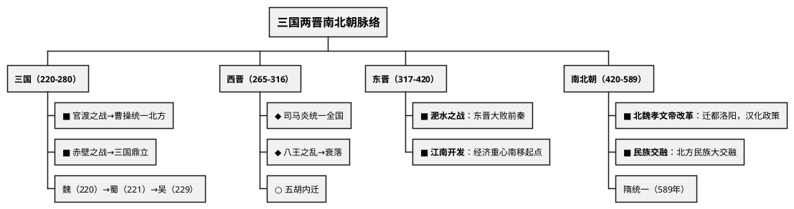
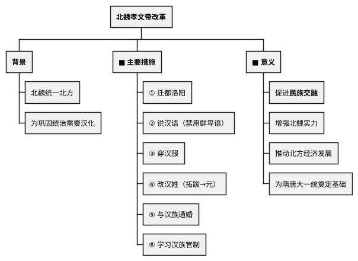

# 三国两晋南北朝（220—589年）

## 考点总览

| 时期 | 时间 | 核心考点 | 掌握等级 |
|------|------|---------|---------|
| 三国鼎立 | 220—280年 | 官渡之战、赤壁之战、魏蜀吴 | ■背 |
| 西晋 | 265—316年 | 统一、八王之乱、少数民族内迁 | ◆理解 |
| 东晋 | 317—420年 | 淝水之战、江南开发 | ■背 |
| 南北朝 | 420—589年 | 孝文帝改革、民族交融 | ■背 |

---

## 一、三国鼎立（220—280年）

### 1. 官渡之战 ■背

- **时间**：200年
- **双方**：曹操 vs 袁绍
- **结果**：曹操以少胜多，击败袁绍
- **影响**：奠定了曹操统一北方的基础

### 2. 赤壁之战 ■背（高频考点）

- **时间**：208年
- **双方**：曹操 vs 孙权、刘备联军
- **结果**：孙刘联军以少胜多，大败曹操
- **影响**：奠定了**三国鼎立**局面的基础

### 3. 三国鼎立

| 政权 | 建立者 | 都城 | 建立时间 |
|------|--------|------|---------|
| **魏**（曹魏） | 曹丕 | 洛阳 | 220年 |
| **蜀**（蜀汉） | 刘备 | 成都 | 221年 |
| **吴**（孙吴） | 孙权 | 建业（南京） | 229年 |

> **三国建立口诀**："**曹魏曹丕都洛阳，蜀汉刘备成都坐，东吴孙权在建业**"

---

## 二、西晋（265—316年）

### 1. 西晋统一 ◆理解

- 263年：魏灭蜀
- 265年：司马炎建立西晋（定都洛阳）
- 280年：西晋灭吴，统一全国
- **意义**：结束了三国分裂的局面

### 2. 八王之乱 ◆理解

- 西晋初年，分封同姓诸侯王
- 诸侯王争权夺利→"八王之乱"
- **影响**：消耗了国力，导致西晋衰落

### 3. 少数民族内迁 ◆理解

- 东汉末年以来，**匈奴、鲜卑、羯、氐、羌**（"五胡"）内迁中原
- **316年**：匈奴灭亡西晋

> **五胡口诀**："**匈奴鲜卑羯氐羌，五胡内迁到中原**"

---

## 三、东晋（317—420年）

### 1. 东晋建立

- **建立者**：司马睿，定都建康（南京）
- 与北方的十六国并立

### 2. 淝水之战 ■背

- **时间**：383年
- **双方**：前秦（苻坚）vs 东晋
- **结果**：东晋以少胜多，大败前秦
- **影响**：前秦瓦解，北方重新分裂；东晋巩固了统治

> **淝水之战相关成语**："**投鞭断流**（骄傲）、**草木皆兵**（恐惧）、**风声鹤唳**（狼狈）"

### 3. 江南开发 ■背

| 原因 | 表现 | 结果 |
|------|------|------|
| 北方战乱，人口南迁 | 带来了劳动力和先进技术 | 江南经济得到开发 |
| 南方自然条件优越 | 兴修水利，开垦荒地 | 为经济重心南移奠定基础 |
| 统治者重视 | 农业发展，手工业进步 | 南北经济差距缩小 |

---

## 四、南北朝（420—589年）

### 1. 南朝的更替 ◆理解

- 宋→齐→梁→陈（统称"南朝"）
- 均定都建康（南京）

### 2. 北魏孝文帝改革 ■背（高频考点）

**背景**：北魏统一北方（439年），为巩固统治需要汉化

**改革措施**：

| 领域 | 措施 |
|------|------|
| **迁都** | 从平城（大同）迁到<b>洛阳</b> |
| **语言** | 说汉语 |
| **服饰** | 穿汉服 |
| **姓氏** | 改汉姓（拓跋→元） |
| **婚姻** | 与汉族通婚 |
| **制度** | 学习汉族官制 |

**意义**：
- 促进了**民族交融**
- 增强了北魏的实力
- 推动了北方经济的发展

> **孝文帝改革口诀**："**迁都洛阳学汉话，穿汉服来改汉姓，通婚联姻学汉制**"

### 3. 民族大交融

### 4. 北朝时期的经济文化

- **《齐民要术》**：贾思勰著，中国现存最早最完整的农书 ◆理解
- **圆周率**：祖冲之计算到小数点后第七位 ◆理解
- **石窟艺术**：云冈石窟（山西大同）、龙门石窟（河南洛阳） ○了解

> **名人口诀**："**贾思勰写齐民要术，祖冲之算圆周率精**"

---

### ✨ 中考高频考点

| 考点 | 必背内容 | 出题方式 |
|------|---------|---------|
| 官渡之战与赤壁之战 | 官渡（曹操胜袁绍）、赤壁（孙刘胜曹操→三国鼎立） | 选择、材料 |
| 淝水之战 | 383年，东晋大败前秦，"草木皆兵" | 选择题 |
| 江南开发 | 北方人口南迁→经济重心南移起点 | 材料分析题 |
| 北魏孝文帝改革 | 迁都洛阳、说汉语穿汉服改汉姓、促进民族交融 | 材料分析题 |

---

## 📌 必背清单

| 序号 | 考点 | 要求 |
|------|------|------|
| 1 | 官渡之战、赤壁之战的时间、双方、影响 | ■必背 |
| 2 | 三国鼎立的形成（魏蜀吴建立者、都城） | ■必背 |
| 3 | 淝水之战的时间、双方、结果、影响 | ■必背 |
| 4 | 江南开发的原因、表现、结果 | ■必背 |
| 5 | 北魏孝文帝改革的措施和意义 | ■必背 |
| 6 | 西晋统一、八王之乱 | ◆理解 |
| 7 | 五胡内迁 | ◆理解 |
| 8 | 《齐民要术》、祖冲之 | ◆理解 |
