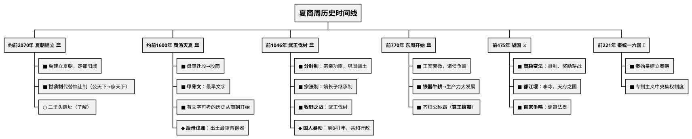
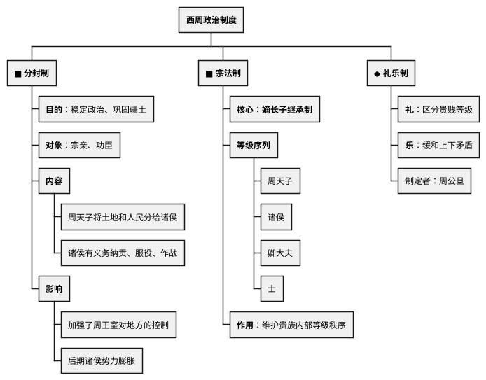
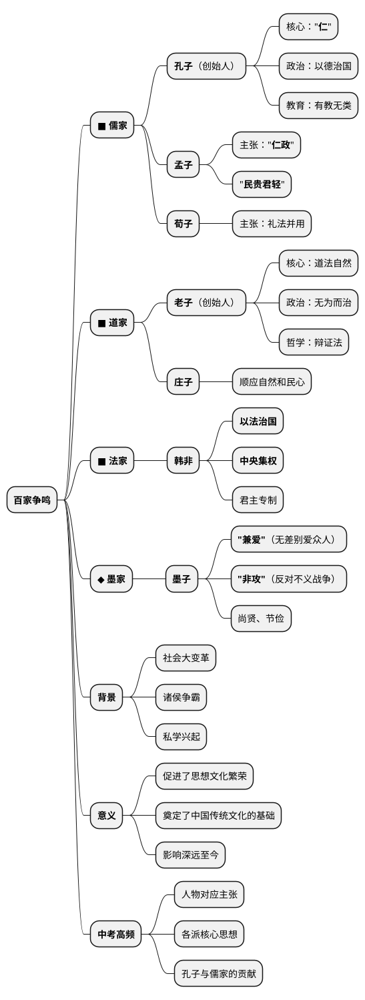

# 夏商周时期

## 考点总览

| 朝代 | 时间 | 建立者 | 重要考点 | 掌握等级 |
|------|------|--------|---------|---------|
| 夏 | 约前2070—约前1600年 | 禹 | 第一个王朝、世袭制代替禅让制、二里头遗址 | ■背 |
| 商 | 约前1600—前1046年 | 汤 | 盘庚迁殷、甲骨文、青铜器、牧野之战 | ■背 |
| 西周 | 前1046—前771年 | 周武王 | 分封制、宗法制、礼乐制、国人暴动 | ■背 |
| 东周(春秋) | 前770—前476年 | 周平王 | 诸侯争霸、铁制农具和牛耕、百家争鸣 | ■背 |
| 东周(战国) | 前475—前221年 | — | 商鞅变法、都江堰、百家争鸣 | ■背 |



---

## 一、夏朝（约前2070—约前1600年）

### 核心考点

- **建立**：禹建立夏朝，定都阳城（今河南登封） ■背
- **制度**：禹死后，儿子启继承王位，**世袭制**代替**禅让制**（"公天下"→"家天下"） ■背
- **遗址**：二里头遗址（河南洛阳），反映了夏朝后期的都城面貌 ○了解
- **灭亡**：夏桀暴政，被商汤所灭 ■背

### 记忆提示

> **世袭制口诀**："禹传启，家天下，公变私"

---

## 二、商朝（约前1600—前1046年）

### 核心考点

- **建立**：汤灭夏，建商 ■背
- **迁都**：盘庚将都城迁到**殷**（今河南安阳），此后商朝也被称为"殷商" ■背
- **甲骨文**：
  - 刻写在龟甲和兽骨上的文字 ○了解
  - **中国已发现最早、体系较完整的文字** ■背
  - 我国有文字可考的历史从商朝开始 ■背
- **青铜器**：
  - **司母戊鼎（后母戊鼎）**：世界上出土最重的青铜器 ◆ 背
  - **四羊方尊**：造型精美的青铜器 ○了解
  - 作用：祭祀、军事、饮食 ○了解
- **灭亡**：商纣王暴政，周武王伐纣 → **牧野之战** ■背

### 记忆提示

> **盘庚迁殷口诀**："盘庚迁殷到安阳，殷商从此叫得响"
>
> **甲骨文考点**：甲骨文→最早文字→商朝→有文字可考的历史开始

---

## 三、西周（前1046—前771年）

### 核心考点

1. **建立**：周武王在**牧野之战**击败商纣王，建立西周，定都镐京（今西安） ■背

2. **分封制** ■背
   - **目的**：稳定周初的政治形势，巩固疆土
   - **对象**：宗亲、功臣
   - **内容**：周天子把土地和人民分给诸侯，诸侯有义务服从周天子（纳贡、服役、作战）
   - **影响**：加强了周王室对地方的控制，但后期诸侯势力膨胀导致分裂

3. **宗法制** ■背
   - **核心**：嫡长子继承制
   - **等级**：周天子→诸侯→卿大夫→士
   - **作用**：维护贵族内部的等级秩序

4. **礼乐制** ◆理解
   - 周公旦制定，规范等级行为的礼仪制度
   - **礼**：区分贵贱等级
   - **乐**：缓和上下矛盾

5. **国人暴动** ■背
   - 公元前841年，周厉王暴政，国人（平民）暴动
   - 厉王逃亡，召公、周公共同执政 → **共和行政**

6. **灭亡**：周幽王"烽火戏诸侯"，犬戎攻破镐京 ■背

### 重要图表

📈 西周等级结构图：
```
周天子
   ↓
 诸侯（分封对象：宗亲、功臣）
   ↓
 卿大夫
   ↓
   士
   ↓
 平民（国人）
   ↓
  奴隶
```



## 四、春秋战国（前770—前221年）

### （一）春秋时期（前770—前476年）

#### 核心考点

1. **王室衰微** ■背
   - 周平王东迁洛邑，王室势力衰落
   - 诸侯争霸，不再听从周天子

2. **春秋五霸** ■背
   - **齐桓公**（第一个霸主，"尊王攘夷"）
   - 晋文公、楚庄王、吴王阖闾、越王勾践
   - 争霸战争：城濮之战（晋楚）、桂陵之战等

3. **经济变化** ■背
   - **铁制农具和牛耕出现** → 生产力大发展
   - 这是春秋时期最重要的经济变革

#### 记忆提示

> **春秋五霸口诀**："齐桓晋文楚庄王，吴阖闾来越勾践"

---

### （二）战国时期（前475—前221年）

#### 核心考点

1. **战国七雄** ■背
   - 齐、楚、秦、燕、赵、魏、韩
   - 口诀："齐楚秦燕赵魏韩，东南西北到中间"

2. **商鞅变法**（秦国） ■背
   - **时间**：公元前356年，秦孝公支持
   - **内容**：
     - 政治：确立县制，改革户籍，严明法度
     - 经济：废除井田制，允许土地自由买卖；奖励耕织；统一度量衡
     - 军事：奖励军功，对有军功者授予爵位
   - **意义**：秦国实力大增，为统一全国奠定基础
   - ⚠️ **闭卷必背！材料分析题高频考点**

3. **都江堰** ■背
   - **建造者**：秦国蜀郡太守李冰
   - **地点**：四川成都平原岷江上
   - **作用**：防洪、灌溉、水运
   - **意义**：使成都平原成为"天府之国"

4. **百家争鸣** ■背（非常重要！）
   - **背景**：社会大变革，各学派纷纷著书立说

   | 学派 | 代表人物 | 核心主张 |
   |------|---------|---------|
   | 儒家 | 孔子 | "仁"、以德治国、有教无类 |
   | 儒家 | 孟子 | "仁政"、"民贵君轻" |
   | 道家 | 老子 | 无为而治、顺应自然 |
   | 道家 | 庄子 | 顺应自然和民心 |
   | 法家 | 韩非 | 以法治国、中央集权 |
   | 墨家 | 墨子 | "兼爱""非攻" |

#### 百家争鸣记忆口诀

> **孔子**："仁爱德治教无类"  
> **孟子**："仁政民贵轻徭役"  
> **老子**："无为自然辩证法"  
> **韩非**："法治集权专制强"  
> **墨子**："兼爱非攻尚节俭"



---

### ✨ 中考高频考点

| 考点 | 必背内容 | 出题方式 |
|------|---------|---------|
| 世袭制代替禅让制 | 禹→启，"公天下"→"家天下" | 选择题、填空 |
| 甲骨文 | 最早文字，商朝，有文字可考历史开始 | 选择题 |
| 分封制 | 目的、对象、内容、影响 | 材料分析题 |
| 宗法制 | 嫡长子继承，等级序列 | 选择题 |
| 牧野之战 | 周武王伐纣，商亡周兴 | 选择题 |
| 春秋五霸 | 齐桓公"尊王攘夷"，铁器牛耕出现 | 选择、材料 |
| 商鞅变法 | 县制、奖励耕战、废除井田制 | 材料分析题 |
| 百家争鸣 | 孔子（仁）、孟子（仁政）、韩非（法治） | 选择、材料 |

---

## 📌 必背清单

| 序号 | 考点 | 要求 |
|------|------|------|
| 1 | 夏朝建立（禹）和世袭制代替禅让制 | ■必背 |
| 2 | 甲骨文的地位和意义 | ■必背 |
| 3 | 分封制的内容和影响 | ■必背 |
| 4 | 宗法制的核心（嫡长子继承制） | ■必背 |
| 5 | 春秋时期铁器牛耕的出现 | ■必背 |
| 6 | 商鞅变法的内容和意义 | ■必背 |
| 7 | 都江堰（李冰、地点、作用） | ■必背 |
| 8 | 百家争鸣各派代表人物及主张 | ■必背 |
| 9 | 二里头遗址、青铜器代表 | ○了解 |
| 10 | 礼乐制的内容 | ◆理解 |
