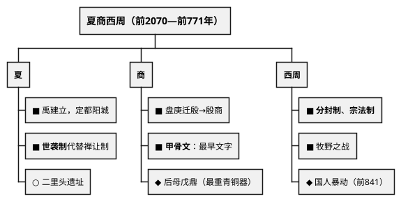
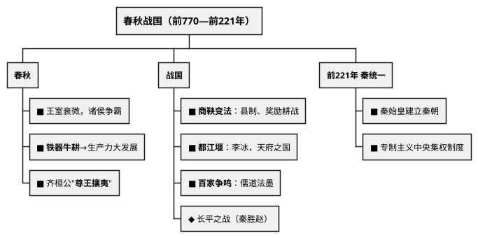
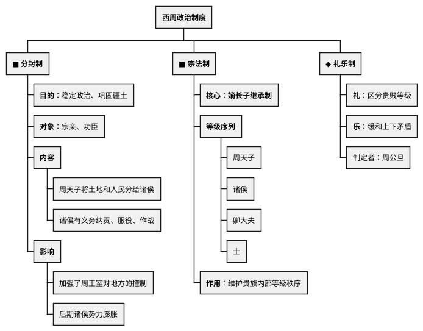
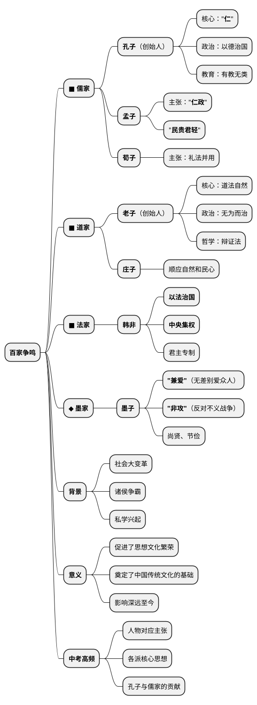

# 夏商周时期

## 考点总览

| 朝代 | 时间 | 建立者 | 重要考点 | 掌握等级 |
|------|------|--------|---------|---------|
| 夏 | 约前2070—约前1600年 | 禹 | 第一个王朝、世袭制代替禅让制、二里头遗址 | ■背 |
| 商 | 约前1600—前1046年 | 汤 | 盘庚迁殷、甲骨文、青铜器、牧野之战 | ■背 |
| 西周 | 前1046—前771年 | 周武王 | 分封制、宗法制、礼乐制、国人暴动 | ■背 |
| 东周(春秋) | 前770—前476年 | 周平王 | 诸侯争霸、铁制农具和牛耕、百家争鸣 | ■背 |
| 东周(战国) | 前475—前221年 | — | 商鞅变法、都江堰、百家争鸣 | ■背 |





---

## 一、夏朝（约前2070—约前1600年）

### 核心考点

- **建立**：禹建立夏朝，定都阳城（今河南登封） ■背
- **制度**：禹死后，儿子启继承王位，**世袭制**代替**禅让制**（"公天下"→"家天下"） ■背
- **遗址**：二里头遗址（河南洛阳），反映了夏朝后期的都城面貌 ○了解
- **灭亡**：夏桀暴政，被商汤所灭 ■背

### 记忆提示

> **世袭制口诀**："禹传启，家天下，公变私"

---

## 二、商朝（约前1600—前1046年）

### 核心考点

- **建立**：汤灭夏，建商 ■背
- **迁都**：盘庚将都城迁到**殷**（今河南安阳），此后商朝也被称为"殷商" ■背
- **甲骨文**：
  - 刻写在龟甲和兽骨上的文字 ○了解
  - **中国已发现最早、体系较完整的文字** ■背
  - 我国有文字可考的历史从商朝开始 ■背
- **青铜器**：
  - **司母戊鼎（后母戊鼎）**：世界上出土最重的青铜器 ◆ 背
  - **四羊方尊**：造型精美的青铜器 ○了解
  - 作用：祭祀、军事、饮食 ○了解
- **灭亡**：商纣王暴政，周武王伐纣 → **牧野之战** ■背

### 记忆提示

> **盘庚迁殷口诀**："盘庚迁殷到安阳，殷商从此叫得响"
>
> **甲骨文考点**：甲骨文→最早文字→商朝→有文字可考的历史开始

---

## 三、西周（前1046—前771年）

### 核心考点

1. **建立**：周武王在**牧野之战**击败商纣王，建立西周，定都镐京（今西安） ■背

2. **分封制** ■背
   - **目的**：稳定周初的政治形势，巩固疆土
   - **对象**：宗亲、功臣
   - **内容**：周天子把土地和人民分给诸侯，诸侯有义务服从周天子（纳贡、服役、作战）
   - **影响**：加强了周王室对地方的控制，但后期诸侯势力膨胀导致分裂

3. **宗法制** ■背
   - **核心**：嫡长子继承制
   - **等级**：周天子→诸侯→卿大夫→士
   - **作用**：维护贵族内部的等级秩序

4. **礼乐制** ◆理解
   - 周公旦制定，规范等级行为的礼仪制度
   - **礼**：区分贵贱等级
   - **乐**：缓和上下矛盾

5. **国人暴动** ■背
   - 公元前841年，周厉王暴政，国人（平民）暴动
   - 厉王逃亡，召公、周公共同执政 → **共和行政**

6. **灭亡**：周幽王"烽火戏诸侯"，犬戎攻破镐京 ■背

### 重要图表

📈 西周等级结构图：
```
周天子
   ↓
 诸侯（分封对象：宗亲、功臣）
   ↓
 卿大夫
   ↓
   士
   ↓
 平民（国人）
   ↓
  奴隶
```



## 四、春秋战国（前770—前221年）

### （一）春秋时期（前770—前476年）

#### 核心考点

1. **王室衰微** ■背
   - 周平王东迁洛邑，王室势力衰落
   - 诸侯争霸，不再听从周天子

2. **春秋五霸** ■背
   - **齐桓公**（第一个霸主，"尊王攘夷"）
   - 晋文公、楚庄王、吴王阖闾、越王勾践
   - 争霸战争：城濮之战（晋楚）、桂陵之战等

3. **经济变化** ■背
   - **铁制农具和牛耕出现** → 生产力大发展
   - 这是春秋时期最重要的经济变革

#### 记忆提示

> **春秋五霸口诀**："齐桓晋文楚庄王，吴阖闾来越勾践"

---

### （二）战国时期（前475—前221年）

#### 核心考点

1. **战国七雄** ■背
   - 齐、楚、秦、燕、赵、魏、韩
   - 口诀："齐楚秦燕赵魏韩，东南西北到中间"

2. **商鞅变法**（秦国） ■背
   - **时间**：公元前356年，秦孝公支持
   - **内容**：
     - 政治：确立县制，改革户籍，严明法度
     - 经济：废除井田制，允许土地自由买卖；奖励耕织；统一度量衡
     - 军事：奖励军功，对有军功者授予爵位
   - **意义**：秦国实力大增，为统一全国奠定基础
   - ⚠️ **闭卷必背！材料分析题高频考点**

3. **都江堰** ■背
   - **建造者**：秦国蜀郡太守李冰
   - **地点**：四川成都平原岷江上
   - **作用**：防洪、灌溉、水运
   - **意义**：使成都平原成为"天府之国"

4. **百家争鸣** ■背（非常重要！）
   - **背景**：社会大变革，各学派纷纷著书立说

   | 学派 | 代表人物 | 核心主张 |
   |------|---------|---------|
   | 儒家 | 孔子 | "仁"、以德治国、有教无类 |
   | 儒家 | 孟子 | "仁政"、"民贵君轻" |
   | 道家 | 老子 | 无为而治、顺应自然 |
   | 道家 | 庄子 | 顺应自然和民心 |
   | 法家 | 韩非 | 以法治国、中央集权 |
   | 墨家 | 墨子 | "兼爱""非攻" |

#### 百家争鸣记忆口诀

> **孔子**："仁爱德治教无类"  
> **孟子**："仁政民贵轻徭役"  
> **老子**："无为自然辩证法"  
> **韩非**："法治集权专制强"  
> **墨子**："兼爱非攻尚节俭"



---

### ✨ 中考高频考点

| 考点 | 必背内容 | 出题方式 |
|------|---------|---------|
| 世袭制代替禅让制 | 禹→启，"公天下"→"家天下" | 选择题、填空 |
| 甲骨文 | 最早文字，商朝，有文字可考历史开始 | 选择题 |
| 分封制 | 目的、对象、内容、影响 | 材料分析题 |
| 宗法制 | 嫡长子继承，等级序列 | 选择题 |
| 牧野之战 | 周武王伐纣，商亡周兴 | 选择题 |
| 春秋五霸 | 齐桓公"尊王攘夷"，铁器牛耕出现 | 选择、材料 |
| 商鞅变法 | 县制、奖励耕战、废除井田制 | 材料分析题 |
| 百家争鸣 | 孔子（仁）、孟子（仁政）、韩非（法治） | 选择、材料 |

---

## 📌 必背清单

| 序号 | 考点 | 要求 |
|------|------|------|
| 1 | 夏朝建立（禹）和世袭制代替禅让制 | ■必背 |
| 2 | 甲骨文的地位和意义 | ■必背 |
| 3 | 分封制的内容和影响 | ■必背 |
| 4 | 宗法制的核心（嫡长子继承制） | ■必背 |
| 5 | 春秋时期铁器牛耕的出现 | ■必背 |
| 6 | 商鞅变法的内容和意义 | ■必背 |
| 7 | 都江堰（李冰、地点、作用） | ■必背 |
| 8 | 百家争鸣各派代表人物及主张 | ■必背 |
| 9 | 二里头遗址、青铜器代表 | ○了解 |
| 10 | 礼乐制的内容 | ◆理解 |


---

# 📝 填空题

---

# 夏商周时期 · 填空题

**班级：\_\_\_\_\_\_\_\_ 姓名：\_\_\_\_\_\_\_\_ 得分：\_\_\_\_\_\_\_\_**

> 共40空，每空2.5分，满分100分。答案在背面。

---

## 一、夏朝

1. 约前2070年，\_\_\_\_\_建立夏朝，定都\_\_\_\_\_。

2. 禹死后，儿子\_\_\_\_\_继承王位，\_\_\_\_\_制代替了\_\_\_\_\_制，从此"公天下"变成了"\_\_\_\_\_\_\_"。

3. 夏朝最后一个国王\_\_\_\_\_暴政，被商汤所灭。

## 二、商朝

4. \_\_\_\_\_灭夏，建立商朝。

5. 商王\_\_\_\_\_将都城迁到\_\_\_\_\_（今河南安阳），此后商朝也被称为"\_\_\_\_\_"。

6. **甲骨文**是指刻写在\_\_\_\_\_和\_\_\_\_\_上的文字。它是中国已发现的\_\_\_\_\_\_\_、\_\_\_\_\_\_\_\_\_的文字。我国有文字可考的历史从\_\_\_\_\_朝开始。

7. **青铜器**：\_\_\_\_\_\_\_\_\_（又称\_\_\_\_\_\_\_\_\_）是世界上出土最重的青铜器。

8. 商纣王暴政，\_\_\_\_\_伐纣，在\_\_\_\_\_\_之战中击败商军，商朝灭亡。

## 三、西周

9. 西周建立者\_\_\_\_\_\_\_，定都\_\_\_\_\_（今西安）。

10. **分封制**：
    - 目的：稳定政治形势，\_\_\_\_\_\_\_\_\_
    - 对象：\_\_\_\_\_、\_\_\_\_\_
    - 内容：周天子把\_\_\_\_\_和\_\_\_\_\_分给诸侯，诸侯有义务\_\_\_\_\_、\_\_\_\_\_、\_\_\_\_\_
    - 影响：加强了周王室对地方的控制，但后期\_\_\_\_\_\_\_\_\_\_\_导致分裂

11. **宗法制**：
    - 核心：\_\_\_\_\_\_\_\_\_\_\_\_\_\_
    - 等级：周天子→\_\_\_\_\_→\_\_\_\_\_→\_\_\_\_\_

12. **国人暴动**：公元前\_\_\_\_年，周厉王暴政，\_\_\_\_\_（平民）暴动，厉王逃亡，\_\_\_\_\_\_\_\_\_\_

13. 西周灭亡：周幽王"\_\_\_\_\_\_\_\_\_\_"，被犬戎攻破镐京。

## 四、春秋

14. 周平王东迁\_\_\_\_\_，东周开始，\_\_\_\_\_衰微，诸侯争霸。

15. 春秋时期最重要的经济变化是\_\_\_\_\_\_\_\_和\_\_\_\_\_的出现，促进了生产力大发展。

16. **春秋五霸**：\_\_\_\_\_\_\_（第一个霸主，提出"\_\_\_\_\_\_\_\_\_"）

17. 城濮之战发生在\_\_\_\_\_和\_\_\_\_\_之间。

## 五、战国

18. **战国七雄**：\_\_\_、\_\_\_、\_\_\_、\_\_\_、\_\_\_、\_\_\_、\_\_\_

19. **商鞅变法**（公元前\_\_\_\_年）：
    - 政治：确立\_\_\_\_制
    - 经济：废除\_\_\_\_\_，允许土地自由买卖；奖励\_\_\_\_\_；统一\_\_\_\_\_\_
    - 军事：奖励\_\_\_\_\_
    - 意义：\_\_\_\_\_\_\_\_\_\_\_\_\_\_\_\_\_\_\_\_\_\_\_\_\_\_\_\_\_\_\_\_

20. **都江堰**：建造者\_\_\_\_\_（秦国蜀郡太守），位于\_\_\_\_\_平原\_\_\_\_江上，作用是\_\_\_\_\_、\_\_\_\_\_、\_\_\_\_\_，使成都平原成为"\_\_\_\_\_\_\_\_\_"

## 六、百家争鸣

21. 各学派代表人物及主张：
    - 孔子（\_\_\_\_家）：核心是"\_\_\_\_"，以德治国，\_\_\_\_\_\_\_\_\_
    - 孟子（\_\_\_\_家）：主张"\_\_\_\_\_"，"\_\_\_\_\_\_\_\_\_"
    - 老子（\_\_\_\_家）：\_\_\_\_\_\_\_\_\_，顺应自然
    - 韩非（\_\_\_\_家）：以\_\_\_\_治国，\_\_\_\_\_\_\_\_\_
    - 墨子（\_\_\_\_家）："\_\_\_\_\_"（无差别爱众人），"\_\_\_\_\_"（反对不义战争）

---

## 参考答案

### 一、夏朝
1. 禹，阳城
2. 启，世袭，禅让，家天下
3. 桀

### 二、商朝
4. 汤
5. 盘庚，殷，殷商
6. 龟甲，兽骨，最早，体系较完整，商
7. 司母戊鼎，后母戊鼎
8. 周武王，牧野

### 三、西周
9. 周武王，镐京
10. 巩固疆土；宗亲，功臣；土地，人民，纳贡，服役，作战；诸侯势力膨胀
11. 嫡长子继承制；诸侯，卿大夫，士
12. 841，国人，共和行政
13. 烽火戏诸侯

### 四、春秋
14. 洛邑，王室
15. 铁制农具，牛耕
16. 齐桓公，尊王攘夷
17. 晋，楚

### 五、战国
18. 齐、楚、秦、燕、赵、魏、韩
19. 356；县；井田制，耕织，度量衡；军功；秦国实力大增，为统一全国奠定基础
20. 李冰，成都，岷，防洪，灌溉，水运，天府之国

### 六、百家争鸣
21. 儒，仁，有教无类；儒，仁政，民贵君轻；道，无为而治；法，法，中央集权；墨，兼爱，非攻


---

# 📝 材料题专项

---

# 夏商周时期 · 材料题专项

> 本文件梳理该专题中考材料分析题的出题角度和答题要点。

---

## 材料分析题通用答题模板

### 第一步：读材料
- 看材料出处（谁写的、什么书）
- 圈关键词（人名、制度名、主张等）

### 第二步：联想教材
- 把材料中的关键词映射到教材知识点
- 确定考查的是哪个时期、哪个知识点

### 第三步：组织答案
- 按"是什么→为什么→怎么样"的逻辑组织
- 如果是评价类问题，注意 **一分为二**（积极+局限）
- 如果是启示类问题，从 **历史联系现实** 作答

---

## 一、分封制

### 出题角度

**角度1：给一段关于分封制的古文材料，要求回答分封制的目的、内容**

常见引用的古文：
- "封建亲戚，以藩屏周"（目的：巩固周王室统治）
- "天子适诸侯，曰巡狩；诸侯朝于天子，曰述职"（义务关系）

**角度2：给出西周等级示意图，要求写出等级序列**

可能出现的图解形式：金字塔图、箭头层级图

**角度3：对比分封制与郡县制**

比较维度：划分标准、官员产生方式、对中央集权的影响

### 答题要点

| 考点 | 必答内容 |
|------|---------|
| **目的** | 稳定政治形势，巩固疆土 |
| **对象** | 宗亲、功臣 |
| **内容** | 周天子将土地和人民分给诸侯，诸侯有义务纳贡、服役、作战 |
| **影响（积极）** | 加强了周王室对地方的控制 |
| **影响（局限）** | 后期诸侯势力膨胀，导致分裂割据 |
| **实质** | 西周的地方行政制度 |

---

## 二、商鞅变法

### 出题角度

**角度1：给出一段商鞅变法的材料，要求概括变法措施**

常见材料："戮力本业，耕织致粟帛多者复其身……"（奖励耕织）
"有军功者，各以率受上爵……"（奖励军功）
"宗室非有军功论，不得为属籍"（废世卿世禄）

**角度2：问商鞅变法为什么能成功 / 有什么意义**

常见考查逻辑：变法内容 → 国富兵强 → 统一基础

**角度3：改革启示类问题**

例："商鞅变法对我们今天的改革有什么启示？"

### 答题要点

| 考点 | 必答内容 |
|------|---------|
| **时间** | 公元前356年，秦孝公支持 |
| **政治** | 确立县制，改革户籍，严明法度 |
| **经济** | 废除井田制，允许土地自由买卖；奖励耕织；统一度量衡 |
| **军事** | 奖励军功，对有军功者授予爵位 |
| **意义** | 秦国实力大增，为统一全国奠定基础 |
| **启示** | 改革要顺应时代潮流；改革要坚决彻底；改革创新是强国之路 |

---

## 三、百家争鸣

### 出题角度

**角度1：给出某学派代表人物言论，判断属于哪家学派**

常见材料甄别：
- "仁者爱人""己所不欲勿施于人" → **孔子（儒家）**
- "民为贵，社稷次之，君为轻" → **孟子（儒家）**
- "道法自然""无为而治" → **老子（道家）**
- "以法治国""法不阿贵" → **韩非（法家）**
- "兼爱""非攻" → **墨子（墨家）**

**角度2：百家争鸣局面形成的背景**

常见问法："为什么春秋战国时期会出现百家争鸣？"

**角度3：各学派思想对后世的影响**

常考：儒家思想成为中国传统文化的主流

### 答题要点

| 学派 | 代表人物 | 核心主张 | 常考关联 |
|------|---------|---------|---------|
| **儒家** | 孔子 | "仁"、以德治国、有教无类 | 与汉武帝"独尊儒术"关联 |
| **儒家** | 孟子 | "仁政"、"民贵君轻" | 与"以人为本"思想关联 |
| **道家** | 老子 | 无为而治、顺应自然、辩证法 | 与生态文明关联 |
| **法家** | 韩非 | 以法治国、中央集权 | 与依法治国关联 |
| **墨家** | 墨子 | "兼爱""非攻"、尚贤节俭 | 与和平发展理念关联 |

**背景四要素**：
1. 社会大变革（铁器牛耕 → 生产力发展）
2. 王室衰微，诸侯争霸
3. 私学兴起，学术下移
4. 各学派代表不同阶级利益

---

## 四、春秋五霸（选择、材料）

### 出题角度

**角度1：给出争霸战争的材料，问体现了什么**

常见材料：齐桓公"尊王攘夷"的口号、城濮之战等

**角度2：问争霸的影响**

答题要点：客观上有助于民族交融，但给人民带来灾难

### 答题要点

| 考点 | 必答内容 |
|------|---------|
| **第一位霸主** | 齐桓公，提出"尊王攘夷"口号 |
| **重要战争** | 城濮之战（晋楚争霸） |
| **经济基础** | 铁制农具和牛耕出现 → 生产力发展 |
| **争霸影响** | 客观上促进民族交融，但给人民带来灾难 |

---

## 考前速记口诀

> **分封制**："分封亲功臣，藩屏周王室"  
> **商鞅变法**："县制耕战度量衡，国富兵强秦统一"  
> **百家争鸣**："孔仁孟政老无为，韩非法治墨兼爱"


---

## 参考答案

