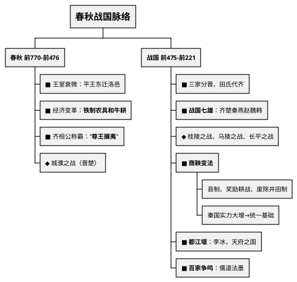
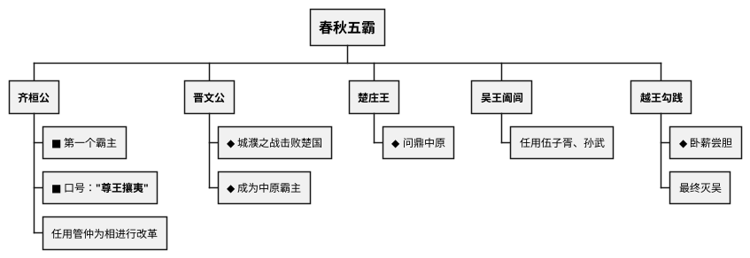
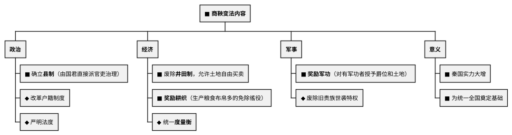

# 春秋战国（前770—前221年）

## 考点总览

| 时期 | 时间 | 核心考点 | 掌握等级 |
|------|------|---------|---------|
| 春秋 | 前770—前476年 | 王室衰微、春秋五霸、铁器牛耕 | ■背 |
| 战国 | 前475—前221年 | 战国七雄、商鞅变法、都江堰、百家争鸣 | ■背 |

---

## 一、春秋时期（前770—前476年）

### 1. 王室衰微 ■背

- **平王东迁**：公元前770年，周平王将都城从镐京迁到**洛邑**（今洛阳）
- 东周开始后，周王室势力衰落，再也无力控制诸侯
- 诸侯不再听从周天子的命令，**分封制逐渐瓦解**

### 2. 经济变革——铁器牛耕 ■背

- **铁制农具和牛耕出现**（春秋时期最重要的经济变革）
- 意义：促进了农业的深耕细作，**大大提高了生产力**
- 影响：生产力的发展→引发了社会变革→推动了社会转型

### 3. 春秋五霸 ■背

- **齐桓公**：第一个霸主，提出"**尊王攘夷**"口号（尊崇周天子，抵御少数民族）■背
- **争霸战争**：城濮之战（晋文公 vs 楚成王，晋胜）
- **争霸影响**：
  - 消极：给人民带来了灾难
  - 积极：客观上有利于**民族交融**

> **春秋五霸口诀**："**齐桓晋文楚庄王，吴阖闾来越勾践**"

---

## 二、战国时期（前475—前221年）

### 1. 三家分晋与田氏代齐 ■背

- **三家分晋**：春秋末期，晋国被赵、魏、韩三家大夫瓜分
- **田氏代齐**：齐国大夫田氏取代了原来的姜氏齐国
- 以上事件反映了**战国时期旧制度瓦解、新兴地主阶级崛起**

### 2. 战国七雄 ■背

| 七雄 | 位置 |
|------|------|
| 齐、楚、秦、燕 | 东、南、西、北 |
| 赵、魏、韩 | 中间（由晋国分出） |

> **战国七雄口诀**："**齐楚秦燕赵魏韩，东南西北到中间**"

**重要战役**：

| 战役 | 双方 | 特点 | 掌握等级 |
|------|------|------|---------|
| **桂陵之战** | 齐魏（围魏救赵） | 孙膑计谋 | ◆理解 |
| **马陵之战** | 齐魏 | 齐胜，魏国衰落 | ◆理解 |
| **长平之战** | 秦赵 | 秦胜，赵国元气大伤 | ■背 |

> **长平之战**是战国时期规模最大、最惨烈的战役，此后东方六国再也无力抵抗秦军的进攻。

### 3. 商鞅变法 ■背（高频考点）

- **时间**：公元前356年，秦孝公支持
- **背景**：秦国落后于东方六国，需要变法图强

**为什么商鞅变法能成功**：
1. 顺应了时代潮流（从奴隶制向封建制过渡）
2. 秦孝公的大力支持
3. 商鞅本人坚决推行

### 4. 都江堰 ■背

| 项目 | 内容 |
|------|------|
| **建造者** | 秦国蜀郡太守**李冰**（父子） |
| **地点** | 四川成都平原岷江上 |
| **功能** | 防洪、灌溉、水运 |
| **影响** | 使成都平原成为"**天府之国**" |
| **地位** | 世界上迄今为止年代最久、唯一留存的大型水利工程 |

---

## 三、百家争鸣 ■背（高频考点）

### 1. 背景

- 社会大变革（铁器牛耕→生产力发展）
- 王室衰微，诸侯争霸
- 私学兴起，学术下移
- 各学派代表不同阶级利益，纷纷著书立说

### 2. 主要学派及代表人物

| 学派 | 代表人物 | 时期 | 核心主张 | 名言/著作 |
|------|---------|------|---------|----------|
| **儒家** | **孔子** | 春秋 | "**仁**"、以德治国、**有教无类** | "己所不欲，勿施于人" |
| **儒家** | **孟子** | 战国 | "**仁政**"、"**民贵君轻**" | "富贵不能淫……" |
| **儒家** | **荀子** | 战国 | 礼法并用 | 《荀子》 |
| **道家** | **老子** | 春秋 | **无为而治**、顺应自然、辩证法 | 《道德经》 |
| **道家** | **庄子** | 战国 | 顺应自然和民心 | 《逍遥游》 |
| **法家** | **韩非** | 战国 | **以法治国**、**中央集权**、君主专制 | 《韩非子》 |
| **墨家** | **墨子** | 战国 | "**兼爱**""**非攻**"、尚贤节俭 | 《墨子》 |
| **兵家** | **孙武** | 春秋 | "知己知彼，百战不殆" | 《孙子兵法》 |

### 3. 百家争鸣的意义 ■背

- 促进了思想文化的繁荣
- 奠定了中国**传统文化**的基础
- 各家思想影响深远，至今仍有重要意义

### 4. 记忆口诀

> **孔子**："仁爱德治教无类"  
> **孟子**："仁政民贵轻徭役"  
> **老子**："无为自然辩证法"  
> **韩非**："法治集权专制强"  
> **墨子**："兼爱非攻尚节俭"

---

## 春秋战国时期的重要成语

| 成语 | 相关事件/人物 |
|------|-------------|
| **退避三舍** | 晋文公（城濮之战） |
| **卧薪尝胆** | 越王勾践 |
| **围魏救赵** | 桂陵之战（孙膑） |
| **纸上谈兵** | 长平之战（赵括） |

---

## 📌 必背清单

| 序号 | 考点 | 要求 |
|------|------|------|
| 1 | 铁制农具和牛耕的出现（生产力大发展） | ■必背 |
| 2 | 齐桓公称霸（"尊王攘夷"） | ■必背 |
| 3 | 王室衰微的表现 | ■必背 |
| 4 | 战国七雄的名称 | ■必背 |
| 5 | 商鞅变法的内容（政治、经济、军事）和意义 | ■必背 |
| 6 | 都江堰（李冰，天府之国） | ■必背 |
| 7 | 百家争鸣各派代表人物及主张 | ■必背 |
| 8 | 孔子（仁、以德治国、有教无类） | ■必背 |
| 9 | 长平之战（秦胜赵，东方六国无力抗秦） | ■必背 |
| 10 | 三家分晋、田氏代齐 | ◆理解 |
| 11 | 桂陵之战、马陵之战 | ◆理解 |

### ✨ 中考高频考点

| 考点 | 必背内容 | 出题方式 |
|------|---------|---------|
| 商鞅变法 | 县制、奖励耕战、废除井田制、意义 | 材料分析题 |
| 百家争鸣 | 孔子（仁）、孟子（仁政）、韩非（法治） | 选择、材料 |
| 春秋争霸 | 齐桓公"尊王攘夷"，铁器牛耕出现 | 选择、材料 |
| 都江堰 | 李冰、防洪灌溉、天府之国 | 选择题 |
