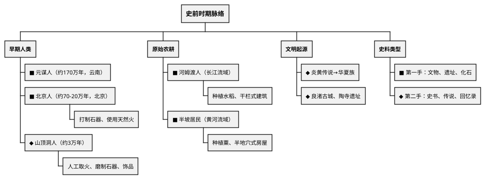

# 史前时期

## 考点总览

| 考点 | 核心内容 | 掌握等级 |
|------|---------|---------|
| 我国早期人类 | 元谋人、北京人、山顶洞人 | ■背 |
| 农耕生活 | 河姆渡人、半坡居民 | ■背 |
| 远古传说 | 炎帝黄帝、华夏族形成 | ◆理解 |
| 中华文明起源 | 良渚古城、陶寺遗址 | ◆理解 |
| 史料类型 | 第一手史料与第二手史料 | ■背 |

---

## 一、我国早期人类

### 1. 元谋人 ■背

- **年代**：距今约 **170万年**（中国确认最早的古人类）
- **地点**：云南省元谋县
- **证据**：两颗门齿化石、粗糙的石器
- **地位**：我国境内目前已确认的**最早**的古人类

### 2. 北京人 ■背

- **年代**：距今约 **70万—20万年**
- **地点**：北京周口店龙骨山
- **体质**：保留猿的某些特征，能直立行走
- **工具**：使用**打制石器**（旧石器时代）
- **用火**：已经学会使用**天然火**（保存火种），能烧烤食物、驱寒照明
- **生活**：群居生活（共同劳动、分享劳动成果）
- **地位**：周口店北京人遗址是迄今所知世界上内涵最丰富的直立人遗址

> **北京人口诀**："北京人，七十万年周口店，打制石器用天然火，群居生活直立走"

### 3. 山顶洞人 ◆理解

- **年代**：距今约 **3万年**
- **地点**：北京周口店（龙骨山顶部洞穴）
- **进步**：已经掌握**人工取火**技术；使用**磨制石器**（骨针）
- **审美**：有审美意识（佩戴装饰品）

### 4. 考古证据与历史研究 ■背

| 考古发现 | 推断结论 |
|---------|---------|
| 门齿化石 | 该地有过古人类活动 |
| 灰烬、烧石、烧骨 | 已经使用火 |
| 粗糙的打制石器 | 处于旧石器时代 |
| 骨针、装饰品 | 掌握缝纫技术、有审美意识 |

---

## 二、原始农耕生活

### 1. 河姆渡人（长江流域）■背

- **地点**：浙江余姚河姆渡
- **年代**：距今约 **7000年**
- **房屋**：**干栏式建筑**（防潮防兽，适应南方潮湿气候）
- **农业**：种植**水稻**（中国最早的稻作农业起源之一）
- **工具**：使用磨制石器（**骨耜**）
- **家畜**：饲养猪、狗等
- **手工业**：制陶、玉器、雕刻

### 2. 半坡居民（黄河流域）■背

- **地点**：陕西西安半坡
- **年代**：距今约 **6000年**
- **房屋**：**半地穴式房屋**（保暖防寒，适应北方气候）
- **农业**：种植**粟**（小米）
- **工具**：磨制石器（**耒耜**）
- **家畜**：饲养猪、狗等
- **手工业**：彩陶（人面鱼纹彩陶盆）

> **河姆渡vs半坡口诀**：
> "**河姆渡在长江南，干栏水稻种得欢；半坡在黄河北，半地穴式种粟米**"

### 3. 原始农业兴起标志 ◆理解

- 农作物种植
- 家畜饲养
- 聚落（定居）
- 磨制石器
- 陶器制作

---

## 三、远古传说与中华文明起源

### 1. 炎帝黄帝传说 ◆理解

- **炎帝**：号神农氏，教民开垦耕种、尝百草
- **黄帝**：号轩辕氏，建造宫室、制衣造车
- **阪泉之战**：黄帝战胜炎帝，两大部落走向联合
- **涿鹿之战**：炎黄部落联合战胜蚩尤
- **华夏族**：炎黄部落联盟以后逐渐形成为华夏族，因此后人尊称炎帝和黄帝为"**人文初祖**"

### 2. 良渚古城与陶寺遗址 ◆理解

- **良渚古城**（浙江杭州）：距今约5300-4300年，有大型水利系统、祭坛、玉器，反映了早期国家的形态
- **陶寺遗址**（山西襄汾）：距今约4300-3900年，有宫城、观象台等，可能属于尧舜时期的都城
- **意义**：中华文明的起源是**多元一体**的

### 3. 史料类型辨析 ■背

| 类型 | 定义 | 举例 |
|------|------|------|
| **第一手史料**（原始史料） | 直接反映历史现场的遗存 | 化石、文物、遗址、甲骨文、档案 |
| **第二手史料**（间接史料） | 后人转述或研究的成果 | 《史记》、回忆录、史学研究论文 |

> **关键考点**：《史记》关于黄帝炎帝的记载属于**第二手史料**（不是第一手），因为司马迁是后人，不是当时人

---

## 📌 必背清单

| 序号 | 考点 | 要求 |
|------|------|------|
| 1 | 元谋人（距今约170万年，最早古人类） | ■必背 |
| 2 | 北京人（距今70-20万年，打制石器，天然火，群居） | ■必背 |
| 3 | 河姆渡人（长江流域，干栏式建筑，水稻，骨耜） | ■必背 |
| 4 | 半坡居民（黄河流域，半地穴式，粟，彩陶） | ■必背 |
| 5 | 史料类型（第一手vs第二手） | ■必背 |
| 6 | 山顶洞人（人工取火、磨制石器） | ◆理解 |
| 7 | 炎黄传说与华夏族形成 | ◆理解 |
| 8 | 良渚古城、陶寺遗址 | ◆理解 |

### ✨ 中考高频考点

| 考点 | 必背内容 | 出题方式 |
|------|---------|---------|
| 北京人 | 距今70-20万年，周口店，打制石器，天然火 | 选择、填空 |
| 河姆渡vs半坡 | 河姆渡(水稻+干栏) vs 半坡(粟+半地穴) | 选择、材料 |
| 史料类型 | 化石/文物=第一手，《史记》=第二手 | 选择 |
