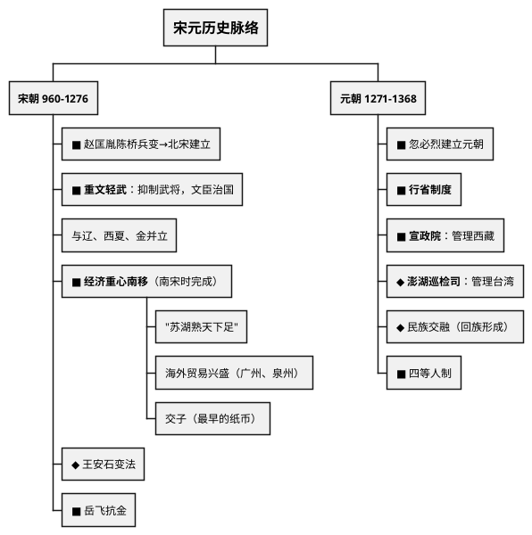
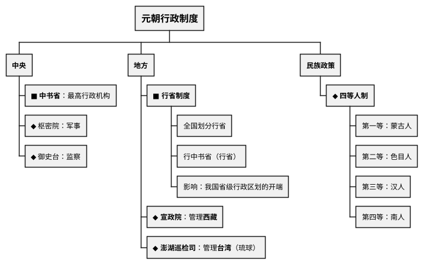

# 宋元时期（960—1368年）

## 考点总览

| 时期 | 时间 | 核心考点 | 掌握等级 |
|------|------|---------|---------|
| 北宋 | 960—1127年 | 重文轻武、王安石变法、民族政权并立 | ■背 |
| 南宋 | 1127—1276年 | 经济重心南移完成、岳飞 | ■背 |
| 元朝 | 1271—1368年 | 行省制度、宣政院、民族交融 | ■背 |

---

## 一、北宋（960—1127年）

### 1. 北宋建立

- **陈桥兵变**：960年，赵匡胤（宋太祖）"黄袍加身"，建立北宋
- **定都**：开封（东京）
- **统一**：结束了五代十国分裂局面

### 2. 重文轻武 ■背

- **杯酒释兵权**：宋太祖解除武将兵权
- **政策**：重用文臣，抑制武将
- **影响**：
  - ✅ 杜绝了武将专权（藩镇割据）
  - ❌ 军队战斗力下降（宋军较弱）

### 3. 民族政权并立

| 政权 | 民族 | 建立者 | 都城 | 与宋关系 |
|------|------|--------|------|---------|
| **辽** | 契丹 | 耶律阿保机 | 上京 | 澶渊之盟（宋辽议和） |
| **西夏** | 党项 | 元昊 | 兴庆府 | 宋夏和议 |
| **金** | 女真 | 完颜阿骨打 | 会宁/中都 | 灭辽→灭北宋（靖康之变） |

> **澶渊之盟**（1005年）■背：宋辽议和，辽撤兵，宋给辽岁币。此后宋辽长期和平。

### 4. 王安石变法 ◆理解

- **时间**：1069年，宋神宗支持
- **目的**：富国强兵
- **内容**：青苗法、募役法、方田均税法等
- **结果**：取得一定成效，但触犯了大官僚利益，最终失败

### 5. 靖康之变

- 1127年，金军攻破开封，掳走宋徽宗、宋钦宗 → 北宋灭亡

---

## 二、南宋（1127—1276年）

### 1. 南宋建立

- 1127年，赵构（宋高宗）在应天府（商丘）称帝
- 后定都**临安**（杭州）
- 与金形成南北对峙局面

### 2. 岳飞抗金 ■背

- 岳家军英勇善战（"冻死不拆屋，饿死不掳掠"）
- **郾城大捷**：大败金军主力
- **结果**：宋高宗和秦桧以"莫须有"罪名害死岳飞
- **原因**：宋高宗怕岳飞功高震主，妨碍议和

### 3. 经济重心南移 ■背（高频考点）

**过程**：东汉末→魏晋南北朝→隋唐→南宋

| 时期 | 进展 |
|------|------|
| 魏晋南北朝 | 江南得到开发，为南移奠定基础 |
| 唐朝中后期 | 经济重心开始南移 |
| **南宋** | **经济重心南移最终完成** |

**表现**：

| 领域 | 表现 |
|------|------|
| **农业** | "苏湖熟，天下足"（苏州、湖州成为粮仓） |
| **手工业** | 丝织业发达（江浙）；棉纺织业兴起；制瓷业兴盛（景德镇） |
| **商业** | 出现<b>交子</b>（中国最早的纸币） |
| **海外贸易** | 广州、泉州、明州是主要港口 |

> **经济重心南移口诀**："**南宋完成南移局，苏湖熟来天下足，交子纸币最早出，海外贸易通五洲**"

---

## 三、元朝（1271—1368年）

### 1. 元朝建立

- **建立者**：忽必烈（元世祖），1271年定国号为元
- **定都**：大都（今北京）
- **统一**：
  - 1276年：元灭南宋
  - **1279年**：元灭南宋残余势力，统一全国

### 2. 行省制度 ■背（高频考点）

- 在中央设**中书省**（最高行政机构），直辖大都附近地区
- 在地方设**行中书省**（简称"行省"）
- **意义**：加强了中央集权，影响至今（我国省级行政区划的开端）

### 3. 元朝对边疆的管理

| 机构 | 管辖地区 | 掌握等级 |
|------|---------|---------|
| **宣政院** | 西藏 | ■背 |
| **澎湖巡检司** | 台湾（琉球） | ◆理解 |
| **北庭都元帅府** | 西域 | ○了解 |

> **元朝边疆口诀**："**宣政院管西藏事，澎湖巡检管台湾**"

### 4. 民族交融 ◆理解

- **回族形成**：大量波斯人、阿拉伯人迁入中国，同汉、蒙古等族融合形成回族
- **影响**：促进了统一多民族国家的发展

---

## 四、宋元文化

| 领域 | 成就 | 人物 | 掌握等级 |
|------|------|------|---------|
| **活字印刷** | 活字印刷术 | 毕昇（北宋） | ■背 |
| **指南针** | 用于航海（北宋） | — | ◆理解 |
| **火药** | 用于军事（宋元） | — | ◆理解 |
| **宋词** | 豪放派苏轼、辛弃疾；婉约派李清照 | — | ○了解 |
| **元曲** | 关汉卿《窦娥冤》 | 关汉卿 | ○了解 |
| **史学** | 《资治通鉴》 | 司马光 | ■背 |

> **宋元科技口诀**："**毕昇发明活字印，指南针用于航行，火药用来造武器，三大发明传世界**"

---

### ✨ 中考高频考点

| 考点 | 必背内容 | 出题方式 |
|------|---------|---------|
| 重文轻武 | 杯酒释兵权、文臣治国、军队战斗力下降 | 选择、材料 |
| 澶渊之盟 | 1005年宋辽议和，长期和平 | 选择题 |
| 靖康之变 | 1127年金灭北宋 | 选择题 |
| 经济重心南移 | 南宋完成、"苏湖熟天下足"、交子 | 材料分析题 |
| 行省制度 | 中书省、行省制、影响至今 | 选择、材料 |
| 宣政院管理西藏 | 元朝设宣政院管理西藏事务 | 选择题 |

---

## 📌 必背清单

| 序号 | 考点 | 要求 |
|------|------|------|
| 1 | 重文轻武政策及其影响 | ■必背 |
| 2 | 澶渊之盟（1005年，宋辽议和） | ■必背 |
| 3 | 靖康之变（1127年，北宋灭亡） | ■必背 |
| 4 | 岳飞抗金 | ■必背 |
| 5 | 经济重心南移完成于南宋 | ■必背 |
| 6 | 交子（最早纸币） | ■必背 |
| 7 | 行省制度的内容和影响 | ■必背 |
| 8 | 宣政院管理西藏 | ■必背 |
| 9 | 活字印刷术（毕昇） | ■必背 |
| 10 | 《资治通鉴》（司马光） | ■必背 |
| 11 | 四等人制 | ◆理解 |
| 12 | 回族形成 | ◆理解 |

---

# 📝 填空题

---

# 宋元时期 · 填空题

**班级：\_\_\_\_\_\_\_\_ 姓名：\_\_\_\_\_\_\_\_ 得分：\_\_\_\_\_\_\_\_**

---

## 一、北宋

1. 960年，\_\_\_\_\_\_\_在\_\_\_\_\_\_\_\_兵变中"黄袍加身"，建立北宋，定都\_\_\_\_\_\_\_。

2. **重文轻武**：宋太祖\_\_\_\_\_\_\_\_\_\_\_（事件）解除武将兵权。影响：杜绝了武将专权，但导致\_\_\_\_\_\_\_\_\_\_\_\_\_\_\_。

3. **民族政权并立**：\_\_\_\_\_\_（契丹，建立者\_\_\_\_\_\_\_\_\_）；\_\_\_\_\_\_（党项，建立者\_\_\_\_\_\_）；\_\_\_\_\_\_（女真，建立者\_\_\_\_\_\_\_\_\_）。

4. **澶渊之盟**（\_\_\_\_年）：宋\_\_\_\_议和，此后双方长期\_\_\_\_\_\_。

5. **靖康之变**（\_\_\_\_年）：\_\_\_\_\_军攻破开封，掳走宋徽宗、宋钦宗，北宋灭亡。

## 二、南宋

6. 1127年，\_\_\_\_\_\_\_（宋高宗）在\_\_\_\_\_\_\_（杭州）建立南宋。

7. **岳飞抗金**：\_\_\_\_\_\_\_\_大捷，被\_\_\_\_\_\_和\_\_\_\_\_\_以"莫须有"罪名害死。

8. **经济重心南移**在\_\_\_\_\_\_\_朝最终完成。"\_\_\_\_\_\_\_\_\_\_\_\_"说明苏湖成为粮仓。

9. **交子**：中国最早的\_\_\_\_\_\_\_，出现在\_\_\_\_\_\_\_朝。

## 三、元朝

10. 1271年，\_\_\_\_\_\_\_（元世祖）建立元朝，定都\_\_\_\_\_\_\_（今北京）。

11. **行省制度**：
    - 中央设\_\_\_\_\_\_\_\_（最高行政机构）
    - 地方设\_\_\_\_\_\_\_\_\_\_\_（简称行省）
    - 意义：加强了\_\_\_\_\_\_\_\_\_，是\_\_\_\_\_\_\_\_\_\_\_\_\_\_\_\_\_\_的开端

12. 管理西藏的机构：\_\_\_\_\_\_\_\_；管理台湾的机构：\_\_\_\_\_\_\_\_\_\_

13. **四等人制**：\_\_\_\_\_\_\_、\_\_\_\_\_\_\_、\_\_\_\_\_\_\_、\_\_\_\_\_\_\_

14. 大量波斯人、阿拉伯人迁入中国，同汉、蒙古等族融合形成\_\_\_\_\_\_。

## 四、文化

15. \_\_\_\_\_\_\_（北宋）发明了活字印刷术。

16. \_\_\_\_\_\_\_\_\_\_\_\_（司马光著）是一部编年体通史。

---

# 📝 材料题专项

---

# 宋元时期 · 材料题专项

> 本文件梳理该专题中考材料分析题的出题角度和答题要点。

---

## 材料分析题通用答题模板

### 第一步：读材料
- 看材料出处（谁写的、什么书）
- 圈关键词（人名、制度名、主张等）

### 第二步：联想教材
- 把材料中的关键词映射到教材知识点
- 确定考查的是哪个时期、哪个知识点

### 第三步：组织答案
- 按"是什么→为什么→怎么样"的逻辑组织
- 如果是评价类问题，注意 **一分为二**（积极+局限）
- 如果是启示类问题，从 **历史联系现实** 作答

---

## 一、重文轻武

### 出题角度

**角度1：给出"杯酒释兵权"的材料，问目的和影响**

**角度2：问重文轻武政策的利弊**

### 答题要点

| 考点 | 必答内容 |
|------|---------|
| **目的** | 防止武将专权，避免藩镇割据重演 |
| **措施** | 杯酒释兵权，重用文臣，抑制武将 |
| **利** | 杜绝了武将专权，维护了内部稳定 |
| **弊** | 军队战斗力下降，对外战争常处于劣势 |

---

## 二、经济重心南移

### 出题角度

**角度1：给出人口南迁数据或粮食产量数据，说明经济重心南移**

常见材料：不同朝代南北方人口比例变化图表

**角度2：问经济重心南移完成的时间和表现**

### 答题要点

- **完成时间**：南宋时期
- **农业**："苏湖熟，天下足"
- **商业**：交子（最早纸币）
- **海外贸易**：广州、泉州为主要港口
- **原因**：北方战乱，人口南迁带来劳动力和技术；南方自然条件优越

---

## 三、行省制度

### 出题角度

**角度1：给出元朝行政区划图，问行省制度的内容**

**角度2：问行省制度的影响**

### 答题要点

- **中央**：设中书省（最高行政机构）
- **地方**：设行中书省（行省）
- **意义**：加强了中央集权，是我国省级行政区划的开端，影响至今

---

## 考前速记

> **重文轻武**："杯酒释兵权，文臣治天下"  
> **经济南移**："南宋完成南移局，苏湖熟来天下足"  
> **行省制**："中书省管中央，行省管地方，省级制度由此始"

---

## 参考答案

1. 赵匡胤，陈桥，开封
2. 杯酒释兵权，军队战斗力下降
3. 辽，耶律阿保机；西夏，元昊；金，完颜阿骨打
4. 1005，辽，和平
5. 1127，金
6. 赵构，临安
7. 郾城，宋高宗，秦桧
8. 南宋，苏湖熟天下足
9. 纸币，北宋
10. 忽必烈，大都
11. 中书省，行中书省，中央集权，我国省级行政区划
12. 宣政院，澎湖巡检司
13. 蒙古人、色目人、汉人、南人
14. 回族
15. 毕昇
16. 资治通鉴
