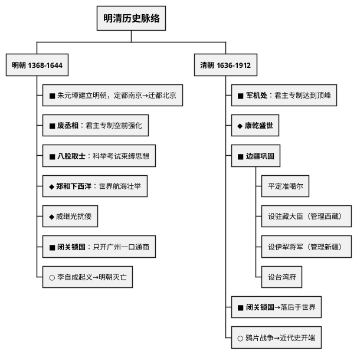
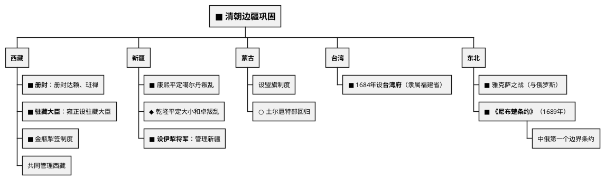

# 明清时期（1368—1912年）

## 考点总览

| 时期 | 时间 | 核心考点 | 掌握等级 |
|------|------|---------|---------|
| 明朝 | 1368—1644年 | 废丞相设三司、八股取士、郑和下西洋、闭关锁国 | ■背 |
| 清朝 | 1636—1912年 | 军机处、康乾盛世、闭关锁国、边疆巩固 | ■背 |

---

## 一、明朝（1368—1644年）

### 1. 明朝建立

- **建立者**：朱元璋（明太祖），1368年称帝
- **定都**：南京→1421年明成祖迁都**北京**
- 推翻元朝统治，恢复汉族政权

### 2. 君主专制的强化

#### ▲ 中央——废丞相 ■背

- **措施**：朱元璋废除丞相制度，六部直接对皇帝负责
- **影响**：皇权空前加强（但政务繁重）
- **内阁**：明成祖时设立内阁，协助皇帝处理政务（但非正式行政机构）

#### ▲ 地方——设三司 ◆理解

| 三司 | 职能 |
|------|------|
| **布政使司** | 行政、财政 |
| **按察使司** | 司法、监察 |
| **都指挥使司** | 军事 |

#### ▲ 厂卫制度 ◆理解

- **锦衣卫**（朱元璋设）、**东厂**（明成祖设）
- 监视百官，直接对皇帝负责
- 标志君主专制加强

#### ▲ 八股取士 ■背

- 科举考试只能以四书五经为内容
- 答题格式严格（八股文）
- **影响**：束缚了人们的思想

### 3. 郑和下西洋 ◆理解（高频考点）

- **时间**：1405—1433年，共七次
- **航海家**：郑和（宦官）
- **出发地**：刘家港（今江苏太仓）
- **到达地区**：东南亚、印度洋、红海沿岸、东非
- **目的**：宣扬国威，加强联系
- **意义**：是世界航海史上的壮举，促进了中国与亚非各国的友好往来

> **郑和下西洋口诀**："**郑和七次下西洋，刘家港出发到东非，宣扬国威交朋友**"

### 4. 戚继光抗倭 ◆理解

- **倭寇**：日本武士和海盗
- **戚继光**组建"戚家军"，在东南沿海抗击倭寇
- **结果**：基本肃清了倭患

### 5. 闭关锁国 ■背

- **背景**：明朝中后期，海防松弛，倭寇猖獗
- **内容**：限制海外贸易，只开**广州**一口通商

### 6. 明朝灭亡

- **李自成起义**：1644年攻入北京，明朝灭亡
- **清军入关**：吴三桂引清军入关，击败李自成

---

## 二、清朝（1636—1912年）

### 1. 清朝建立

- **满族**的前身是女真族
- **1616年**：努尔哈赤建立后金
- **1636年**：皇太极改国号为大清
- **1644年**：清军入关，迁都北京

### 2. 君主专制的顶峰

#### ▲ 军机处 ■背

- **设立**：雍正帝
- **职能**：处理军务，后成为辅助皇帝处理政务的中枢机构
- **特点**：军机大臣跪受笔录，军国大事由皇帝裁决
- **影响**：**君主专制达到顶峰**

> **君主专制演变顺序**：
> 秦：三公九卿 → 隋唐：三省六部 → 明：废丞相 → 清：**军机处（顶峰）**

#### ▲ 文字狱 ◆理解

- 从知识分子的文章词句中摘取片段，罗织罪名
- **目的**：压制汉人的反抗，加强思想控制
- **影响**：禁锢了思想自由

### 3. 康乾盛世 ◆理解

- 康熙、雍正、乾隆三朝（约100年）
- 社会稳定，经济发展，人口增长
- 是清朝鼎盛时期

### 4. 边疆巩固 ■背

#### 对西藏的管辖

| 措施 | 内容 | 掌握等级 |
|------|------|---------|
| **册封** | 顺治册封达赖喇嘛；康熙册封班禅额尔德尼 | ■背 |
| **驻藏大臣** | 雍正设驻藏大臣，与达赖班禅共同管理西藏 | ■背 |
| **金瓶掣签** | 转世灵童由金瓶掣签决定 | ◆理解 |

> **西藏口诀**："**册封达赖和班禅，设置驻藏大臣管，金瓶掣签定灵童**"

#### 对新疆的管辖

| 事件 | 人物 | 掌握等级 |
|------|------|---------|
| 平定噶尔丹叛乱 | 康熙 | ■背 |
| 平定大小和卓叛乱 | 乾隆 | ◆理解 |
| 设伊犁将军 | 乾隆 | ■背 |

#### 对台湾的管辖

- 1684年，清朝**设台湾府**，隶属福建省 ■背
- 加强了台湾与祖国内地的联系

#### 雅克萨之战与《尼布楚条约》

- 1685—1686年：康熙组织雅克萨之战，击败沙俄
- **1689年**：中俄签订**《尼布楚条约》**■背
- 意义：中俄第一个边界条约，从法律上肯定了黑龙江和乌苏里江流域是中国领土

### 5. 清朝的闭关锁国 ■背

- **原因**：自给自足的经济、维护统治稳定、防范外来侵略
- **表现**：严格限制海外贸易，只开放**广州**一口通商
- **影响**：
  - ✅ 维护了国家主权
  - ❌ 导致中国**落后于世界潮流**（最重要影响！）

> **对比记忆**：
> 明朝时**郑和下西洋**（开放）→ 清朝**闭关锁国**（封闭）
> → 中国从领先走向落后

---

## 三、明清文化

| 领域 | 成就 | 作者/人物 | 掌握等级 |
|------|------|----------|---------|
| **建筑** | 明长城 | — | ◆理解 |
| **建筑** | 北京城（紫禁城） | 明成祖 | ◆理解 |
| **科技** | 《本草纲目》 | 李时珍 | ■背 |
| **科技** | 《天工开物》"中国17世纪的工艺百科全书" | 宋应星 | ◆理解 |
| **小说** | 《三国演义》 | 罗贯中 | ○了解 |
| **小说** | 《水浒传》 | 施耐庵 | ○了解 |
| **小说** | 《西游记》 | 吴承恩 | ○了解 |
| **小说** | 《红楼梦》（中国古典小说最高峰） | 曹雪芹 | ◆理解 |

> **明清科技口诀**："**时珍本草纲目全，应星天工开物赞**"

---

### ✨ 中考高频考点

| 考点 | 必背内容 | 出题方式 |
|------|---------|---------|
| 明废丞相 | 朱元璋废丞相，六部直接对皇帝负责，皇权加强 | 选择题 |
| 八股取士 | 四书五经内容，八股文格式，束缚思想 | 选择题 |
| 军机处 | 雍正设，君主专制达到顶峰 | 选择、材料 |
| 闭关锁国 | 只开广州一口通商，导致落后于世界潮流 | 材料分析题 |
| 清朝边疆巩固 | 驻藏大臣（西藏）、伊犁将军（新疆）、台湾府 | 材料分析题 |
| 《尼布楚条约》 | 1689年中俄第一个边界条约 | 选择题 |

---

## 📌 必背清单

| 序号 | 考点 | 要求 |
|------|------|------|
| 1 | 明朝废丞相（加强皇权） | ■必背 |
| 2 | 八股取士及其危害 | ■必背 |
| 3 | 军机处（君主专制达到顶峰） | ■必背 |
| 4 | 郑和下西洋（时间、次数、到达地区、意义） | ◆理解 |
| 5 | 闭关锁国政策及影响 | ■必背 |
| 6 | 清朝对西藏的管辖（册封、驻藏大臣、金瓶掣签） | ■必背 |
| 7 | 清朝设台湾府（1684年） | ■必背 |
| 8 | 《尼布楚条约》 | ■必背 |
| 9 | 设伊犁将军（新疆） | ■必背 |
| 10 | 李时珍《本草纲目》 | ■必背 |
| 11 | 戚继光抗倭 | ◆理解 |
| 12 | 康乾盛世 | ◆理解 |
