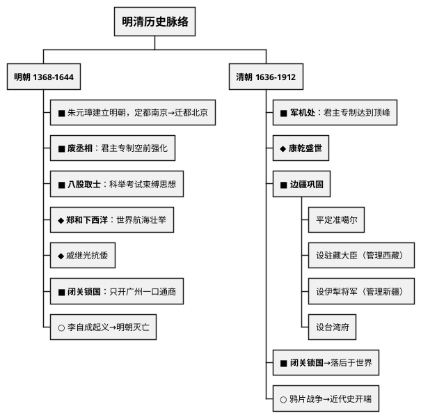
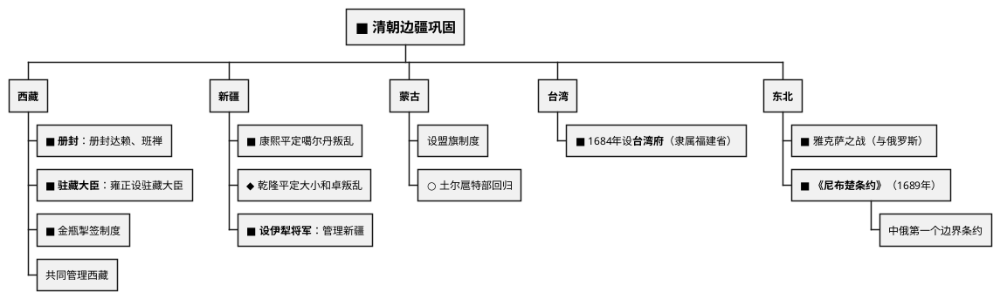

# 明清时期（1368—1912年）

## 考点总览

| 时期 | 时间 | 核心考点 | 掌握等级 |
|------|------|---------|---------|
| 明朝 | 1368—1644年 | 废丞相设三司、八股取士、郑和下西洋、闭关锁国 | ■背 |
| 清朝 | 1636—1912年 | 军机处、康乾盛世、闭关锁国、边疆巩固 | ■背 |

---

## 一、明朝（1368—1644年）

### 1. 明朝建立

- **建立者**：朱元璋（明太祖），1368年称帝
- **定都**：南京→1421年明成祖迁都**北京**
- 推翻元朝统治，恢复汉族政权

### 2. 君主专制的强化

#### ▲ 中央——废丞相 ■背

- **措施**：朱元璋废除丞相制度，六部直接对皇帝负责
- **影响**：皇权空前加强（但政务繁重）
- **内阁**：明成祖时设立内阁，协助皇帝处理政务（但非正式行政机构）

#### ▲ 地方——设三司 ◆理解

| 三司 | 职能 |
|------|------|
| **布政使司** | 行政、财政 |
| **按察使司** | 司法、监察 |
| **都指挥使司** | 军事 |

#### ▲ 厂卫制度 ◆理解

- **锦衣卫**（朱元璋设）、**东厂**（明成祖设）
- 监视百官，直接对皇帝负责
- 标志君主专制加强

#### ▲ 八股取士 ■背

- 科举考试只能以四书五经为内容
- 答题格式严格（八股文）
- **影响**：束缚了人们的思想

### 3. 郑和下西洋 ◆理解（高频考点）

- **时间**：1405—1433年，共七次
- **航海家**：郑和（宦官）
- **出发地**：刘家港（今江苏太仓）
- **到达地区**：东南亚、印度洋、红海沿岸、东非
- **目的**：宣扬国威，加强联系
- **意义**：是世界航海史上的壮举，促进了中国与亚非各国的友好往来

> **郑和下西洋口诀**："**郑和七次下西洋，刘家港出发到东非，宣扬国威交朋友**"

### 4. 戚继光抗倭 ◆理解

- **倭寇**：日本武士和海盗
- **戚继光**组建"戚家军"，在东南沿海抗击倭寇
- **结果**：基本肃清了倭患

### 5. 闭关锁国 ■背

- **背景**：明朝中后期，海防松弛，倭寇猖獗
- **内容**：限制海外贸易，只开**广州**一口通商

### 6. 明朝灭亡

- **李自成起义**：1644年攻入北京，明朝灭亡
- **清军入关**：吴三桂引清军入关，击败李自成

---

## 二、清朝（1636—1912年）

### 1. 清朝建立

- **满族**的前身是女真族
- **1616年**：努尔哈赤建立后金
- **1636年**：皇太极改国号为大清
- **1644年**：清军入关，迁都北京

### 2. 君主专制的顶峰

#### ▲ 军机处 ■背

- **设立**：雍正帝
- **职能**：处理军务，后成为辅助皇帝处理政务的中枢机构
- **特点**：军机大臣跪受笔录，军国大事由皇帝裁决
- **影响**：**君主专制达到顶峰**

> **君主专制演变顺序**：
> 秦：三公九卿 → 隋唐：三省六部 → 明：废丞相 → 清：**军机处（顶峰）**

#### ▲ 文字狱 ◆理解

- 从知识分子的文章词句中摘取片段，罗织罪名
- **目的**：压制汉人的反抗，加强思想控制
- **影响**：禁锢了思想自由

### 3. 康乾盛世 ◆理解

- 康熙、雍正、乾隆三朝（约100年）
- 社会稳定，经济发展，人口增长
- 是清朝鼎盛时期

### 4. 边疆巩固 ■背

#### 对西藏的管辖

| 措施 | 内容 | 掌握等级 |
|------|------|---------|
| **册封** | 顺治册封达赖喇嘛；康熙册封班禅额尔德尼 | ■背 |
| **驻藏大臣** | 雍正设驻藏大臣，与达赖班禅共同管理西藏 | ■背 |
| **金瓶掣签** | 转世灵童由金瓶掣签决定 | ◆理解 |

> **西藏口诀**："**册封达赖和班禅，设置驻藏大臣管，金瓶掣签定灵童**"

#### 对新疆的管辖

| 事件 | 人物 | 掌握等级 |
|------|------|---------|
| 平定噶尔丹叛乱 | 康熙 | ■背 |
| 平定大小和卓叛乱 | 乾隆 | ◆理解 |
| 设伊犁将军 | 乾隆 | ■背 |
| **新疆建省**（1884年） | 清政府在新疆设立行省 | ■背 |

#### 对台湾的管辖

- 1684年，清朝**设台湾府**，隶属福建省 ■背
- 加强了台湾与祖国内地的联系

#### 雅克萨之战与《尼布楚条约》

- 1685—1686年：康熙组织雅克萨之战，击败沙俄
- **1689年**：中俄签订**《尼布楚条约》**■背
- 意义：中俄第一个边界条约，从法律上肯定了黑龙江和乌苏里江流域是中国领土

### 5. 清朝的闭关锁国 ■背

- **原因**：自给自足的经济、维护统治稳定、防范外来侵略
- **表现**：严格限制海外贸易，只开放**广州**一口通商
- **影响**：
  - ✅ 维护了国家主权
  - ❌ 导致中国**落后于世界潮流**（最重要影响！）

> **对比记忆**：
> 明朝时**郑和下西洋**（开放）→ 清朝**闭关锁国**（封闭）
> → 中国从领先走向落后

---

## 三、明清文化

| 领域 | 成就 | 作者/人物 | 掌握等级 |
|------|------|----------|---------|
| **建筑** | 明长城 | — | ◆理解 |
| **建筑** | 北京城（紫禁城） | 明成祖 | ◆理解 |
| **科技** | 《本草纲目》 | 李时珍 | ■背 |
| **科技** | 《天工开物》"中国17世纪的工艺百科全书" | 宋应星 | ◆理解 |
| **小说** | 《三国演义》 | 罗贯中 | ○了解 |
| **小说** | 《水浒传》 | 施耐庵 | ○了解 |
| **小说** | 《西游记》 | 吴承恩 | ○了解 |
| **小说** | 《红楼梦》（中国古典小说最高峰） | 曹雪芹 | ◆理解 |

> **明清科技口诀**："**时珍本草纲目全，应星天工开物赞**"

---

### ✨ 中考高频考点

| 考点 | 必背内容 | 出题方式 |
|------|---------|---------|
| 明废丞相 | 朱元璋废丞相，六部直接对皇帝负责，皇权加强 | 选择题 |
| 八股取士 | 四书五经内容，八股文格式，束缚思想 | 选择题 |
| 军机处 | 雍正设，君主专制达到顶峰 | 选择、材料 |
| 闭关锁国 | 只开广州一口通商，导致落后于世界潮流 | 材料分析题 |
| 清朝边疆巩固 | 驻藏大臣（西藏）、伊犁将军（新疆）、台湾府 | 材料分析题 |
| 《尼布楚条约》 | 1689年中俄第一个边界条约 | 选择题 |

---

## 📌 必背清单

| 序号 | 考点 | 要求 |
|------|------|------|
| 1 | 明朝废丞相（加强皇权） | ■必背 |
| 2 | 八股取士及其危害 | ■必背 |
| 3 | 军机处（君主专制达到顶峰） | ■必背 |
| 4 | 郑和下西洋（时间、次数、到达地区、意义） | ◆理解 |
| 5 | 闭关锁国政策及影响 | ■必背 |
| 6 | 清朝对西藏的管辖（册封、驻藏大臣、金瓶掣签） | ■必背 |
| 7 | 清朝设台湾府（1684年） | ■必背 |
| 8 | 《尼布楚条约》 | ■必背 |
| 9 | 设伊犁将军（新疆） | ■必背 |
| 10 | 李时珍《本草纲目》 | ■必背 |
| 11 | 戚继光抗倭 | ◆理解 |
| 12 | 康乾盛世 | ◆理解 |

---

# 📝 填空题

---

# 明清时期 · 填空题

**班级：\_\_\_\_\_\_\_\_ 姓名：\_\_\_\_\_\_\_\_ 得分：\_\_\_\_\_\_\_\_**

---

## 一、明朝

1. 1368年，\_\_\_\_\_\_\_（明太祖）建立明朝，定都\_\_\_\_\_\_\_。1421年\_\_\_\_\_\_\_迁都\_\_\_\_\_\_\_。

2. **废丞相**：朱元璋废除\_\_\_\_\_\_\_，六部直接对\_\_\_\_\_\_\_负责，\_\_\_\_\_\_空前加强。

3. **八股取士**：科举以\_\_\_\_\_\_\_\_\_为内容，答题格式严格（\_\_\_\_\_\_\_\_），束缚了人们思想。

4. **郑和下西洋**（\_\_\_\_—\_\_\_\_年，共\_\_\_\_次）：
   - 航海家：\_\_\_\_\_\_\_（宦官）
   - 出发地：\_\_\_\_\_\_\_（今江苏太仓）
   - 到达：\_\_\_\_\_\_\_、印度洋、红海沿岸、\_\_\_\_\_\_\_
   - 意义：世界航海史上的壮举，促进了中国与亚非各国的友好往来

5. **戚继光抗倭**：\_\_\_\_\_\_\_组建"\_\_\_\_\_\_\_"，在东南沿海抗击倭寇。

6. **闭关锁国**：限制海外贸易，只开\_\_\_\_\_\_\_一口通商。

7. 1644年，\_\_\_\_\_\_\_起义攻入北京，明朝灭亡。\_\_\_\_\_\_\_引清军入关。

## 二、清朝

8. 1616年\_\_\_\_\_\_\_建立后金；1636年\_\_\_\_\_\_\_改国号为清；1644年清军入关。

9. **军机处**（\_\_\_\_\_\_帝设立）：辅助皇帝处理政务，\_\_\_\_\_\_\_\_\_\_\_\_\_\_\_\_\_\_达到顶峰。

10. **边疆巩固**：
    - **西藏**：册封\_\_\_\_\_\_\_和\_\_\_\_\_\_\_；雍正设\_\_\_\_\_\_\_\_\_，共同管理西藏；\_\_\_\_\_\_\_\_\_制度确定转世灵童
    - **新疆**：康熙平定\_\_\_\_\_\_\_叛乱；乾隆设\_\_\_\_\_\_\_\_\_管理新疆
    - **台湾**：1684年设\_\_\_\_\_\_\_，隶属\_\_\_\_\_\_\_省
    - **东北**：康熙组织\_\_\_\_\_\_\_之战，击败沙俄；签订《\_\_\_\_\_\_\_\_\_\_\_》（1689年），是中俄第一个边界条约

11. **闭关锁国**：
    - 原因：自给自足的经济、维护统治稳定
    - 表现：只开放\_\_\_\_\_\_\_一口通商
    - 影响：导致中国\_\_\_\_\_\_\_\_\_\_\_\_\_\_\_\_

## 三、文化

12. 李时珍著《\_\_\_\_\_\_\_\_\_\_\_》，宋应星著《\_\_\_\_\_\_\_\_\_\_\_》被称为"中国17世纪的工艺百科全书"。

13. 曹雪芹著《\_\_\_\_\_\_\_\_\_\_\_》，是中国古典小说的最高峰。

14. 1884年，清政府在\_\_\_\_\_\_设立行省，加强了西北边疆治理。

**参考答案：**
14. 新疆

1. 朱元璋，南京，明成祖，北京
2. 丞相，皇帝，皇权（君主专制）
3. 四书五经，八股文
4. 1405，1433，7，郑和，刘家港，东南亚，东非
5. 戚继光，戚家军
6. 广州
7. 李自成，吴三桂
8. 努尔哈赤，皇太极
9. 雍正，君主专制
10. 达赖，班禅；驻藏大臣；金瓶掣签。噶尔丹；伊犁将军。台湾府，福建。雅克萨，尼布楚条约
11. 广州，落后于世界潮流
12. 本草纲目，天工开物
13. 红楼梦

---

# 📝 材料题专项

---

# 明清时期 · 材料题专项

> 本文件梳理该专题中考材料分析题的出题角度和答题要点。

---

## 材料分析题通用答题模板

### 第一步：读材料
- 看材料出处（谁写的、什么书）
- 圈关键词（人名、制度名、主张等）

### 第二步：联想教材
- 把材料中的关键词映射到教材知识点
- 确定考查的是哪个时期、哪个知识点

### 第三步：组织答案
- 按"是什么→为什么→怎么样"的逻辑组织
- 如果是评价类问题，注意 **一分为二**（积极+局限）
- 如果是启示类问题，从 **历史联系现实** 作答

---

## 一、军机处

### 出题角度

**角度1：给出军机处的职能描述，问设立的目的和影响**

常见材料："军机大臣跪受笔录""军国大事由皇帝裁决"

**角度2：考查君主专制演变线索**

常见问法："从秦到清，君主专制是如何演变的？"

### 答题要点

- **设立**：雍正帝
- **职能**：辅助皇帝处理政务，军国大事由皇帝裁决
- **特点**：军机大臣跪受笔录
- **影响**：君主专制达到顶峰

**君主专制演变线索**：
秦（三公九卿）→ 隋唐（三省六部）→ 明（废丞相）→ **清（军机处，顶峰）**

---

## 二、闭关锁国

### 出题角度

**角度1：给出闭关锁国的材料，问内容和影响**

**角度2：对比开放与封闭——对比郑和下西洋与清朝闭关锁国**

**角度3：现实联系——"闭关锁国对我们今天的启示"**

### 答题要点

| 考点 | 必答内容 |
|------|---------|
| **表现** | 只开放广州一口通商，严格限制海外贸易 |
| **原因** | 自给自足经济；维护统治稳定；防范外来侵略 |
| **积极** | 一定程度上维护了国家主权 |
| **消极** | 导致中国落后于世界潮流（核心影响） |
| **对比** | 明郑和下西洋（开放）→ 清闭关锁国（封闭）→ 中国从领先走向落后 |
| **启示** | 对外开放才能进步，闭关自守必然落后 |

---

## 三、清朝边疆巩固

### 出题角度

**角度1：给出地图，要求填写清朝管理边疆的措施**

**角度2：给出对西藏管理的材料，问具体措施**

### 答题要点

| 地区 | 措施 | 意义 |
|------|------|------|
| **西藏** | 册封达赖班禅；设驻藏大臣；金瓶掣签 | 加强了对西藏的管辖 |
| **新疆** | 平定噶尔丹叛乱；设伊犁将军 | 加强了对新疆的管辖 |
| **台湾** | 1684年设台湾府（隶属福建省） | 加强了台湾与内地的联系 |
| **东北** | 雅克萨之战；《尼布楚条约》（1689年） | 从法律上肯定领土主权 |

---

## 四、新疆建省

### 出题角度

- 给出清政府治理新疆的材料，问新疆建省的时间、意义及其与之前的管理措施（伊犁将军）的关系

### 答题要点

- **时间**：1884年
- **设置**：清政府在新疆设立行省
- **意义**：加强了西北边疆治理，与之前设伊犁将军等举措一脉相承
- **与西域都护的关系**：前60年西汉设西域都护→唐设安西都护府→清设伊犁将军→1884年新疆建省

---

## 考前速记

> **军机处**："雍正设军机，君主专制到顶峰"  
> **闭关锁国**："一口通商广州城，闭关落后世界潮"  
> **边疆**："驻藏大臣管西藏，伊犁将军镇新疆，台湾府设闽省管"

---

## 参考答案

