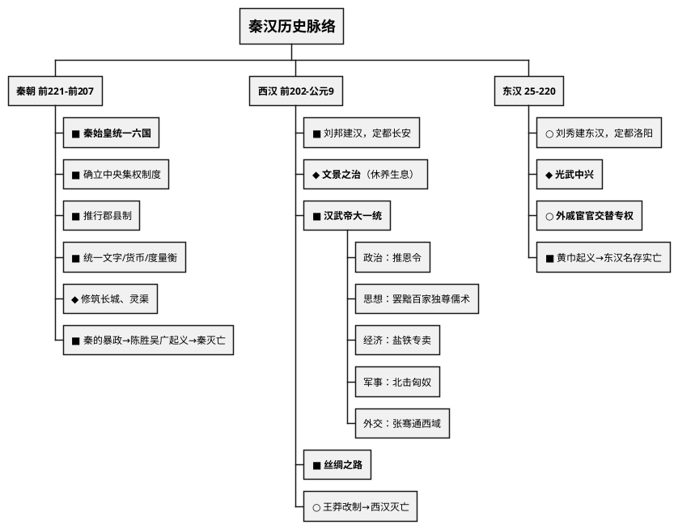
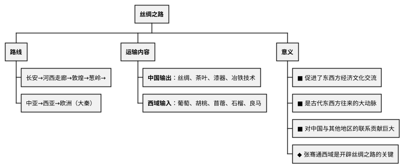

# 秦汉时期

## 考点总览

| 时期 | 时间 | 建立者/皇帝 | 重要考点 | 掌握等级 |
|------|------|-----------|---------|---------|
| 秦朝 | 前221—前207年 | 秦始皇（嬴政） | 统一六国、中央集权、郡县制、暴政灭亡 | ■背 |
| 西汉 | 前202—9年 | 刘邦 | 文景之治、汉武帝大一统、丝绸之路 | ■背 |
| 东汉 | 25—220年 | 刘秀 | 光武中兴、外戚宦官交替专权 | ◆理解 |

---

## 一、秦朝（前221—前207年）

### 1. 秦统一六国 ■背

- **时间**：公元前230—前221年，秦王嬴政先后灭韩、赵、魏、楚、燕、齐
- **结果**：建立了中国历史上**第一个统一的多民族的封建国家**
- **定都**：咸阳

### 2. 秦始皇巩固统一的措施 ■背（高频考点）

#### 政治——确立中央集权制度

| 措施 | 内容 | 作用 |
|------|------|------|
| **皇帝制** | 称"始皇帝"，总揽大权 | 最高统治者 |
| **三公九卿** | 丞相（行政）、太尉（军事）、御史大夫（监察） | 中央官僚体系 |
| **郡县制** | 全国分为36郡，郡下设县 | 加强了中央集权 |

#### 经济文化——统一措施

| 措施 | 内容 |
|------|------|
| **统一文字** | 以小篆为标准字体 |
| **统一货币** | 以圆形方孔半两钱为标准货币 |
| **统一度量衡** | 统一尺寸、升斗、斤两 |
| **车同轨** | 统一车轨宽度，修筑驰道 |

#### 军事——北御南征

- ■ **修筑长城**：抵御匈奴，西起临洮，东到辽东
- ■ **开凿灵渠**：沟通湘江和漓江，连接长江水系和珠江水系
- ○ **开发岭南**：设桂林、南海、象郡

### 3. 秦的暴政与灭亡 ■背

| 暴政表现 | 具体内容 |
|---------|---------|
| 徭役繁重 | 修长城、阿房宫、骊山陵墓 |
| 赋税沉重 | 征收大量赋税 |
| 刑罚残酷 | 连坐、族诛等酷刑 |
| 焚书坑儒 | 禁锢思想，销毁书籍 |

- **陈胜吴广起义**（前209年）：中国历史上第一次大规模农民起义
  - 口号："王侯将相宁有种乎"
  - 地点：大泽乡
- **刘邦灭秦**：前207年，刘邦攻入咸阳，秦朝灭亡

### 4. 记忆口诀

> **统一措施口诀**："书同文车同轨，币同形度量同"
>
> **三公职能**："丞相管行政，太尉管军事，御史大夫管监察"
>
> **秦亡原因**："徭役重赋税重，刑罚残酷焚书坑"

---

## 二、西汉（前202—9年）

### 1. 西汉建立 ■背

- **楚汉之争**：刘邦与项羽争夺天下
- **垓下之围**：项羽兵败自刎乌江
- **刘邦称帝**：前202年建立西汉，定都长安

### 2. 文景之治 ◆理解

- **汉高祖**：实行休养生息政策
- **汉文帝、汉景帝**：
  - 注重以农为本，减轻赋税（"三十税一"）
  - 废除一些严刑峻法
  - 提倡节俭
- **结果**：政治清明，经济发展，社会稳定 → 史称"**文景之治**"

### 3. 汉武帝大一统 ■背（中考核心！）

#### ▲ 政治——推恩令

- **背景**：诸侯国势力强大，威胁中央
- **内容**：规定诸侯王死后，由嫡长子和其他子弟共同继承封地
- **效果**：诸侯国越分越小，势力削弱，加强了中央集权

#### ▲ 思想——罢黜百家，独尊儒术

- **提出者**：董仲舒
- **内容**：排斥其他各家学说，把儒家学说立为正统思想
- **影响**：确立了儒家思想在中国的**正统地位**，影响此后两千多年

#### ▲ 经济——加强中央集权

- 铸币权收归中央（**五铢钱**）
- **盐铁专卖**：由国家统一经营盐和铁
- 平抑物价

#### ▲ 军事——北击匈奴

- **卫青、霍去病**率军北击匈奴
- 漠北战役：匈奴主力被歼，不敢南下

#### ▲ 外交——张骞通西域

| 次数 | 时间 | 目的 | 结果 |
|------|------|------|------|
| 第一次 | 前138年 | 联络大月氏夹击匈奴 | 未达目的，但了解了西域情况 |
| 第二次 | 前119年 | 加强与西域各国的联系 | 促进了汉朝与西域的往来 |

### 4. 丝绸之路 ■背

> **丝绸之路口诀**："长安出发过河西，经敦煌到葱岭，中亚西亚到欧洲，丝绸茶叶传西方，葡萄胡桃进中原"

### 5. 西汉灭亡

- 西汉后期，土地兼并严重，社会矛盾尖锐
- **王莽**篡权，建立"新朝"（9—25年）
- 王莽改革失败，绿林赤眉起义

---

## 三、东汉（25—220年）

### 1. 光武中兴 ◆理解

- **建立者**：刘秀（光武帝），定都洛阳
- **措施**：
  - 释放奴隶，减轻赋税
  - 整顿吏治，严惩贪官
- **结果**：社会安定，经济恢复 → "光武中兴"

### 2. 东汉中后期 ◆理解

- **外戚宦官交替专权**：皇帝年幼时，外戚掌权；皇帝长大后，依靠宦官夺权
- **后果**：政治腐败，朝政混乱
- **豪强地主**势力壮大，形成割据

### 3. 东汉灭亡 ■背

- **黄巾起义**（184年）：张角创立"太平道"，领导农民起义
- **影响**：东汉政权名存实亡，地方州郡割据
- **220年**：曹丕称帝，东汉灭亡，进入三国时期

---

## 四、秦汉时期的文化成就

| 领域 | 成就 | 人物 | 掌握等级 |
|------|------|------|---------|
| **史学** | 《史记》——第一部纪传体通史 | 司马迁 | ■背 |
| **医学** | "医圣"——《伤寒杂病论》 | 张仲景 | ○了解 |
| **医学** | "神医"——发明"麻沸散" | 华佗 | ○了解 |
| **造纸术** | 改进造纸术——"蔡侯纸" | 蔡伦 | ■背 |
| **宗教** | 佛教传入（西汉末年） | — | ◆理解 |
| **宗教** | 道教产生（东汉末年） | — | ○了解 |

> **《史记》口诀**："司马迁写史记，通史纪传第一部，黄帝写到汉武帝"

> **造纸术口诀**："蔡伦改进造纸术，轻便廉价传天下"

---

### ✨ 中考高频考点

| 考点 | 必背内容 | 出题方式 |
|------|---------|---------|
| 秦统一六国 | 第一个统一的多民族封建国家 | 选择题、填空 |
| 秦始皇巩固统一 | 皇帝制、三公九卿、郡县制、统一文字货币度量衡 | 材料分析题 |
| 秦的暴政与灭亡 | 徭役赋税繁重、焚书坑儒、陈胜吴广起义 | 选择题 |
| 汉武帝大一统 | 推恩令、独尊儒术、盐铁专卖、北击匈奴、张骞通西域 | 材料分析题 |
| 丝绸之路 | 路线（长安→河西走廊→西域→中亚→欧洲）、交流内容 | 材料分析题 |
| 蔡伦改进造纸术 | 蔡侯纸，促进文化传播 | 选择题、填空 |

---

## 📌 必背清单

| 序号 | 考点 | 要求 |
|------|------|------|
| 1 | 秦统一六国的意义 | ■必背 |
| 2 | 秦始皇巩固统一的措施（政治、经济、文化、军事） | ■必背 |
| 3 | 秦的暴政表现与陈胜吴广起义 | ■必背 |
| 4 | 汉武帝大一统（推恩令、独尊儒术、盐铁专卖） | ■必背 |
| 5 | 丝绸之路的路线、交流内容、意义 | ■必背 |
| 6 | 张骞通西域的目的和意义 | ■必背 |
| 7 | 文景之治 | ◆理解 |
| 8 | 司马迁与《史记》 | ■必背 |
| 9 | 蔡伦改进造纸术 | ■必背 |
| 10 | 东汉外戚宦官专权、黄巾起义 | ◆理解 |
