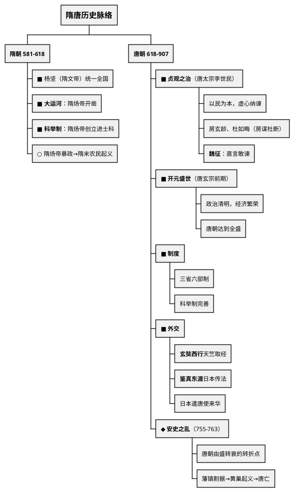
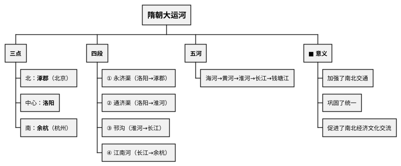
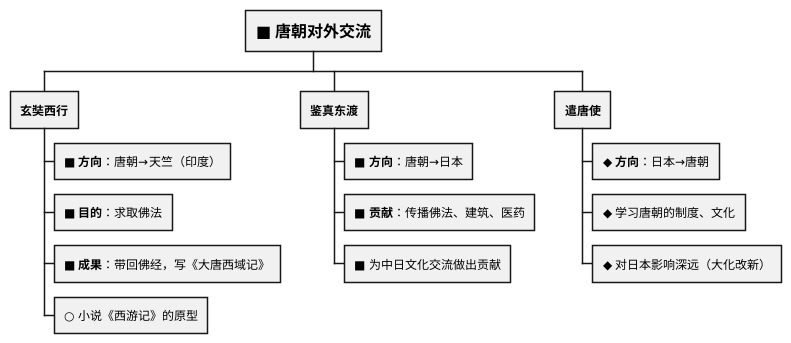

# 隋唐时期（581—907年）

## 考点总览

| 时期 | 时间 | 核心考点 | 掌握等级 |
|------|------|---------|---------|
| 隋朝 | 581—618年 | 大运河、科举制创立 | ■背 |
| 唐朝 | 618—907年 | 贞观之治、开元盛世、三省六部 | ■背 |
| 唐朝外交 | — | 玄奘西行、鉴真东渡、遣唐使 | ■背 |
| 唐朝灭亡 | — | 安史之乱、黄巢起义、藩镇割据 | ■背 |

---

## 一、隋朝（581—618年）

### 1. 隋的统一 ◆理解

- **建立**：581年，北周外戚杨坚（隋文帝）建立隋朝，定都长安
- **统一**：589年，隋灭陈，统一全国
- **意义**：结束了长期分裂的局面

### 2. 大运河 ■背（高频考点）

- **开凿者**：隋炀帝杨广
- **目的**：加强南北交通，巩固统治
- **三点**：中心<b>洛阳</b>、北端<b>涿郡</b>（北京）、南端<b>余杭</b>（杭州）
- **四段**：永济渠、通济渠、邗沟、江南河
- **五河**：海河、黄河、淮河、长江、钱塘江

> **大运河口诀**："**三点四段通五河，涿郡洛阳到余杭**"

### 3. 科举制 ■背（高频考点）

- **创立**：隋炀帝创立<b>进士科</b>，标志着科举制的正式形成
- **意义**：加强了皇帝在选官上的权力，扩大了官吏选拔范围

> **科举制口诀**："**隋炀帝设进士科，科举制度从此始**"

### 4. 隋朝灭亡

- 隋炀帝暴政（徭役繁重）
- 隋末农民起义
- 618年，隋炀帝被杀，隋亡

---

## 二、唐朝（618—907年）

### 1. 唐朝建立

- 618年，李渊（唐高祖）建立唐朝，定都长安
- 李世民发动"玄武门之变"，继位（唐太宗）

### 2. 贞观之治 ■背（高频考点）

- **皇帝**：唐太宗李世民
- **重要人物**：
  - **魏征**：直言敢谏，被唐太宗称为"镜子"
  - **房玄龄、杜如晦**："房谋杜断"

| 方面 | 措施 |
|------|------|
| **政治** | 完善三省六部制；修订法律 |
| **经济** | 减轻赋税，鼓励发展生产 |
| **用人** | 虚心纳谏，知人善任 |
| **民族** | 民族平等，被尊为"天可汗" |

- **评价**：政治清明，经济发展，国力强盛 → **贞观之治**

> **贞观之治口诀**："**太宗虚心纳谏言，魏征房杜在身边，减轻赋税促生产，贞观之治美名传**"

### 3. 三省六部制 ◆理解

- **中书省**：草拟政令→**门下省**：审核政令→**尚书省**：执行政令
- **尚书省下设六部**：吏户礼兵刑工

### 4. 开元盛世 ■背（高频考点）

- **皇帝**：唐玄宗（前期）
- **措施**：整顿吏治，发展经济，注重文教
- **结果**：唐朝达到<b>全盛</b>时期 → **"开元盛世"**

### 5. 唐朝的民族关系

| 民族 | 事件 | 掌握等级 |
|------|------|---------|
| **吐蕃**（西藏） | 文成公主入藏（嫁给松赞干布） | ■背 |
| | 金城公主入藏 | ◆理解 |
| | 促进了汉藏友好 | ■背 |
| **突厥** | 击败东突厥，设立都护府 | ○了解 |

> **文成公主口诀**："**文成公主嫁吐蕃，松赞干布好姻缘，汉藏友好传佳话**"

### 6. 唐朝的对外交流

> **对外交流对比口诀**：
> "**玄奘西行去取经，鉴真东渡传佛学，遣唐使来学制度，唐朝开放通世界**"

### 7. 唐朝的文学艺术

| 领域 | 成就 | 代表人物 | 掌握等级 |
|------|------|---------|---------|
| **诗歌** | 唐诗黄金时代 | 李白（诗仙）、杜甫（诗圣）、白居易 | ■背 |
| **书法** | 书法艺术兴盛 | 颜真卿、柳公权 | ○了解 |
| **绘画** | — | 阎立本、吴道子（画圣） | ○了解 |

> **唐诗口诀**："**李白诗仙浪漫派，杜甫诗圣写现实，白居易的通俗诗**"

### 8. 唐朝的衰落

| 事件 | 时间 | 影响 | 掌握等级 |
|------|------|------|---------|
| **安史之乱** | 755—763年 | 唐朝由盛转衰的<b>转折点</b> | ■背 |
| **藩镇割据** | 唐中后期 | 地方节度使拥兵自重 | ◆理解 |
| **宦官专权** | 唐后期 | 朝政混乱 | ○了解 |
| **黄巢起义** | 875年 | 沉重打击唐朝统治 | ◆理解 |
| **唐朝灭亡** | 907年 | 朱温废唐建后梁 | ■背 |

---

### ✨ 中考高频考点

| 考点 | 必背内容 | 出题方式 |
|------|---------|---------|
| 大运河 | 三点（涿郡洛阳余杭）、四段、五河、意义 | 选择、材料 |
| 科举制 | 隋炀帝设进士科→科举制形成 | 选择题 |
| 贞观之治 | 唐太宗、魏征、以民为本、虚心纳谏 | 选择、材料 |
| 开元盛世 | 唐玄宗前期，唐朝全盛时期 | 选择题 |
| 文成公主入藏 | 嫁给松赞干布，促进汉藏友好 | 选择题 |
| 玄奘西行与鉴真东渡 | 玄奘→天竺取经；鉴真→日本传法 | 选择、材料 |
| 安史之乱 | 755—763年，唐朝由盛转衰的转折点 | 选择题 |

---

## 📌 必背清单

| 序号 | 考点 | 要求 |
|------|------|------|
| 1 | 大运河的三点、四段、五河及意义 | ■必背 |
| 2 | 科举制的创立（隋炀帝、进士科） | ■必背 |
| 3 | 贞观之治（唐太宗、魏征、措施） | ■必背 |
| 4 | 开元盛世（唐玄宗前期，全盛时期） | ■必背 |
| 5 | 文成公主入吐蕃 | ■必背 |
| 6 | 玄奘西行与鉴真东渡的方向、目的、成果 | ■必背 |
| 7 | 唐诗代表诗人（李白、杜甫、白居易） | ■必背 |
| 8 | 安史之乱（时间、影响→唐朝由盛转衰） | ■必背 |
| 9 | 三省六部制 | ◆理解 |
| 10 | 遣唐使 | ◆理解 |

---

# 📝 填空题

---

# 隋唐时期 · 填空题

**班级：\_\_\_\_\_\_\_\_ 姓名：\_\_\_\_\_\_\_\_ 得分：\_\_\_\_\_\_\_\_**

---

## 一、隋朝

1. 581年，\_\_\_\_\_\_\_建立隋朝，589年灭\_\_\_\_\_统一全国。

2. **大运河**（\_\_\_\_\_\_\_开凿）：
   - 三点：北\_\_\_\_\_\_\_、中心\_\_\_\_\_\_\_、南\_\_\_\_\_\_\_
   - 四段：\_\_\_\_\_\_\_、\_\_\_\_\_\_\_、\_\_\_\_\_\_\_、\_\_\_\_\_\_\_
   - 五河：\_\_\_\_\_\_、\_\_\_\_\_\_、\_\_\_\_\_\_、\_\_\_\_\_\_、\_\_\_\_\_\_\_
   - 意义：加强了\_\_\_\_\_\_\_\_，巩固了统一

3. **科举制**：\_\_\_\_\_\_\_创立\_\_\_\_\_\_\_科，标志着科举制正式形成。

## 二、唐朝

4. 618年，\_\_\_\_\_\_\_建立唐朝，定都\_\_\_\_\_\_\_。

5. **贞观之治**（\_\_\_\_\_\_\_）：
   - 虚心纳谏：大臣\_\_\_\_\_\_被比作"镜子"
   - 房玄龄、杜如晦："\_\_\_\_\_\_\_\_\_\_\_\_"
   - 措施：完善三省六部制，减轻\_\_\_\_\_\_，鼓励\_\_\_\_\_\_

6. **三省六部制**：\_\_\_\_\_\_省草拟→\_\_\_\_\_\_省审核→\_\_\_\_\_\_省执行

7. **开元盛世**（\_\_\_\_\_\_\_前期）：唐朝达到\_\_\_\_\_\_\_时期

8. **文成公主**嫁给\_\_\_\_\_\_\_（吐蕃赞普），促进了\_\_\_\_\_\_友好

9. **对外交流**：
   - \_\_\_\_\_\_\_西行天竺取经，写成《\_\_\_\_\_\_\_\_\_\_\_》
   - \_\_\_\_\_\_\_东渡日本，传播佛法
   - 日本派\_\_\_\_\_\_\_来华学习唐朝制度

10. **唐诗**：\_\_\_\_\_\_\_（诗仙）、\_\_\_\_\_\_\_（诗圣）、\_\_\_\_\_\_\_

11. **安史之乱**（\_\_\_\_—\_\_\_\_年）：唐朝由盛转衰的\_\_\_\_\_\_\_\_\_\_

12. 唐朝灭亡：\_\_\_\_\_\_年，\_\_\_\_\_\_废唐建后梁

**参考答案：**

1. 杨坚（隋文帝），陈
2. 隋炀帝；涿郡，洛阳，余杭；永济渠、通济渠、邗沟、江南河；海河、黄河、淮河、长江、钱塘江；南北交通
3. 隋炀帝，进士
4. 李渊（唐高祖），长安
5. 唐太宗李世民，魏征，房谋杜断，赋税，发展生产
6. 中书，门下，尚书
7. 唐玄宗，全盛
8. 松赞干布，汉藏
9. 玄奘，大唐西域记；鉴真；遣唐使
10. 李白，杜甫，白居易
11. 755，763，转折点
12. 907，朱温

---

# 📝 材料题专项

---

# 隋唐时期 · 材料题专项

---

## 一、大运河

### 出题角度

**角度1：给出大运河示意图，要求填写三点、四段**

常见填空形式：地图填空或列表

**角度2：问隋炀帝开凿大运河的目的和意义**

**角度3：评价类题目——"有人说大运河是功，有人说大运河是过"**

### 答题要点

| 考点 | 必答内容 |
|------|---------|
| **三点** | 北涿郡（北京）、中心洛阳、南余杭（杭州） |
| **四段** | 永济渠、通济渠、邗沟、江南河 |
| **五河** | 海河、黄河、淮河、长江、钱塘江 |
| **目的** | 加强南北交通，巩固统治 |
| **意义** | 加强南北交通，巩固统一，促进经济文化交流 |
| **评价** | 积极：上述意义；消极：劳民伤财，加重百姓负担 |

---

## 二、贞观之治

### 出题角度

**角度1：给出唐太宗言论材料，问体现的治国思想**

常见材料：
- "水能载舟，亦能覆舟" → 以民为本
- "以铜为镜……以人为镜" → 虚心纳谏（魏征）

**角度2：问贞观之治的表现和原因**

### 答题要点

| 考点 | 必答内容 |
|------|---------|
| **皇帝** | 唐太宗李世民 |
| **纳谏** | 魏征直言敢谏，被称为"镜子" |
| **用人** | 房玄龄、杜如晦（房谋杜断），知人善任 |
| **政治** | 完善三省六部制，修订法律 |
| **经济** | 减轻赋税，鼓励发展生产 |
| **民族** | 民族平等，被尊为"天可汗" |

---

## 三、玄奘西行与鉴真东渡

### 出题角度

**角度1：给出玄奘或鉴真的生平材料，判断是谁**

区分关键：
- 玄奘：唐朝→天竺（印度），求取佛法，写成《大唐西域记》
- 鉴真：唐朝→日本，传播佛法、建筑、医药

**角度2：对比两人的异同**

常考表格对比题

### 答题要点

| 对比项 | 玄奘西行 | 鉴真东渡 |
|--------|---------|---------|
| **方向** | 唐朝→天竺（印度） | 唐朝→日本 |
| **目的** | 求取佛法 | 传播佛法 |
| **成果** | 带回佛经，写《大唐西域记》 | 传播文化，促进中日交流 |
| **精神** | 不畏艰险，求学精神 | 坚持不懈，传播文化 |

**共同体现**：唐朝对外开放、兼容并包的时代特征

---

## 考前速记

> **大运河**："三点四段通五河，南北交通大动脉"  
> **贞观之治**："太宗纳谏用贤臣，轻徭薄赋民为本"  
> **对外交流**："玄奘西行去取经，鉴真东渡传佛法，唐朝开放通天下"

---

## 参考答案

