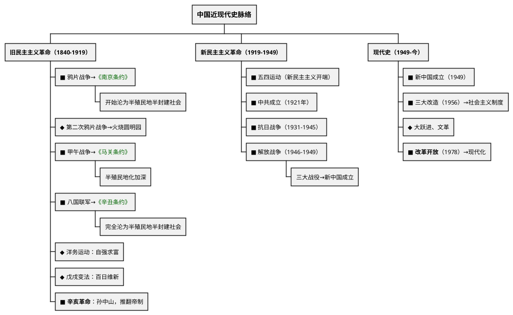

# 中国近现代史（1840年至今）

## 考点总览

| 时期 | 时间 | 核心考点 | 掌握等级 |
|------|------|---------|---------|
| 鸦片战争 | 1840—1842年 | 林则徐虎门销烟、《南京条约》 | ■背 |
| 第二次鸦片战争 | 1856—1860年 | 火烧圆明园、《北京条约》 | ◆理解 |
| 太平天国 | 1851—1864年 | 洪秀全、天京陷落 | ○了解 |
| 甲午中日战争 | 1894—1895年 | 《马关条约》 | ■背 |
| 八国联军侵华 | 1900—1901年 | 《辛丑条约》 | ■背 |
| 辛亥革命 | 1911年 | 孙中山、武昌起义、中华民国 | ■背 |
| 新民主主义革命 | 1919—1949年 | 五四运动、中共成立、长征、抗战、解放战争 | ■背 |
| 新中国成立后 | 1949年至今 | 建国、三大改造、改革开放 | ■背 |

---

## 一、近代化的阵痛与探索

### 1. 鸦片战争（1840—1842年）■背

| 项目 | 内容 |
|------|------|
| **背景** | 英国向中国走私鸦片，林则徐<b>虎门销烟</b>（1839年） |
| **结果** | 中国战败，签订<b>《南京条约》</b>（中国近代第一个不平等条约） |
| **《南京条约》** | 割香港岛；赔款2100万银元；开放五口通商；协定关税 |
| **影响** | 中国开始从封建社会沦为<b>半殖民地半封建社会</b>，近代史开端 |

### 2. 第二次鸦片战争（1856—1860年）◆理解

- **英法联军火烧圆明园**（1860年）
- **《北京条约》**：割九龙司给英国，增开通商口岸

### 3. 太平天国运动（1851—1864年）○了解

- 洪秀全领导，定都天京（南京）
- **《天朝田亩制度》**：平均分配土地

### 4. 甲午中日战争（1894—1895年）■背

| 项目 | 内容 |
|------|------|
| **事件** | 邓世昌黄海海战（致远舰） |
| **结果** | 中国战败，签订<b>《马关条约》</b> |
| **《马关条约》** | 割台湾及澎湖列岛；赔款2亿两；开放沙市等通商口岸；允许在通商口岸开设工厂 |
| **影响** | <b>半殖民地化程度大大加深</b> |

> **甲午口诀**："**马关割台赔两亿，开厂通商半殖民深**"

### 5. 八国联军侵华（1900—1901年）■背

- **八国**：英、美、俄、日、法、德、意、奥
- **结果**：签订**《辛丑条约》**
- **内容**：赔款4.5亿两；在北京东交民巷设使馆界；拆毁大沽炮台
- **影响**：中国<b>完全沦为半殖民地半封建社会</b>

> **《辛丑条约》口诀**："**辛丑赔款四亿五，拆炮台来设使馆，完全沦为半殖民**"

### 6. 近代化探索

| 运动 | 时间 | 口号 | 代表人物 | 掌握等级 |
|------|------|------|---------|---------|
| **洋务运动** | 19世纪60—90年代 | 自强、求富 | 李鸿章、曾国藩、张之洞 | ◆理解 |
| **戊戌变法** | 1898年（百日维新） | 变法图强 | 康有为、梁启超、光绪帝 | ◆理解 |
| **辛亥革命** | 1911年 | 三民主义 | 孙中山 | ■背 |
| **新文化运动** | 1915年 | 民主、科学 | 陈独秀、胡适、鲁迅 | ◆理解 |

#### 洋务运动 ◆理解

- **内容**：兴办近代军事工业（江南制造总局）和民用工业（轮船招商局）
- **评价**：是中国历史上第一次近代化运动；但根本目的是维护清朝统治，没有使中国富强

#### 辛亥革命 ■背（高频考点）

| 项目 | 内容 |
|------|------|
| **领导者** | 孙中山（中国民主革命的先行者） |
| **指导思想** | **三民主义**（民族、民权、民生） |
| **武昌起义** | 1911年10月10日，辛亥革命爆发 |
| **中华民国** | 1912年1月1日成立，定都南京 |
| **历史意义** | 推翻了清王朝，结束了封建君主专制制度，使民主共和观念深入人心 |

---

## 二、新民主主义革命（1919—1949年）

### 1. 五四运动（1919年）■背

- **导火线**：巴黎和会上中国外交失败
- **口号**："外争主权，内除国贼"
- **先锋**：北京学生 → **主力**：上海工人（工人阶级登上政治舞台）
- **结果**：初步胜利（释放被捕学生，罢免曹汝霖等）
- **意义**：**新民主主义革命的开端**

### 2. 中国共产党成立（1921年）■背

- **时间地点**：1921年7月，上海（后转到嘉兴南湖）
- **代表**：毛泽东、董必武等13人
- **意义**：中国革命的面貌**焕然一新**

### 3. 国民革命与北伐（1924—1927年）◆理解

- 国共第一次合作，创办黄埔军校
- **北伐战争**：打倒列强，铲除军阀
- **结果**：基本推翻了北洋军阀统治

### 4. 土地革命时期（1927—1937年）

| 事件 | 内容 | 掌握等级 |
|------|------|---------|
| **南昌起义** | 1927年8月1日，建军节由来 | ■背 |
| **秋收起义** | 毛泽东领导 | ○了解 |
| **井冈山革命根据地** | 中国第一个农村革命根据地 | ■背 |
| **长征** | 1934—1936年 | ■背 |

#### 长征（1934—1936年）■背

- **原因**：第五次反"围剿"失败
- **出发**：江西瑞金
- **转折**：**遵义会议**（1935年）——确立了毛泽东的领导地位，是党的历史上生死攸关的转折点
- **到达**：陕北吴起镇→1936年会宁会师
- **精神**：不怕艰难险阻的革命英雄主义

### 5. 抗日战争（1931—1945年）■背

| 事件 | 时间 | 内容 |
|------|------|------|
| **九一八事变** | 1931年 | 局部抗战开始 |
| **七七事变（卢沟桥事变）** | 1937年 | **全面抗战开始** |
| **南京大屠杀** | 1937年 | 30万同胞遇难 |
| **台儿庄战役** | 1938年 | 抗战以来正面战场最大胜利（李宗仁） |
| **百团大战** | 1940年 | 八路军主动出击（彭德怀） |
| **日本投降** | 1945年8月15日 | 抗战胜利 |

> **抗战必胜口诀**："**十四年抗战，1931到1945；全面抗战从七七，国共合作打鬼子**"

### 6. 台湾光复与法理依据

- **《马关条约》**（1895年）割让台湾给日本（已在甲午战争部分详述）
- **《开罗宣言》**（1943年）：规定日本侵占的中国领土（东北、台湾、澎湖列岛）**归还中国**
- **《波茨坦公告》**（1945年）：重申《开罗宣言》条款
- **台湾光复**：1945年抗战胜利后，台湾回到祖国怀抱
- 这是台湾是中国领土不可分割的一部分的**法理依据**

> **台湾法理口诀**："**马关割台辛酸史，开罗宣言定归还，波茨坦公告再确认，台湾自古属中国**"

### 7. 解放战争（1946—1949年）■背

| 事件 | 内容 |
|------|------|
| **重庆谈判** | 1945年，国共双方达成"双十协定" |
| **三大战役** | **辽沈战役**→**淮海战役**→**平津战役**（基本消灭国民党主力） |
| **渡江战役** | 1949年4月，解放南京→国民党统治覆灭 |

> **三大战役口诀**："**辽沈淮海和平津，三大战役定乾坤**"

### 7. 新中国成立（1949年）■背

- **开国大典**：1949年10月1日
- **意义**：开辟了中国历史的新纪元，中国人民站起来了

---

## 三、现代史（1949年至今）

### 1. 向社会主义过渡（1949—1956年）

| 事件 | 内容 | 掌握等级 |
|------|------|---------|
| **抗美援朝** | 1950—1953年，保家卫国 | ◆理解 |
| **土地改革** | 1950—1952年，废除封建土地制度 | ◆理解 |
| **一五计划** | 1953—1957年，优先发展重工业 | ◆理解 |
| **三大改造** | 1956年完成→**社会主义基本制度建立** | ■背 |

### 2. 社会主义建设（1956—1978年）◆理解

- **中共八大**：正确分析主要矛盾
- **大跃进、人民公社化运动**：急于求成，忽视客观规律
- **文化大革命**（1966—1976年）：左倾错误

### 3. 改革开放（1978年以来）■背

| 事件 | 内容 |
|------|------|
| **十一届三中全会**（1978年） | **改革开放的开端**，把工作中心转移到经济建设上来 |
| **家庭联产承包责任制** | 农村改革（安徽小岗村） |
| **经济特区** | 深圳（"窗口"）、珠海、汕头、厦门、海南 |
| **加入WTO** | 2001年，融入全球化 |
| **中国梦** | 习近平提出：国家富强、民族振兴、人民幸福 |

> **改革开放口诀**："**1978十一届三中全会，改革开放从此起，深圳特区窗口亮，经济发展创奇迹**"

### 4. 民族与外交

| 项目 | 内容 | 掌握等级 |
|------|------|---------|
| **民族区域自治** | 解决民族问题的基本政策 | ■背 |
| **一国两制** | 邓小平提出，解决港澳台问题 | ■背 |
| **香港回归** | 1997年7月1日 | ■背 |
| **澳门回归** | 1999年12月20日 | ■背 |
| **和平共处五项原则** | 1953年周恩来提出 | ◆理解 |

---

### ✨ 中考高频考点

| 考点 | 必背内容 | 出题方式 |
|------|---------|---------|
| 《南京条约》 | 鸦片战争后签订，开始沦为半殖民地半封建社会 | 选择、材料 |
| 《马关条约》 | 甲午战败，割台赔款开厂，半殖民地化加深 | 选择、材料 |
| 《辛丑条约》 | 赔款4.5亿、设使馆界，完全沦为半殖民地 | 选择、材料 |
| 辛亥革命 | 孙中山、三民主义、推翻帝制、民主共和观念 | 材料分析题 |
| 五四运动 | 1919年，新民主主义革命开端 | 选择、材料 |
| 抗日战争 | 七七事变全面抗战、南京大屠杀、1945年胜利 | 材料分析题 |
| 三大战役 | 辽沈、淮海、平津，基本消灭国民党主力 | 选择题 |
| 新中国成立 | 1949年10月1日，中国人民站起来了 | 选择题 |
| 十一届三中全会 | 1978年，改革开放的开端 | 材料分析题 |
| 一国两制 | 邓小平提出，港澳回归 | 选择题 |

---

## 📌 必背清单

| 序号 | 考点 | 要求 |
|------|------|------|
| 1 | 《南京条约》内容和影响（半殖民地半封建社会开端） | ■必背 |
| 2 | 《马关条约》内容（割台、赔款、开厂） | ■必背 |
| 3 | 《辛丑条约》内容及影响（完全沦为半殖民地） | ■必背 |
| 4 | 辛亥革命的意义（推翻帝制，民主共和） | ■必背 |
| 5 | 五四运动（1919年，新民主主义革命开端） | ■必背 |
| 6 | 中共成立（1921年） | ■必背 |
| 7 | 长征、遵义会议 | ■必背 |
| 8 | 抗日战争（全面抗战起始、南京大屠杀、胜利） | ■必背 |
| 9 | 三大战役（辽沈、淮海、平津） | ■必背 |
| 10 | 新中国成立的意义 | ■必背 |
| 11 | 三大改造完成→社会主义制度建立 | ■必背 |
| 12 | 十一届三中全会→改革开放 | ■必背 |
| 13 | 家庭联产承包责任制、经济特区 | ■必背 |
| 14 | 一国两制、港澳回归 | ■必背 |
| 15 | 洋务运动、戊戌变法 | ◆理解 |
| 16 | 抗美援朝、一五计划 | ◆理解 |
