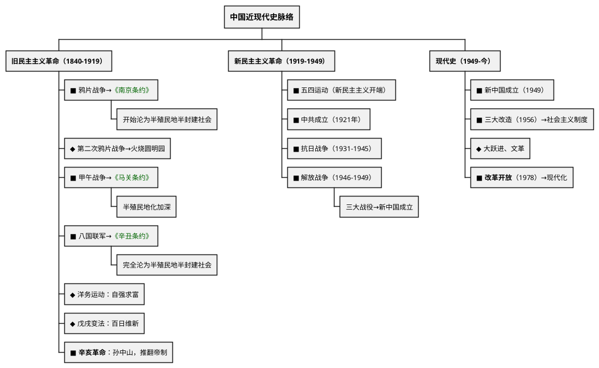

# 中国近现代史（1840年至今）

## 考点总览

| 时期 | 时间 | 核心考点 | 掌握等级 |
|------|------|---------|---------|
| 鸦片战争 | 1840—1842年 | 林则徐虎门销烟、《南京条约》 | ■背 |
| 第二次鸦片战争 | 1856—1860年 | 火烧圆明园、《北京条约》 | ◆理解 |
| 太平天国 | 1851—1864年 | 洪秀全、天京陷落 | ○了解 |
| 甲午中日战争 | 1894—1895年 | 《马关条约》 | ■背 |
| 八国联军侵华 | 1900—1901年 | 《辛丑条约》 | ■背 |
| 辛亥革命 | 1911年 | 孙中山、武昌起义、中华民国 | ■背 |
| 新民主主义革命 | 1919—1949年 | 五四运动、中共成立、长征、抗战、解放战争 | ■背 |
| 新中国成立后 | 1949年至今 | 建国、三大改造、改革开放 | ■背 |

---

## 一、近代化的阵痛与探索

### 1. 鸦片战争（1840—1842年）■背

| 项目 | 内容 |
|------|------|
| **背景** | 英国向中国走私鸦片，林则徐<b>虎门销烟</b>（1839年） |
| **结果** | 中国战败，签订<b>《南京条约》</b>（中国近代第一个不平等条约） |
| **《南京条约》** | 割香港岛；赔款2100万银元；开放五口通商；协定关税 |
| **影响** | 中国开始从封建社会沦为<b>半殖民地半封建社会</b>，近代史开端 |

### 2. 第二次鸦片战争（1856—1860年）◆理解

- **英法联军火烧圆明园**（1860年）
- **《北京条约》**：割九龙司给英国，增开通商口岸

### 3. 太平天国运动（1851—1864年）○了解

- 洪秀全领导，定都天京（南京）
- **《天朝田亩制度》**：平均分配土地

### 4. 甲午中日战争（1894—1895年）■背

| 项目 | 内容 |
|------|------|
| **事件** | 邓世昌黄海海战（致远舰） |
| **结果** | 中国战败，签订<b>《马关条约》</b> |
| **《马关条约》** | 割台湾及澎湖列岛；赔款2亿两；开放沙市等通商口岸；允许在通商口岸开设工厂 |
| **影响** | <b>半殖民地化程度大大加深</b> |

> **甲午口诀**："**马关割台赔两亿，开厂通商半殖民深**"

### 5. 八国联军侵华（1900—1901年）■背

- **八国**：英、美、俄、日、法、德、意、奥
- **结果**：签订**《辛丑条约》**
- **内容**：赔款4.5亿两；在北京东交民巷设使馆界；拆毁大沽炮台
- **影响**：中国<b>完全沦为半殖民地半封建社会</b>

> **《辛丑条约》口诀**："**辛丑赔款四亿五，拆炮台来设使馆，完全沦为半殖民**"

### 6. 近代化探索

| 运动 | 时间 | 口号 | 代表人物 | 掌握等级 |
|------|------|------|---------|---------|
| **洋务运动** | 19世纪60—90年代 | 自强、求富 | 李鸿章、曾国藩、张之洞 | ◆理解 |
| **戊戌变法** | 1898年（百日维新） | 变法图强 | 康有为、梁启超、光绪帝 | ◆理解 |
| **辛亥革命** | 1911年 | 三民主义 | 孙中山 | ■背 |
| **新文化运动** | 1915年 | 民主、科学 | 陈独秀、胡适、鲁迅 | ◆理解 |

#### 洋务运动 ◆理解

- **内容**：兴办近代军事工业（江南制造总局）和民用工业（轮船招商局）
- **评价**：是中国历史上第一次近代化运动；但根本目的是维护清朝统治，没有使中国富强

#### 辛亥革命 ■背（高频考点）

| 项目 | 内容 |
|------|------|
| **领导者** | 孙中山（中国民主革命的先行者） |
| **指导思想** | **三民主义**（民族、民权、民生） |
| **武昌起义** | 1911年10月10日，辛亥革命爆发 |
| **中华民国** | 1912年1月1日成立，定都南京 |
| **历史意义** | 推翻了清王朝，结束了封建君主专制制度，使民主共和观念深入人心 |

---

## 二、新民主主义革命（1919—1949年）

### 1. 五四运动（1919年）■背

- **导火线**：巴黎和会上中国外交失败
- **口号**："外争主权，内除国贼"
- **先锋**：北京学生 → **主力**：上海工人（工人阶级登上政治舞台）
- **结果**：初步胜利（释放被捕学生，罢免曹汝霖等）
- **意义**：**新民主主义革命的开端**

### 2. 中国共产党成立（1921年）■背

- **时间地点**：1921年7月，上海（后转到嘉兴南湖）
- **代表**：毛泽东、董必武等13人
- **意义**：中国革命的面貌**焕然一新**

### 3. 国民革命与北伐（1924—1927年）◆理解

- 国共第一次合作，创办黄埔军校
- **北伐战争**：打倒列强，铲除军阀
- **结果**：基本推翻了北洋军阀统治

### 4. 土地革命时期（1927—1937年）

| 事件 | 内容 | 掌握等级 |
|------|------|---------|
| **南昌起义** | 1927年8月1日，建军节由来 | ■背 |
| **秋收起义** | 毛泽东领导 | ○了解 |
| **井冈山革命根据地** | 中国第一个农村革命根据地 | ■背 |
| **长征** | 1934—1936年 | ■背 |

#### 长征（1934—1936年）■背

- **原因**：第五次反"围剿"失败
- **出发**：江西瑞金
- **转折**：**遵义会议**（1935年）——确立了毛泽东的领导地位，是党的历史上生死攸关的转折点
- **到达**：陕北吴起镇→1936年会宁会师
- **精神**：不怕艰难险阻的革命英雄主义

### 5. 抗日战争（1931—1945年）■背

| 事件 | 时间 | 内容 |
|------|------|------|
| **九一八事变** | 1931年 | 局部抗战开始 |
| **七七事变（卢沟桥事变）** | 1937年 | **全面抗战开始** |
| **南京大屠杀** | 1937年 | 30万同胞遇难 |
| **台儿庄战役** | 1938年 | 抗战以来正面战场最大胜利（李宗仁） |
| **百团大战** | 1940年 | 八路军主动出击（彭德怀） |
| **日本投降** | 1945年8月15日 | 抗战胜利 |

> **抗战必胜口诀**："**十四年抗战，1931到1945；全面抗战从七七，国共合作打鬼子**"

### 6. 解放战争（1946—1949年）■背

| 事件 | 内容 |
|------|------|
| **重庆谈判** | 1945年，国共双方达成"双十协定" |
| **三大战役** | **辽沈战役**→**淮海战役**→**平津战役**（基本消灭国民党主力） |
| **渡江战役** | 1949年4月，解放南京→国民党统治覆灭 |

> **三大战役口诀**："**辽沈淮海和平津，三大战役定乾坤**"

### 7. 新中国成立（1949年）■背

- **开国大典**：1949年10月1日
- **意义**：开辟了中国历史的新纪元，中国人民站起来了

---

## 三、现代史（1949年至今）

### 1. 向社会主义过渡（1949—1956年）

| 事件 | 内容 | 掌握等级 |
|------|------|---------|
| **抗美援朝** | 1950—1953年，保家卫国 | ◆理解 |
| **土地改革** | 1950—1952年，废除封建土地制度 | ◆理解 |
| **一五计划** | 1953—1957年，优先发展重工业 | ◆理解 |
| **三大改造** | 1956年完成→**社会主义基本制度建立** | ■背 |

### 2. 社会主义建设（1956—1978年）◆理解

- **中共八大**：正确分析主要矛盾
- **大跃进、人民公社化运动**：急于求成，忽视客观规律
- **文化大革命**（1966—1976年）：左倾错误

### 3. 改革开放（1978年以来）■背

| 事件 | 内容 |
|------|------|
| **十一届三中全会**（1978年） | **改革开放的开端**，把工作中心转移到经济建设上来 |
| **家庭联产承包责任制** | 农村改革（安徽小岗村） |
| **经济特区** | 深圳（"窗口"）、珠海、汕头、厦门、海南 |
| **加入WTO** | 2001年，融入全球化 |
| **中国梦** | 习近平提出：国家富强、民族振兴、人民幸福 |

> **改革开放口诀**："**1978十一届三中全会，改革开放从此起，深圳特区窗口亮，经济发展创奇迹**"

### 4. 民族与外交

| 项目 | 内容 | 掌握等级 |
|------|------|---------|
| **民族区域自治** | 解决民族问题的基本政策 | ■背 |
| **一国两制** | 邓小平提出，解决港澳台问题 | ■背 |
| **香港回归** | 1997年7月1日 | ■背 |
| **澳门回归** | 1999年12月20日 | ■背 |
| **和平共处五项原则** | 1953年周恩来提出 | ◆理解 |

---

### ✨ 中考高频考点

| 考点 | 必背内容 | 出题方式 |
|------|---------|---------|
| 《南京条约》 | 鸦片战争后签订，开始沦为半殖民地半封建社会 | 选择、材料 |
| 《马关条约》 | 甲午战败，割台赔款开厂，半殖民地化加深 | 选择、材料 |
| 《辛丑条约》 | 赔款4.5亿、设使馆界，完全沦为半殖民地 | 选择、材料 |
| 辛亥革命 | 孙中山、三民主义、推翻帝制、民主共和观念 | 材料分析题 |
| 五四运动 | 1919年，新民主主义革命开端 | 选择、材料 |
| 抗日战争 | 七七事变全面抗战、南京大屠杀、1945年胜利 | 材料分析题 |
| 三大战役 | 辽沈、淮海、平津，基本消灭国民党主力 | 选择题 |
| 新中国成立 | 1949年10月1日，中国人民站起来了 | 选择题 |
| 十一届三中全会 | 1978年，改革开放的开端 | 材料分析题 |
| 一国两制 | 邓小平提出，港澳回归 | 选择题 |

---

## 📌 必背清单

| 序号 | 考点 | 要求 |
|------|------|------|
| 1 | 《南京条约》内容和影响（半殖民地半封建社会开端） | ■必背 |
| 2 | 《马关条约》内容（割台、赔款、开厂） | ■必背 |
| 3 | 《辛丑条约》内容及影响（完全沦为半殖民地） | ■必背 |
| 4 | 辛亥革命的意义（推翻帝制，民主共和） | ■必背 |
| 5 | 五四运动（1919年，新民主主义革命开端） | ■必背 |
| 6 | 中共成立（1921年） | ■必背 |
| 7 | 长征、遵义会议 | ■必背 |
| 8 | 抗日战争（全面抗战起始、南京大屠杀、胜利） | ■必背 |
| 9 | 三大战役（辽沈、淮海、平津） | ■必背 |
| 10 | 新中国成立的意义 | ■必背 |
| 11 | 三大改造完成→社会主义制度建立 | ■必背 |
| 12 | 十一届三中全会→改革开放 | ■必背 |
| 13 | 家庭联产承包责任制、经济特区 | ■必背 |
| 14 | 一国两制、港澳回归 | ■必背 |
| 15 | 洋务运动、戊戌变法 | ◆理解 |
| 16 | 抗美援朝、一五计划 | ◆理解 |

---

# 📝 填空题

---

# 中国近现代史 · 填空题

**班级：\_\_\_\_\_\_\_\_ 姓名：\_\_\_\_\_\_\_\_ 得分：\_\_\_\_\_\_\_\_**

---

## 一、列强侵略与民族危机

1. **鸦片战争**（\_\_\_\_—\_\_\_\_年）：\_\_\_\_\_\_\_\_\_\_，中国战败，签订《\_\_\_\_\_\_\_\_\_\_》，割\_\_\_\_\_\_\_、赔款\_\_\_\_\_\_\_、开放五口通商。中国开始沦为\_\_\_\_\_\_\_\_\_\_\_\_\_\_\_\_\_\_。

2. **甲午中日战争**（1894—1895年）：\_\_\_\_\_\_\_黄海海战，签订《\_\_\_\_\_\_\_\_\_\_》，割\_\_\_\_\_\_\_\_\_\_、赔款\_\_\_\_\_\_\_、允许在通商口岸\_\_\_\_\_\_\_\_\_。半殖民地化程度\_\_\_\_\_\_\_\_\_\_。

3. **八国联军侵华**（1900—1901年）：签订《\_\_\_\_\_\_\_\_\_\_》，赔款\_\_\_\_\_\_\_，设\_\_\_\_\_\_\_\_\_\_\_\_。中国\_\_\_\_\_\_\_\_\_\_\_\_\_\_\_\_\_\_\_\_\_。

## 二、近代化探索

4. **辛亥革命**（1911年）：
   - 领导者：\_\_\_\_\_\_\_
   - 指导思想：\_\_\_\_\_\_\_\_\_（民族、民权、民生）
   - 武昌起义：1911年\_\_\_\_\_\_日
   - 中华民国成立：1912年\_\_\_\_\_\_日
   - 意义：推翻了\_\_\_\_\_\_\_，结束了\_\_\_\_\_\_\_\_\_\_\_\_\_\_\_，使\_\_\_\_\_\_\_\_\_\_\_\_深入民心

## 三、新民主主义革命

5. **五四运动**（\_\_\_\_年）：
   - 导火线：\_\_\_\_\_\_\_\_\_\_\_\_\_\_\_\_\_\_\_\_\_\_\_
   - 口号："\_\_\_\_\_\_\_\_\_\_，\_\_\_\_\_\_\_\_\_\_"
   - 先锋：\_\_\_\_\_\_\_\_\_\_ → 主力：\_\_\_\_\_\_\_\_\_
   - 意义：\_\_\_\_\_\_\_\_\_\_\_\_\_\_\_\_\_\_的开端

6. **中共成立**：\_\_\_\_\_年\_\_\_\_月，在\_\_\_\_\_\_\_（后转到嘉兴南湖）召开中共一大。

7. **南昌起义**：1927年\_\_\_\_\_\_日，\_\_\_\_\_\_\_\_\_节由来。

8. **井冈山革命根据地**：中国第一个\_\_\_\_\_\_\_\_\_\_\_\_\_\_\_。

9. **长征**（1934—1936年）：
   - 原因：第五次反"围剿"失败
   - 转折点：\_\_\_\_\_\_会议（1935年），确立了\_\_\_\_\_\_\_的领导地位

10. **抗日战争**（1931—1945年）：
    - \_\_\_\_\_\_\_事变（1931年）：局部抗战开始
    - \_\_\_\_\_\_\_事变（1937年）：\_\_\_\_\_\_抗战开始
    - 1937年\_\_\_\_\_\_\_\_\_\_：30万同胞遇难
    - 1945年\_\_\_\_\_\_日：日本宣布投降

11. **解放战争三大战役**：\_\_\_\_\_\_战役、\_\_\_\_\_\_战役、\_\_\_\_\_\_战役

12. **新中国成立**：1949年\_\_\_\_\_\_日，开辟了中国历史\_\_\_\_\_\_\_\_，中国人民站起来了。

## 四、现代史

13. 1956年\_\_\_\_\_\_\_\_\_完成，\_\_\_\_\_\_\_\_\_\_\_\_制度基本建立。

14. **十一届三中全会**（\_\_\_\_年）：\_\_\_\_\_\_\_\_的开端。

15. **家庭联产承包责任制**：农村改革始于\_\_\_\_\_\_\_\_\_（安徽）。

16. **经济特区**：\_\_\_\_\_\_（"窗口"）、珠海、汕头、厦门、海南。

17. **一国两制**（\_\_\_\_\_\_提出）：香港回归\_\_\_\_年，澳门回归\_\_\_\_年。

**参考答案：**

1. 1840，1842，林则徐虎门销烟，南京条约，香港岛，2100万银元，半殖民地半封建社会
2. 邓世昌，马关条约，台湾及澎湖列岛，2亿两，开设工厂，大大加深
3. 辛丑条约，4.5亿两，东交民巷使馆界，完全沦为半殖民地半封建社会
4. 孙中山，三民主义，10月10，1月1，清王朝，封建君主专制制度，民主共和观念
5. 1919，巴黎和会中国外交失败，外争主权内除国贼，北京学生，上海工人，新民主主义革命
6. 1921，7，上海
7. 8月1，建军
8. 农村革命根据地
9. 遵义，毛泽东
10. 九一八，七七（卢沟桥），全面，南京大屠杀，8月15
11. 辽沈，淮海，平津
12. 10月1，新纪元
13. 三大改造，社会主义
14. 1978，改革开放
15. 小岗村
16. 深圳
17. 邓小平，1997，1999

---

# 📝 材料题专项

---

# 中国近现代史 · 材料题专项

> 本文件梳理该专题中考材料分析题的出题角度和答题要点。

---

## 材料分析题通用答题模板

### 第一步：读材料
- 看材料出处（谁写的、什么书）
- 圈关键词（人名、制度名、主张等）

### 第二步：联想教材
- 把材料中的关键词映射到教材知识点
- 确定考查的是哪个时期、哪个知识点

### 第三步：组织答案
- 按"是什么→为什么→怎么样"的逻辑组织
- 如果是评价类问题，注意 **一分为二**（积极+局限）
- 如果是启示类问题，从 **历史联系现实** 作答

---

## 一、三大不平等条约

### 出题角度

**角度1：给出条约内容摘录，判断是哪一个条约**

关键区分：
- 割香港岛、赔2100万银元 → **《南京条约》**
- 割台湾及澎湖列岛、赔2亿两、允许设厂 → **《马关条约》**
- 赔款4.5亿两、设使馆界、拆炮台 → **《辛丑条约》**

**角度2：问每个条约对中国社会性质的影响**

### 答题要点

| 条约 | 战争 | 核心内容 | 对中国社会的影响 |
|------|------|---------|----------------|
| **《南京条约》** | 鸦片战争 | 割香港岛、赔2100万银元、五口通商、协定关税 | **开始**沦为半殖民地半封建社会 |
| **《马关条约》** | 甲午中日战争 | 割台湾、赔2亿两、允许设厂 | **大大加深**半殖民地化程度 |
| **《辛丑条约》** | 八国联军侵华 | 赔4.5亿两、设使馆界、拆炮台 | **完全**沦为半殖民地半封建社会 |

---

## 二、辛亥革命

### 出题角度

**角度1：给出辛亥革命的材料，问历史意义**

**角度2：给出三民主义的材料，问核心内容**

### 答题要点

| 考点 | 必答内容 |
|------|---------|
| **领导者** | 孙中山，中国民主革命的先行者 |
| **指导思想** | 三民主义（民族、民权、民生） |
| **武昌起义** | 1911年10月10日 |
| **中华民国** | 1912年1月1日成立，定都南京 |
| **意义** | 推翻了清王朝，结束了封建君主专制制度 |
| **影响** | 使民主共和观念深入人心 |

---

## 三、五四运动

### 出题角度

**角度1：给出巴黎和会相关材料，问五四运动的导火线**

**角度2：给出口号材料，问五四运动的性质和意义**

### 答题要点

- **导火线**：巴黎和会上中国外交失败
- **口号**："外争主权，内除国贼"
- **先锋→主力**：北京学生→上海工人（工人阶级登台）
- **性质**：彻底反帝反封建的爱国运动
- **意义**：新民主主义革命的开端

---

## 四、抗日战争

### 出题角度

**角度1：给出抗战相关事件材料，考查时间线**

常考：九一八事变（1931，局部抗战）→七七事变（1937，全面抗战）→南京大屠杀（1937）→日本投降（1945）

**角度2：问抗战胜利的原因**

### 答题要点

- **局部抗战开始**：1931年九一八事变
- **全面抗战开始**：1937年七七事变（卢沟桥事变）
- **南京大屠杀**：30万同胞遇难
- **胜利**：1945年8月15日日本宣布投降
- **胜利原因**：全民族抗战（根本原因）、国共合作、世界反法西斯力量支持
- **意义**：中国近代以来反抗外来侵略的第一次完全胜利

---

## 五、十一届三中全会

### 出题角度

**角度1：给出会议内容材料，问会议的历史意义**

**角度2：对比新中国成立以来党的重大会议**

### 答题要点

- **时间**：1978年
- **内容**：把工作中心转移到经济建设上来；实行改革开放
- **意义**：改革开放的开端，是党的历史上的伟大转折
- **关联**：家庭联产承包责任制（安徽小岗村）→经济特区（深圳）→加入WTO

---

## 考前速记

> **三大条约**："南京开始半殖民，马关加深辛丑完"  
> **辛亥革命**："中山先生革命先，三民主义指方向，辛亥革命摧帝制"  
> **五四运动**："1919五四起，新民主主义开端"  
> **改革开放**："1978三中全会，改革开放兴中华"

---

## 参考答案

