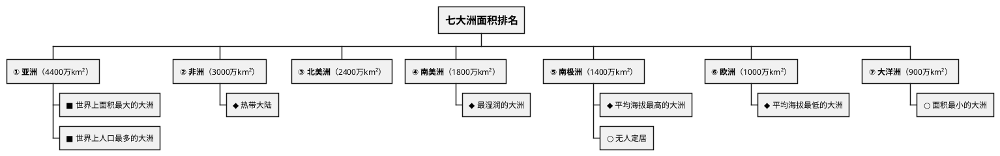
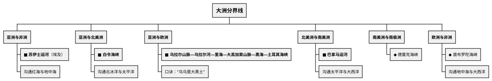
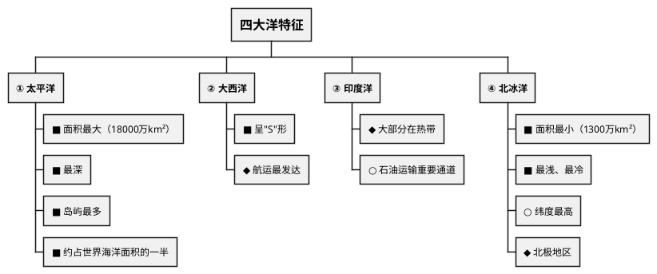

# 大洲和大洋

## 考点总览

| 考点 | 核心内容 | 掌握等级 |
|------|---------|---------|
| 海陆比例 | 七分海洋，三分陆地 | ■背 |
| 七大洲 | 名称、面积排序、分界线 | ■背 |
| 四大洋 | 名称、面积排序、特征 | ■背 |
| 大洲分界线 | 苏伊士运河、巴拿马运河等 | ■背 |
| 板块运动 | 六大板块、碰撞与张裂 | ◆理解 |

---

## 一、海陆分布

### 海陆比例 ■背

- **地球表面**：海洋占 **71%**，陆地占 **29%**
- 口诀："**七分海洋，三分陆地**"
- **北半球**：陆地面积比海洋小，但陆地集中在北半球
- **南半球**：海洋面积占绝对优势

### 大陆、半岛、岛屿的区别 ◆理解

| 概念 | 定义 | 举例 |
|------|------|------|
| **大陆** | 面积广大的陆地 | 亚欧大陆、非洲大陆 |
| **半岛** | 伸入海洋的陆地 | 阿拉伯半岛（最大）、印度半岛 |
| **岛屿** | 四面环水的小块陆地 | 格陵兰岛（最大）、台湾岛 |

> **记忆**：大陆 > 半岛 > 岛屿（按与陆地相连的程度区分）

---

## 二、七大洲

### 1. 七大洲的名称 ■背

**亚洲、非洲、北美洲、南美洲、南极洲、欧洲、大洋洲**

> **面积从大到小口诀**："**亚非北南美，南极欧大洋**"

### 2. 七大洲的地理位置 ■背

| 大洲 | 半球位置 | 重要特征 |
|------|---------|---------|
| **亚洲** | 主要在北半球、东半球 | 面积最大，跨纬度最广 |
| **非洲** | 赤道横穿中部 | 热带大陆，有"热带大陆"之称 |
| **北美洲** | 北半球、西半球 | 北部靠近北极圈 |
| **南美洲** | 赤道以南（大部分） | 最湿润的大洲，有亚马孙河 |
| **南极洲** | 南极点周围 | 最冷、平均海拔最高 |
| **欧洲** | 北半球、东半球 | 平均海拔最低 |
| **大洋洲** | 南半球、东半球 | 面积最小 |

### 3. 大洲分界线 ■背（高频考点）

> **分界线记忆口诀**：
> - "**苏伊士运河亚非界，巴拿马运河南北美**"
> - "**亚欧分界在乌拉尔，白令海峡连美亚**"

---

## 三、四大洋

### 1. 四大洋的名称 ■背

**太平洋、大西洋、印度洋、北冰洋**

> **面积从大到小口诀**："**太大印北**"（太平洋→大西洋→印度洋→北冰洋）

### 2. 四大洋特征

| 大洋 | 面积（万km²） | 特征 | 掌握等级 |
|------|-------------|------|---------|
| **太平洋** | 18000 | 面积最大、最深、岛屿最多 | ■背 |
| **大西洋** | 9300 | 呈"S"形，世界第二 | ■背 |
| **印度洋** | 7500 | 大部分在热带 | ◆理解 |
| **北冰洋** | 1300 | 面积最小、最浅、最冷 | ■背 |

### 3. 各大洲濒临的大洋

| 大洲 | 濒临的大洋 |
|------|-----------|
| 亚洲 | 北冰洋、太平洋、印度洋 |
| 非洲 | 大西洋、印度洋 |
| 北美洲 | 北冰洋、太平洋、大西洋 |
| 南美洲 | 太平洋、大西洋 |
| 南极洲 | 太平洋、大西洋、印度洋（三大洋环绕） |
| 欧洲 | 北冰洋、大西洋 |
| 大洋洲 | 太平洋、印度洋 |

---

## 四、板块运动

### 六大板块 ◆理解

- 亚欧板块、非洲板块、美洲板块、太平洋板块、印度洋板块、南极洲板块

### 基本规律

- **板块内部**：地壳比较稳定
- **板块交界处**：地壳比较活跃 → 火山、地震

### 两种运动方式

| 运动方式 | 结果 | 举例 |
|---------|------|------|
| **碰撞挤压** | 山脉升高 | 喜马拉雅山（亚欧板块与印度洋板块碰撞） |
| **张裂拉伸** | 裂谷、海洋 | 东非大裂谷 |

---

## 五、中考易混点

| 易混点 | 区分 |
|--------|------|
| 苏伊士运河 vs 巴拿马运河 | **苏伊士**：亚非分界，连红海地中海；**巴拿马**：南北美分界，连太平洋大西洋 |
| 白令海峡 vs 德雷克海峡 | **白令**：亚洲与北美；**德雷克**：南美与南极洲 |
| 最大岛屿 vs 最大半岛 | **格陵兰岛**（最大岛屿）vs **阿拉伯半岛**（最大半岛） |
| 平均海拔最高 vs 最低 | **南极洲**（最高）vs **欧洲**（最低）|

---

### ✨ 中考高频考点

| 考点 | 必背内容 | 出题方式 |
|------|---------|---------|
| 海陆比例 | 七分海洋三分陆地（71%海洋，29%陆地） | 选择题 |
| 七大洲排序 | 亚非北南美，南极欧大洋（面积从大到小） | 选择、填空 |
| 四大洋排序 | 太平洋→大西洋→印度洋→北冰洋（"太大印北"） | 选择、填空 |
| 大洲分界线 | 苏伊士运河（亚非）、巴拿马运河（南北美）、白令海峡（亚北美） | 选择、材料 |
| 太平洋特征 | 面积最大、最深、岛屿最多、约占海洋面积一半 | 选择题 |

---

## 📌 必背清单

| 序号 | 考点 | 要求 |
|------|------|------|
| 1 | 海陆比例（七分海洋三分陆地） | ■必背 |
| 2 | 七大洲名称及面积排序 | ■必背 |
| 3 | 四大洋名称及面积排序 | ■必背 |
| 4 | 苏伊士运河、巴拿马运河、白令海峡的位置 | ■必背 |
| 5 | 亚欧分界线 | ■必背 |
| 6 | 各大洲濒临的大洋 | ■必背 |
| 7 | 太平洋的特征（最大、最深、最多岛屿） | ■必背 |
| 8 | 六大板块名称 | ◆理解 |
| 9 | 板块运动基本规律 | ◆理解 |
| 10 | 大陆、半岛、岛屿的概念区分 | ◆理解 |

---

# 📝 填空题

---

# 大洲和大洋 · 填空题

**班级：\_\_\_\_\_\_\_\_ 姓名：\_\_\_\_\_\_\_\_ 得分：\_\_\_\_\_\_\_\_**

---

## 一、海陆分布

1. 地球表面海洋占\_\_\_\_%，陆地占\_\_\_\_%，即"\_\_\_\_\_\_\_\_\_\_\_\_\_"

## 二、七大洲

2. 七大洲名称（面积从大到小）：\_\_\_\_\_、\_\_\_\_\_、\_\_\_\_\_、\_\_\_\_\_、\_\_\_\_\_、\_\_\_\_\_、\_\_\_\_\_
   口诀："\_\_\_\_\_\_\_\_\_\_\_\_\_\_\_\_\_\_\_"

3. **大洲分界线**：
   - 亚洲与非洲：\_\_\_\_\_\_\_\_\_\_\_\_（沟通\_\_\_\_\_\_海与\_\_\_\_\_\_\_海）
   - 亚洲与北美洲：\_\_\_\_\_\_\_\_\_\_\_
   - 亚洲与欧洲：\_\_\_\_\_\_\_山脉—乌拉尔河—\_\_\_\_\_\_\_—大高加索山脉—\_\_\_\_\_\_\_—土耳其海峡
   - 北美洲与南美洲：\_\_\_\_\_\_\_\_\_\_\_\_（沟通\_\_\_\_\_\_\_\_与\_\_\_\_\_\_\_\_）

## 三、四大洋

4. 四大洋面积从大到小：\_\_\_\_\_\_\_、\_\_\_\_\_\_\_、\_\_\_\_\_\_\_、\_\_\_\_\_\_\_
   口诀："\_\_\_\_\_\_\_\_\_\_"

5. **太平洋**特征：面积最\_\_\_\_、最\_\_\_\_、岛屿最\_\_\_\_，约占世界海洋面积的\_\_\_\_\_\_
   **北冰洋**特征：面积最\_\_\_\_、最\_\_\_\_、最\_\_\_\_

## 四、板块运动

6. 板块内部地壳较\_\_\_\_\_\_；板块交界处地壳较\_\_\_\_\_\_

7. **喜马拉雅山**的形成：\_\_\_\_\_\_板块与\_\_\_\_\_\_板块碰撞挤压

**参考答案：**

1. 71，29，七分海洋三分陆地
2. 亚洲、非洲、北美洲、南美洲、南极洲、欧洲、大洋洲，"亚非北南美，南极欧大洋"
3. 苏伊士运河，红，地中；白令海峡；乌拉尔，里海，黑海；巴拿马运河，太平洋，大西洋
4. 太平洋、大西洋、印度洋、北冰洋，"太大印北"
5. 大，深，多，一半；小，浅，冷
6. 稳定，活跃
7. 亚欧，印度洋

---

# 📝 材料题专项

---

# 大洲和大洋 · 材料题专项

---

## 大洲分界线

### 出题角度

**角度1：给出世界地图，要求填写大洲分界线的名称和位置**

常考形式：地图填图题，用字母或序号标注位置

**角度2：给出分界线的描述，判断是哪一条分界线**

### 答题要点

| 分界线 | 分隔大洲 | 沟通水域 | 位置记忆 |
|--------|---------|---------|---------|
| **苏伊士运河** | 亚洲与非洲 | 红海与地中海 | 埃及境内 |
| **巴拿马运河** | 北美洲与南美洲 | 太平洋与大西洋 | 巴拿马境内 |
| **白令海峡** | 亚洲与北美洲 | 北冰洋与太平洋 | 俄罗斯与美国之间 |
| **乌拉尔山脉—乌拉尔河—里海—大高加索山脉—黑海—土耳其海峡** | 亚洲与欧洲 | — | 俄罗斯境内 |

### 容易混淆的考点

- **苏伊士运河** vs **巴拿马运河**：前者连红海地中海（亚非界），后者连太平洋大西洋（南北美界）
- **白令海峡** vs **德雷克海峡**：前者亚洲北美界，后者南美南极洲界

---

## 考前速记

> **分界线口诀**："苏伊士运河亚非界，巴拿马运河南北美，白令海峡亚美连"

---

## 参考答案

