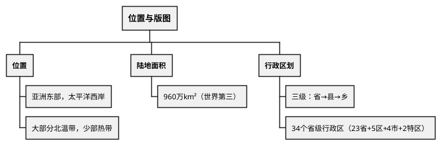
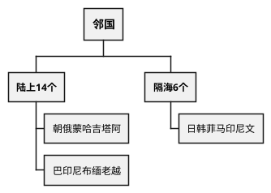

# 中国地理

## 考点总览

| 板块 | 核心考点 | 掌握等级 |
|------|---------|---------|
| 疆域与行政区划 | 位置、领土面积、34个省级行政区 | ■背 |
| 人口与民族 | 人口分布线（胡焕庸线）、民族分布 | ■背 |
| 地形 | 三级阶梯、主要山脉、四大高原/盆地/平原 | ■背 |
| 气候 | 温度带、干湿区、季风气候 | ■背 |
| 河流 | 长江、黄河、水文特征 | ■背 |
| 自然资源 | 类型、分布、南水北调、西气东输 | ◆理解 |

---

## 一、疆域与行政区划

### 1. 中国的位置 ■背

| 位置类型 | 内容 | 意义 |
|---------|------|------|
| **半球** | 北半球、东半球 | — |
| **纬度** | 大部分在北温带，南部在热带（无寒带） | 气候多样 |
| **海陆** | **亚洲东部、太平洋西岸** | 海陆兼备 |

### 2. 领土面积 ■背

- **陆地面积**：约**960万km²**（世界第三，仅次于俄罗斯、加拿大）
- **领海**：约300万km²
- **国界线**：长2.2万km
- **海岸线**：长1.8万km

### 3. 邻国 ■背

| 方向 | 邻国（口诀） |
|------|-------------|
| 陆上邻国（14个） | "**朝俄蒙哈吉塔阿，巴印尼布缅老越**"（朝鲜、俄罗斯、蒙古、哈萨克斯坦、吉尔吉斯斯坦、塔吉克斯坦、阿富汗、巴基斯坦、印度、尼泊尔、不丹、缅甸、老挝、越南） |
| 隔海相望（6个） | "**日韩菲马印尼文**"（日本、韩国、菲律宾、马来西亚、印度尼西亚、文莱） |

### 4. 行政区划 ■背

- **三级行政区划**：省（自治区、直辖市、特别行政区）→ 县（市）→ 乡（镇）
- **34个省级行政区**：23个省 + 5个自治区 + 4个直辖市 + 2个特别行政区

> **直辖市口诀**："**北上天重**"（北京、上海、天津、重庆）
>
> **特别行政区**：香港、澳门

---

## 二、人口与民族

### 1. 人口分布 ■背

- **人口数量**：世界第一（约14亿）
- **分布线**：**黑河—腾冲线**（胡焕庸线）
  - 东南部：人口密集
  - 西北部：人口稀疏

### 2. 民族 ■背

- **56个民族**：汉族占约92%，55个少数民族
- **分布特点**：**大杂居、小聚居、交错居住**
- 少数民族主要分布在：西南、西北、东北

**人口最多的少数民族**：壮族（广西）
**人口最少的少数民族**：塔塔尔族等

### 3. 节庆文化 ◆理解

| 民族 | 节日/文化 |
|------|----------|
| 蒙古族 | 那达慕大会 |
| 藏族 | 雪顿节 |
| 傣族 | 泼水节 |
| 汉族 | 春节、元宵、端午、中秋 |

---

## 三、中国的地形

### 1. 地势特征 ■背

> **西高东低，呈三级阶梯状分布**

| 阶梯 | 平均海拔 | 主要地形类型 | 界线 | 掌握等级 |
|------|---------|-------------|------|---------|
| **第一阶梯** | 4000米以上 | 高原 | 青藏高原 | ■背 |
| **第二阶梯** | 1000—2000米 | 高原、盆地 | 第一/二阶梯：昆仑山—祁连山—横断山脉 | ■背 |
| **第三阶梯** | 500米以下 | 平原、丘陵 | 第二/三阶梯：大兴安岭—太行山—巫山—雪峰山 | ■背 |

### 2. 主要山脉

> **口诀**："**三横三纵三弧形**"

- **东西走向**：天山—阴山、昆仑山—秦岭、南岭
- **东北西南走向**：大兴安岭—太行山—巫山—雪峰山、长白山—武夷山、台湾山脉
- **弧形山脉**：喜马拉雅山（世界最高——**珠穆朗玛峰**8848.86米）

### 3. 四大高原

| 名称 | 特征 | 掌握等级 |
|------|------|---------|
| **青藏高原** | 世界最高（"世界屋脊"），雪山连绵 | ■背 |
| **内蒙古高原** | 地势平坦，草原广布 | ◆理解 |
| **黄土高原** | 千沟万壑，水土流失严重 | ■背 |
| **云贵高原** | 喀斯特地貌，崎岖不平 | ◆理解 |

### 4. 四大盆地

| 名称 | 特征 | 掌握等级 |
|------|------|---------|
| **塔里木盆地** | 我国最大盆地，内有塔克拉玛干沙漠（最大沙漠） | ■背 |
| **准噶尔盆地** | 我国第二大盆地 | ○了解 |
| **柴达木盆地** | "聚宝盆"，矿产资源丰富 | ◆理解 |
| **四川盆地** | "天府之国"，紫色土肥沃 | ■背 |

### 5. 三大平原

| 名称 | 特征 | 掌握等级 |
|------|------|---------|
| **东北平原** | 面积最大，黑土肥沃 | ■背 |
| **华北平原** | 黄河冲积形成 | ■背 |
| **长江中下游平原** | "鱼米之乡" | ■背 |

---

## 四、中国的气候

### 1. 气候特征 ■背

> **气候复杂多样，季风气候显著**

- **东部**：季风气候（温带季风→亚热带季风→热带季风）
- **西北**：温带大陆性气候（干旱少雨）
- **青藏高原**：高原山地气候（高寒）

### 2. 温度带 ■背

| 温度带 | 范围 | 作物熟制 |
|--------|------|---------|
| **寒温带** | 黑龙江北部 | 一年一熟 |
| **中温带** | 东北大部、内蒙古 | 一年一熟 |
| **暖温带** | 华北、新疆南部 | 两年三熟/一年两熟 |
| **亚热带** | 秦岭—淮河以南 | 一年两熟/三熟 |
| **热带** | 滇粤台南部 | 一年三熟 |

### 3. 秦岭—淮河一线（重要分界线）■背

**秦岭—淮河一线的地理意义**：

| 对比项 | 秦岭—淮河以北 | 秦岭—淮河以南 |
|--------|-------------|-------------|
| **温度带** | 暖温带 | 亚热带 |
| **干湿区** | 半湿润区 | 湿润区 |
| **年降水量** | <800mm | >800mm |
| **河流冬季** | 结冰 | 不结冰 |
| **耕地类型** | 旱地 | 水田 |
| **主要作物** | 小麦、玉米 | 水稻、油菜 |
| **主食** | 面食 | 米饭 |

> **秦岭淮河口诀**："**秦岭淮河一条线，南北气候分界清，暖温亚热各一边，旱地水田两分明**"

### 4. 降水的空间分布

- **规律**：从东南沿海向西北内陆递减
- **干湿区**：湿润区→半湿润区→半干旱区→干旱区

---

## 五、河流

### 1. 长江 ■背

| 项目 | 内容 |
|------|------|
| **长度** | 6300km，中国第一大河，世界第三 |
| **发源地** | 唐古拉山（青藏高原） |
| **注入** | 东海 |
| **上中下游分界** | 宜昌（湖北）、湖口（江西） |
| **主要支流** | 汉江（最长支流）、嘉陵江、岷江 |
| **特征** | **"黄金水道"**（航运价值高）、水能资源丰富 |
| **主要问题** | 中游洪涝、下游泥沙淤积 |

### 2. 黄河 ■背

| 项目 | 内容 |
|------|------|
| **长度** | 5464km，中国第二长河 |
| **发源地** | 巴颜喀拉山（青藏高原） |
| **注入** | 渤海 |
| **特征** | **含沙量大**（世界之最），**"地上河"** |
| **问题** | 上游荒漠化、中游水土流失（黄土高原）、下游"地上河"（泥沙淤积） |
| **治理** | 中游植树造林保持水土、下游加固堤坝 |

> **长江黄河口诀**："**长江长入东海，黄河黄入渤海；长江水能航运好，黄河含沙量最大**"

---

## 六、自然资源

### 1. 资源特点 ◆理解

- **总量丰富**，**人均不足**
- 种类多，分布不均衡

### 2. 主要资源分布

| 资源 | 主要分布 | 掌握等级 |
|------|---------|---------|
| **煤炭** | 山西、陕西、内蒙古 | ◆理解 |
| **石油** | 大庆、胜利、克拉玛依 | ◆理解 |
| **天然气** | 新疆（塔里木盆地）、四川盆地 | ◆理解 |
| **水能** | 长江上游、黄河上游 | ◆理解 |

### 3. 跨区域调配工程

| 工程 | 内容 | 作用 | 掌握等级 |
|------|------|------|---------|
| **南水北调** | 长江流域→华北、西北地区 | 缓解北方缺水 | ■背 |
| **西气东输** | 新疆→东部沿海 | 缓解东部能源短缺 | ◆理解 |

---

## 七、农业与工业 ○了解

### 农业分布

- **东部**：种植业（东部季风区）
- **西部**：畜牧业
  - **青藏牧区**：高寒牧区，饲养**牦牛**、藏绵羊（牧草矮小）
  - **内蒙古牧区**：温带草原牧区
  - **新疆牧区**：山地牧区
- **南北方差异**：南稻北麦、南甘北甜、南油北豆

### 传统民居与地理环境 ◆理解

| 民居类型 | 分布地区 | 与地理环境的关系 |
|---------|---------|----------------|
| **干栏式建筑** | 南方湿热地区 | 通风防潮，适应多雨气候 |
| **吊脚楼** | 西南山区（湘西、黔东南） | 依山而建，排水防潮 |
| **窑洞** | 黄土高原 | 利用黄土直立性，冬暖夏凉 |
| **蒙古包** | 内蒙古草原 | 拆卸方便，适应游牧生活 |

### 台湾地理要点 ■背

- **位置**：中国东南沿海，东临太平洋
- **地形**：中部多山地（**中央山脉**），地势崎岖
- **交通**：受地形影响，铁路呈**环岛环状分布**
- **气候**：亚热带季风气候（北部）/ 热带季风气候（南部）
- **经济**：半导体、电子制造业发达

### 工业分布

- **东部沿海**：工业集中（长三角、珠三角、京津唐）
- **中部**：资源型工业

---

### ✨ 中考高频考点

| 考点 | 必背内容 | 出题方式 |
|------|---------|---------|
| 中国位置与面积 | 亚洲东部太平洋西岸，960万km²世界第三 | 选择题 |
| 34个省级行政区 | 23省+5自治区+4直辖市+2特别行政区 | 选择、填空 |
| 地势三级阶梯 | 西高东低，三级阶梯分界线及主要地形 | 选择、材料 |
| 秦岭—淮河一线 | 南北分界：暖温带/亚热带、800mm降水线、旱地/水田 | 材料分析题 |
| 长江与黄河 | 长江（黄金水道）、黄河（含沙量大、地上河） | 选择、材料 |
| 南水北调 | 长江→华北西北，缓解北方缺水 | 选择题 |

---

## 📌 必背清单

| 序号 | 考点 | 要求 |
|------|------|------|
| 1 | 中国位置（亚洲东部、太平洋西岸） | ■必背 |
| 2 | 领土面积960万km²（世界第三） | ■必背 |
| 3 | 34个省级行政区 | ■必背 |
| 4 | 人口分布线（黑河—腾冲线） | ■必背 |
| 5 | 民族分布特点（大杂居小聚居） | ■必背 |
| 6 | 地势三级阶梯及分界线 | ■必背 |
| 7 | 四大高原特征 | ■必背 |
| 8 | 四大盆地特征 | ■必背 |
| 9 | 三大平原特征 | ■必背 |
| 10 | 秦岭—淮河一线的地理意义 | ■必背 |
| 11 | 长江发源地、注入海、特征（黄金水道） | ■必背 |
| 12 | 黄河含沙量大、"地上河" | ■必背 |
| 13 | 南水北调的作用 | ■必背 |
| 14 | 气候特征（复杂多样，季风显著） | ◆理解 |
| 15 | 温度带与作物熟制 | ◆理解 |
