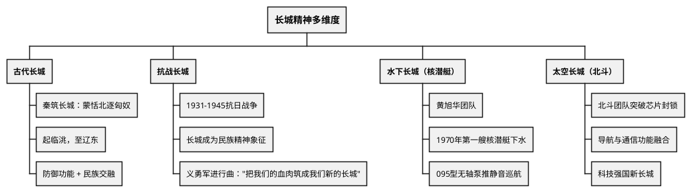

# 长城精神 · 多维度综合专题

> 中考综合题常考（见拱墅区一模第32题、冲刺四第32题），跨历史与道法

---

## 一、古代防御长城

### 秦筑长城 ■背

- **背景**：秦统一后，派**蒙恬**北击匈奴，收复河南地（河套地区）
- **修筑**：**秦始皇**下令修筑长城，"起临洮，至辽东，延袤万余里"
- **目的**：抵御匈奴南下侵扰
- **作用**：既是军事防御线，也是一条**生态过渡带**（农牧分界线）

### 明长城 ◆理解

- 明朝重修长城，东起鸭绿江，西至嘉峪关
- 是历史上规模最大的长城修筑工程
- 山海关、居庸关、嘉峪关等著名关隘

### 长城的文化意义

- 长城不仅是军事防御工程，更是中华文明的精神图腾
- 见证了农耕文明与游牧文明的交流交融

> **长城口诀**："**秦筑长城防匈奴，起临洮来到辽东，明朝重修固边防**"

---

## 二、抗战长城（民族精神）

### 抗战中的长城象征 ■背

- 抗日战争（1931-1945）中，长城成为**中华民族不屈精神的象征**
- **《义勇军进行曲》**（国歌）："把我们的血肉筑成我们新的长城"
- 长城抗战：1933年中国军队在长城一线抗击日军（喜峰口大捷等）

### 长城与民族精神

- 长城精神体现了以**爱国主义**为核心的民族精神
- 团结统一、自强不息、坚韧不拔

---

## 三、水下长城（核潜艇）

### 核潜艇研制历程 ◆理解

- **黄旭华**：中国核潜艇之父，带领团队用算盘、磅秤攻克核潜艇技术
- **1970年12月**：我国自主研制的**第一艘核潜艇**成功下水
- **意义**：辽阔海域有了护卫国土的"水下移动长城"，是大国战略威慑力量的重要标志
- **新时代**：095型核潜艇采用无轴泵推技术，实现静音巡航

---

## 四、太空长城（北斗）

### 北斗卫星导航系统 ◆理解

- **北斗团队**突破芯片技术封锁，实现导航与通信功能高度融合
- 从古代"依山凭险"到现代科技强军，"长城精神"在新时代不断延伸
- **意义**：科技强国的"新长城"，维护国家安全的战略支撑

---

## 中考出题角度

| 角度 | 考查方式 | 涉及知识点 |
|------|---------|-----------|
| **历史维度** | 秦筑长城的背景、目的、作用 | 秦始皇统一、蒙恬北击匈奴 |
| **精神维度** | 长城象征了什么民族精神 | 爱国主义为核心的民族精神 |
| **当代维度** | 核潜艇/北斗如何体现长城精神 | 科技创新、国家安全、黄旭华 |
| **综合写作** | 以"新时代的长城精神"为题写短评 | 国家安全+科技创新+民族精神 |

---

## 📌 必背清单

| 序号 | 考点 | 要求 |
|------|------|------|
| 1 | 秦始皇派蒙恬筑长城（起临洮至辽东） | ■必背 |
| 2 | 长城是抗战精神的象征（国歌素材） | ■必背 |
| 3 | 水下长城（核潜艇，黄旭华，1970年） | ◆理解 |
| 4 | 太空长城（北斗系统，科技强军） | ◆理解 |
