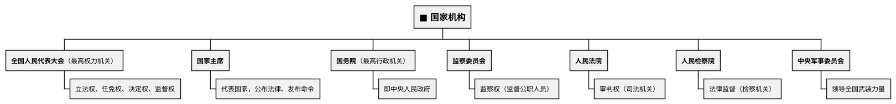
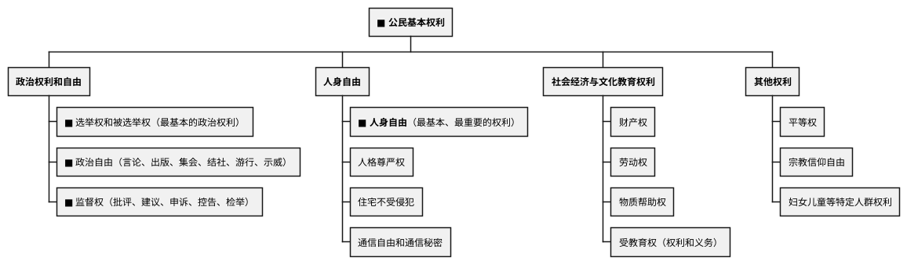
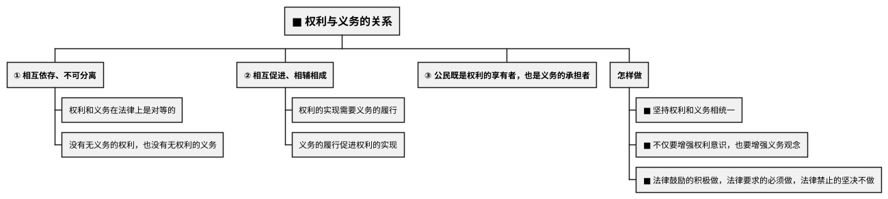

# 宪法与公民权利义务

## 考点总览

| 考点 | 核心内容 | 掌握等级 |
|------|---------|---------|
| 宪法的地位 | 国家的根本法，最高法律效力 | ■背 |
| 宪法的原则 | 人民主权、基本人权、法治、权力制约 | ■背 |
| 公民基本权利 | 政治权利、人身自由、社会经济权利等 | ■背 |
| 公民基本义务 | 遵守法律、纳税、服兵役等 | ■背 |
| 权利与义务的关系 | 统一、不可分割 | ■背 |

---

## 一、宪法

### 1. 宪法的地位 ■背

**宪法是国家的根本法**，是治国安邦的总章程

| 对比项 | 宪法 | 普通法律 |
|--------|------|---------|
| **内容** | 规定国家生活中最根本的问题 | 规定某一方面问题 |
| **法律效力** | **最高法律效力**（法律之母） | 不得与宪法相抵触 |
| **制定修改** | 比普通法律更严格 | — |

> **宪法口诀**："**宪法是国家根本法，法律效力她最大，任何法律不冲突，制修程序更严格**"

### 2. 宪法的基本原则 ◆理解

- **人民主权原则**：国家的一切权力属于人民
- **基本人权原则**：尊重和保障人权
- **法治原则**：依法治国
- **权力制约原则**：权力机关相互制约

### 3. 我国的国家制度 ◆理解

| 制度 | 内容 |
|------|------|
| **根本政治制度** | **人民代表大会制度**（人民行使权力的机关） |
| **基本政治制度** | 中国共产党领导的多党合作和政治协商制度、民族区域自治制度、基层群众自治制度 |
| **根本制度** | 社会主义制度 |
| **基本经济制度** | 公有制为主体、多种所有制经济共同发展 |

### 4. 我国的国家机构 ■背

---

## 二、公民基本权利

### 1. 权利的分类 ■背

### 2. 高频考点 ■背

| 权利 | 关键点 |
|------|--------|
| **选举权和被选举权** | 年满18周岁、未被剥夺政治权利的中国公民 |
| **人身自由** | 公民最基本、最重要的权利 |
| **受教育权** | 既是权利，也是义务 |
| **监督权** | 公民对国家机关及其工作人员进行监督 |

---

## 三、公民基本义务

### 1. 义务的分类 ■背

| 分类 | 具体内容 |
|------|---------|
| **遵守宪法和法律** | 公民最基本、最重要的义务 |
| **维护国家统一和民族团结** | 中华民族最高利益 |
| **维护国家安全、荣誉和利益** | — |
| **依法服兵役** | 光荣义务 |
| **依法纳税** | — |
| **其他义务** | 受教育、劳动、计划生育等 |

### 2. 高频考点 ■背

- **遵守宪法和法律**是公民最基本、最重要的义务
- **维护国家统一和民族团结**是中华民族的最高利益
- **依法纳税**是公民的义务（偷税漏税是违法行为）

---

## 四、权利与义务的关系 ■背

> **权利义务口诀**："**权利义务不可分，既是享有也要担，法律鼓励积极做，要求必须禁不做**"

---

### ✨ 中考高频考点

| 考点 | 必背内容 | 出题方式 |
|------|---------|---------|
| 宪法是根本法 | 最高法律效力，国家根本法 | 选择、材料 |
| 人民代表大会制度 | 根本政治制度，人民行使权力的机关 | 选择题 |
| 国家机构 | 全国人大（权力）、国务院（行政）、法院（审判）、检察院（监督） | 选择题 |
| 选举权和被选举权 | 最基本的政治权利，年满18周岁未被剥夺政治权利 | 选择题 |
| 人身自由 | 最基本最重要的权利 | 选择题 |
| 权利与义务的关系 | 相互依存不可分离，既是享有者也是承担者 | 材料分析题 |

---

## 📌 必背清单

| 序号 | 考点 | 要求 |
|------|------|------|
| 1 | 宪法是国家的根本法（最高法律效力） | ■必背 |
| 2 | 人民代表大会制度（根本政治制度） | ■必背 |
| 3 | 国家机构及职责 | ■必背 |
| 4 | 选举权和被选举权（基本政治权利） | ■必背 |
| 5 | 人身自由（最基本最重要的权利） | ■必背 |
| 6 | 遵守宪法和法律（最基本最重要的义务） | ■必背 |
| 7 | 权利与义务的关系（统一、不可分割） | ■必背 |
| 8 | 监督权 | ◆理解 |

---

# 📝 填空题

---

# 宪法与公民权利义务 · 填空题

**班级：\_\_\_\_\_\_\_\_ 姓名：\_\_\_\_\_\_\_\_ 得分：\_\_\_\_\_\_\_\_**

---

## 一、宪法

1. 宪法是国家的\_\_\_\_\_\_\_，具有最高的\_\_\_\_\_\_\_\_\_。

2. 宪法规定的内容是国家生活中最\_\_\_\_\_\_\_的问题；普通法律只规定某\_\_\_\_\_\_\_的问题。

3. **根本政治制度**：\_\_\_\_\_\_\_\_\_\_\_\_\_\_\_\_\_\_（人民行使权力的机关）。

4. 国家机构的相互关系：全国人大（\_\_\_\_\_\_\_\_\_\_\_\_\_）、国家主席、国务院（\_\_\_\_\_\_\_\_\_\_\_\_）、监察委员会（\_\_\_\_\_\_\_）、人民法院（\_\_\_\_\_\_\_）、人民检察院（法律监督）。

## 二、公民基本权利

5. **政治权利和自由**：\_\_\_\_\_\_\_\_和\_\_\_\_\_\_\_（最基本的政治权利）、政治自由（6种）、\_\_\_\_\_\_\_（批评建议申诉控告检举）。

6. **人身自由**：公民最\_\_\_\_\_\_、最\_\_\_\_\_\_\_的权利。

7. **受教育权**：既是\_\_\_\_\_\_\_，也是\_\_\_\_\_\_\_。

## 三、公民基本义务

8. **遵守宪法和法律**：公民最\_\_\_\_\_\_、最\_\_\_\_\_\_\_的义务。

9. **维护国家统一和民族团结**：中华民族\_\_\_\_\_\_\_\_\_\_\_\_。

10. 公民的基本义务还包括：\_\_\_\_\_\_\_\_\_\_、\_\_\_\_\_\_\_\_、\_\_\_\_\_\_\_\_等。

## 四、权利与义务的关系

11. 权利和义务\_\_\_\_\_\_\_\_、不可分离。没有无\_\_\_\_\_\_的权利，也没有无\_\_\_\_\_\_的义务。

12. 公民既是\_\_\_\_\_\_\_\_\_\_\_\_，也是\_\_\_\_\_\_\_\_\_\_\_\_。

13. 对法律的态度：法律\_\_\_\_\_\_的积极做，法律\_\_\_\_\_\_\_必须做，法律\_\_\_\_\_\_\_坚决不做。

**参考答案：**

1. 根本法，法律效力
2. 根本，方面
3. 人民代表大会制度
4. 最高权力机关，最高行政机关，监察权，审判权
5. 选举权，被选举权，监督权
6. 基本，重要
7. 权利，义务
8. 基本，重要
9. 最高利益
10. 依法服兵役，依法纳税，受教育
11. 相互依存，义务，权利
12. 权利的享有者，义务的承担者
# 宪法与公民权利义务 · 填空题

**班级：\_\_\_\_\_\_\_\_ 姓名：\_\_\_\_\_\_\_\_ 得分：\_\_\_\_\_\_\_\_**

---

## 一、宪法

1. 宪法是国家的\_\_\_\_\_\_\_，具有最高的\_\_\_\_\_\_\_\_\_。

2. 宪法规定的内容是国家生活中最\_\_\_\_\_\_\_的问题；普通法律只规定某\_\_\_\_\_\_\_的问题。

3. **根本政治制度**：\_\_\_\_\_\_\_\_\_\_\_\_\_\_\_\_\_\_（人民行使权力的机关）。

4. 国家机构的相互关系：全国人大（\_\_\_\_\_\_\_\_\_\_\_\_\_）、国家主席、国务院（\_\_\_\_\_\_\_\_\_\_\_\_）、监察委员会（\_\_\_\_\_\_\_）、人民法院（\_\_\_\_\_\_\_）、人民检察院（法律监督）。

## 二、公民基本权利

5. **政治权利和自由**：\_\_\_\_\_\_\_\_和\_\_\_\_\_\_\_（最基本的政治权利）、政治自由（6种）、\_\_\_\_\_\_\_（批评建议申诉控告检举）。

6. **人身自由**：公民最\_\_\_\_\_\_、最\_\_\_\_\_\_\_的权利。

7. **受教育权**：既是\_\_\_\_\_\_\_，也是\_\_\_\_\_\_\_。

## 三、公民基本义务

8. **遵守宪法和法律**：公民最\_\_\_\_\_\_、最\_\_\_\_\_\_\_的义务。

9. **维护国家统一和民族团结**：中华民族\_\_\_\_\_\_\_\_\_\_\_\_。

10. 公民的基本义务还包括：\_\_\_\_\_\_\_\_\_\_、\_\_\_\_\_\_\_\_、\_\_\_\_\_\_\_\_等。

## 四、权利与义务的关系

11. 权利和义务\_\_\_\_\_\_\_\_、不可分离。没有无\_\_\_\_\_\_的权利，也没有无\_\_\_\_\_\_的义务。

12. 公民既是\_\_\_\_\_\_\_\_\_\_\_\_，也是\_\_\_\_\_\_\_\_\_\_\_\_。

13. 对法律的态度：法律\_\_\_\_\_\_的积极做，法律\_\_\_\_\_\_\_必须做，法律\_\_\_\_\_\_\_坚决不做。

**参考答案：**

1. 根本法，法律效力
2. 根本，方面
3. 人民代表大会制度
4. 最高权力机关，最高行政机关，监察权，审判权
5. 选举权，被选举权，监督权
6. 基本，重要
7. 权利，义务
8. 基本，重要
9. 最高利益
10. 依法服兵役，依法纳税，受教育

---

# 📝 材料题专项

---

# 宪法与公民权利义务 · 材料题专项

---

## 一、宪法是国家的根本法

### 出题角度

**角度1：给出宪法和普通法律的对比材料，问为什么宪法具有最高法律效力**

**角度2：问宪法与其他法律的关系**

### 答题要点

| 对比项 | 宪法 | 普通法律 |
|--------|------|---------|
| **内容** | 规定国家生活中最根本的问题 | 规定某一方面问题 |
| **效力** | 最高法律效力（法律之母） | 不得与宪法相抵触 |
| **制修** | 比普通法律更严格 | — |

**宪法是国家的根本法，是治国安邦的总章程**

---

## 二、权利与义务的关系

### 出题角度

**角度1：给出社会生活中的案例，要求用权利与义务的关系进行分析**

**角度2：问"公民应如何正确行使权利和履行义务"**

### 答题要点

**关系**：
1. 权利和义务**相互依存、不可分离**
2. 没有无义务的权利，也没有无权利的义务
3. 公民既是**权利的享有者**，也是**义务的承担者**

**做法**：
- 坚持权利和义务相统一
- 增强权利意识，同时增强义务观念
- 法律鼓励的→积极做；法律要求的→必须做；法律禁止的→坚决不做

---

## 考前速记

> **权利义务**："权利义务不可分，既是享有也要担"

---

## 参考答案

