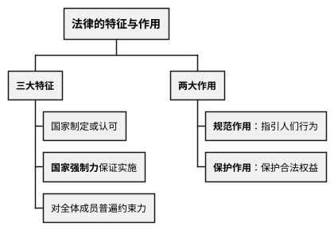
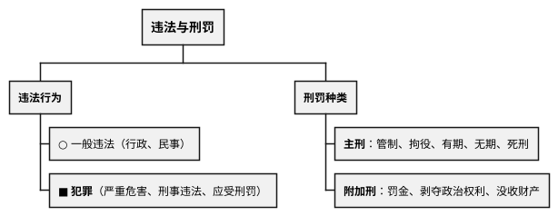
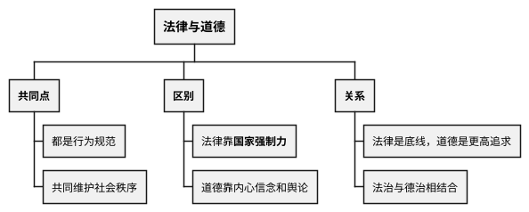
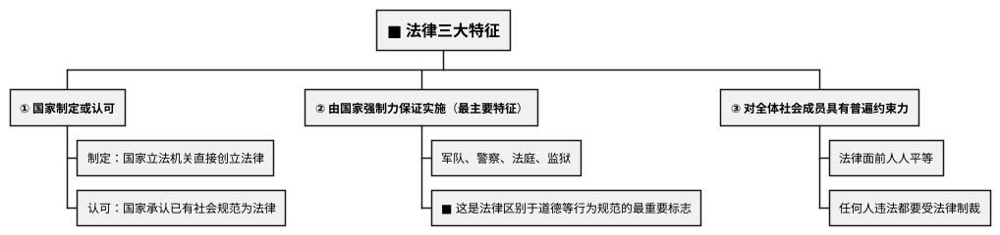
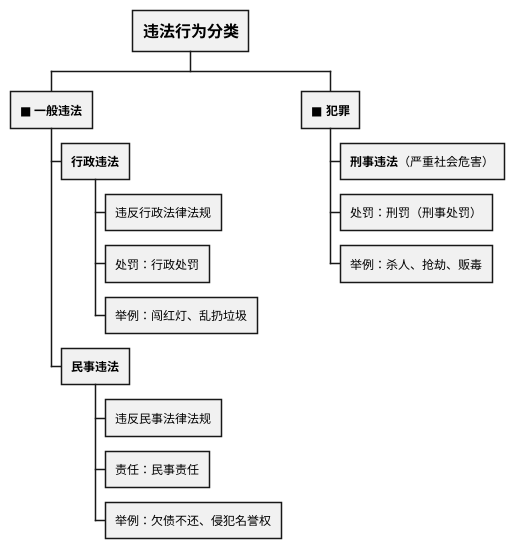

# 法律基本知识

## 考点总览

| 考点 | 核心内容 | 掌握等级 |
|------|---------|---------|
| 法律的特征 | 国家制定或认可、国家强制力保证实施、对全体成员具有普遍约束力 | ■背 |
| 法律的作用 | 规范作用、保护作用 | ■背 |
| 违法行为的分类 | 一般违法（行政违法、民事违法）vs 犯罪（刑事违法） | ■背 |
| 犯罪的特征 | 严重社会危害性、刑事违法性、应受刑罚处罚性 | ■背 |
| 刑罚的种类 | 主刑（5种）、附加刑（3种） | ■背 |
| 法律与道德 | 相同点、不同点、相互配合 | ◆理解 |







---

## 一、法律的特征 ■背（高频考点）

法律是**由国家制定或认可**、**由国家强制力保证实施**的，对**全体社会成员具有普遍约束力**的行为规范。



> **法律特征口诀**："**一认可制定二强制三普遍**"
>
> **关键词**："法律靠国家强制力，这是最大特征；道德靠内心和舆论"

---

## 二、法律的作用 ■背

| 作用 | 内容 | 表现 |
|------|------|------|
| **规范作用** | 规定人们可以做什么、必须做什么、禁止做什么 | 指引、评价、预测 |
| **保护作用** | 保护人们的合法权益，维护社会秩序 | 惩罚违法、保护合法 |

> **法律作用口诀**："**规范行为有方向，保护权益有保障**"

---

## 三、违法行为的分类 ■背

### 违法行为的含义

**违法行为**：违反法律、法规的行为。

### 违法行为的种类



### 一般违法与犯罪的关系

| 对比项 | 一般违法 | 犯罪 |
|--------|---------|------|
| **社会危害性** | 较轻 | 严重 |
| **违法性** | 违反行政法/民法 | 违反刑法 |
| **应受处罚** | 行政处罚/民事责任 | 刑罚（刑事处罚） |
| **联系** | 两者都是违法行为，一般违法可能发展为犯罪 | |

> **重要结论**：**一般违法与犯罪都是违法行为，都具有社会危害性**。二者没有不可逾越的鸿沟，有一般违法行为的人如果不及时改正，可能发展为犯罪。

---

## 四、犯罪的特征 ■背（高频考点）

犯罪是具有**严重社会危害性**、**刑事违法性**、应受**刑罚处罚性**的行为。

### 犯罪的三个特征

```
                    ┌─────────────────────┐
                    │   ■ 严重社会危害性   │
                    │    （最本质特征）     │
                    └──────────┬──────────┘
                               │
          ┌────────────────────┼────────────────────┐
          │                    │                    │
          ▼                    ▼                    ▼
  ┌───────────────┐   ┌───────────────┐   ┌───────────────┐
  │ ■ 刑事违法性  │   │               │   │ ■ 应受刑罚    │
  │  （法律标志）  │◄──┤  犯罪 = 三者  ├──►│  处罚性       │
  │               │   │    同时具备    │   │  （必然结果）  │
  └───────────────┘   └───────────────┘   └───────────────┘
```

> **犯罪特征口诀**："**严重危害是本质，刑事违法是标志，应受刑罚是结果**"

---

## 五、刑罚的种类 ■背

### 主刑（5种）——只能单独适用

| 主刑 | 期限 | 说明 |
|------|------|------|
| 管制 | 3个月—2年 | 不关押，限制自由 |
| 拘役 | 1个月—6个月 | 短期剥夺自由 |
| 有期徒刑 | 6个月—15年 | 长期剥夺自由 |
| 无期徒刑 | 终身 | 剥夺终身自由 |
| **死刑** | — | 最严厉的刑罚（包括死刑缓期执行） |

> **主刑口诀**："**管拘有无死**"（管制→拘役→有期徒刑→无期徒刑→死刑）

### 附加刑（3种）——可单独适用，也可附加适用

| 附加刑 | 说明 |
|--------|------|
| **罚金** | 强制缴纳一定数额金钱（<b>注意：≠罚款</b>） |
| **剥夺政治权利** | 剥夺选举权、被选举权等 |
| **没收财产** | 没收犯罪分子个人财产的一部分或全部 |

> **罚金 vs 罚款**：**罚金**是刑罚（犯罪后用），**罚款**是行政处罚（违法后用）

---

## 六、法律与道德的关系 ◆理解

### 相同点

- 都是社会的**行为规范**
- 都约束人们的行为
- 共同维护社会秩序

### 不同点

| 对比项 | 法律 | 道德 |
|--------|------|------|
| **产生方式** | 国家制定或认可 | 自发形成 |
| **实施手段** | <b>国家强制力</b> | 内心信念、社会舆论 |
| **约束范围** | 最底线的行为要求 | 范围更广，要求更高 |
| **表现形式** | 明确、成文 | 不成文，存在于意识中 |

### 法律与道德相互配合

- **法律**：对道德起**保障**作用，用法律的强制性促进道德建设
- **道德**：对法律起**支撑**作用，提高人们的法治观念
- **国家治理**：需要法律和道德**共同发挥作用**，**法治与德治相结合**

> **法律 & 道德口诀**："**法律是最低底线，道德是更高追求；法律靠强制，道德靠自觉**"

---

## 中考易混点

| 易混点 | 区分 |
|--------|------|
| 罚金 vs 罚款 | **罚金**是刑罚（法院宣判），**罚款**是行政处罚（如交警） |
| 拘留 vs 拘役 | **拘留**是行政处罚，**拘役**是刑罚（短期剥夺自由） |
| 行政违法 vs 民事违法 | **行政**违反行政管理秩序，**民事**侵犯他人权益 |
| 法律最主要特征 vs 犯罪最本质特征 | **法律**：国家强制力；**犯罪**：严重社会危害性 |

---

### ✨ 中考高频考点

| 考点 | 必背内容 | 出题方式 |
|------|---------|---------|
| 法律三大特征 | 国家制定或认可、国家强制力保证实施、普遍约束力 | 选择、材料 |
| 法律与道德区别 | 法律靠国家强制力，道德靠内心信念和社会舆论 | 选择题 |
| 一般违法与犯罪 | 一般违法（行政违法/民事违法），犯罪（刑事违法） | 选择、材料 |
| 犯罪三特征 | 严重社会危害性、刑事违法性、应受刑罚处罚性 | 选择、材料 |
| 刑罚种类 | 主刑5种（管拘有无死）、附加刑3种（罚金/剥夺政治权利/没收财产） | 选择题 |

---

## 📌 必背清单

| 序号 | 考点 | 要求 |
|------|------|------|
| 1 | 法律的三大特征 | ■必背 |
| 2 | 法律与道德的区别（最主要：国家强制力） | ■必背 |
| 3 | 一般违法与犯罪的区别及联系 | ■必背 |
| 4 | 犯罪的三个特征（严重危害、刑事违法、应受刑罚） | ■必背 |
| 5 | 刑罚的主刑（5种）和附加刑（3种） | ■必背 |
| 6 | 法律的作用（规范、保护） | ■必背 |
| 7 | 法律与道德的相互关系 | ◆理解 |
