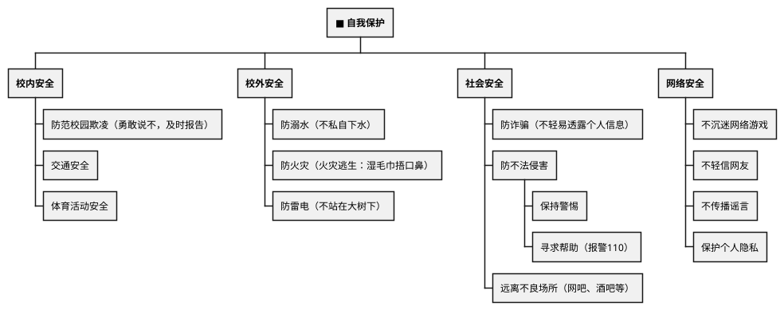

# 生命安全与健康教育

## 考点总览

| 考点 | 核心内容 | 掌握等级 |
|------|---------|---------|
| 青春期的变化 | 生理心理变化、悦纳自己 | ◆理解 |
| 情绪管理 | 情绪的分类、调节方法 | ◆理解 |
| 友谊与交往 | 交友原则、师生关系、亲子关系 | ◆理解 |
| 自我保护 | 自我保护的方法与意识 | ■背 |
| 珍爱生命 | 生命的特点、敬畏生命 | ■背 |
| 禁毒、防艾 | 远离毒品、预防艾滋病 | ◆理解 |
| 网络安全 | 合理使用网络、防范网络陷阱 | ■背 |

---

## 一、青春期

### 1. 青春期的变化 ◆理解

| 方面 | 变化 |
|------|------|
| **生理** | 身体外形的变化、内部器官的完善、性机能的成熟 |
| **心理** | 认知能力提高、自我意识增强、情绪波动大 |

### 2. 悦纳自己 ◆理解

- 正确认识自己——从生理、心理、社会三个方面
- 接纳自己的不完美
- 发挥自己的优势，不断完善自己

### 3. 青春的创造 ◆理解

- 发展独立思维：不人云亦云，有自己的见解
- 培养批判精神：敢于质疑
- 开发创造潜力：用智慧和双手去探索

---

## 二、情绪管理

### 1. 情绪的基本类型 ○了解

- 喜、怒、哀、惧（四种基本情绪）

### 2. 调节情绪的方法 ◆理解

| 方法 | 举例 |
|------|------|
| **改变认知评价** | 换个角度看问题 |
| **转移注意** | 听音乐、运动 |
| **合理宣泄** | 哭一场、找人倾诉 |
| **放松训练** | 深呼吸、冥想 |

---

## 三、友谊与交往

### 1. 交友原则 ◆理解

- 真诚友善
- 相互尊重
- 理解宽容
- 不交损友（朋友有原则）

### 2. 师生交往 ◆理解

- 尊重老师
- 主动沟通
- 正确对待老师的批评

### 3. 亲子关系 ◆理解

- 理解父母的关爱
- 学会与父母沟通
- 化解亲子冲突

### 4. 异性交往 ◆理解

- 自然大方地交往
- 把握分寸，注意场合
- 相互尊重，保持适当的距离

---

## 四、自我保护 ■背

### 1. 自我保护意识

- 增强安全意识
- 学会辨别是非
- 遇到危险保持冷静

### 2. 自我保护的方法

> **自我保护口诀**："**生命安全是第一，遇到危险要冷静，学会求助与呼救，远离危险保平安**"

---

## 五、珍爱生命 ■背

### 1. 生命的特点

| 特点 | 含义 |
|------|------|
| **来之不易** | 生命是大自然的奇迹 |
| **不可逆** | 生命一去不复返 |
| **短暂** | 生命有时尽 |
| **独特** | 每个人都是独一无二的 |

### 2. 敬畏生命 ■背

- 生命至上，珍爱自己的生命
- 不漠视他人的生命
- 在他人需要帮助时伸出援手

### 3. 生命的意义 ◆理解

- 在平凡中创造伟大
- 积极承担社会责任
- 实现人生价值

---

## 六、禁毒与防艾 ◆理解

### 1. 远离毒品

- 毒品危害：损害健康、毁灭家庭、危害社会
- 吸食毒品是违法行为
- 自觉抵制毒品，不尝试第一口

### 2. 预防艾滋病

- 传播途径：血液传播、母婴传播、性传播
- 日常接触不传播（握手、拥抱、共餐等）
- 关爱艾滋病患者，消除歧视

---

## 七、合理利用网络 ■背

### 1. 网络的利弊

| 利 | 弊 |
|----|----|
| 方便信息获取 | 沉迷网络影响学习 |
| 拓展社交范围 | 网络诈骗、信息泄露 |
| 丰富学习资源 | 网络谣言、不良信息 |

### 2. 合理用网的原则 ■背

- **合理安排时间**：不沉迷
- **提高辨别能力**：不信谣不传谣
- **保护个人隐私**：不随意透露个人信息
- **遵守网络道德和法律**：文明上网
- **理性参与网络生活**：传播正能量

---

### ✨ 中考高频考点

| 考点 | 必背内容 | 出题方式 |
|------|---------|---------|
| 个人自我保护 | 防校园欺凌、防诈骗、消防安全、拨打110 | 材料分析题 |
| 珍爱生命 | 生命来之不易、不可逆、短暂、独特，生命至上 | 选择、材料 |
| 合理利用网络 | 不沉迷、不传谣、保护隐私、文明上网 | 材料分析题 |
| 情绪管理 | 改变认知评价、转移注意、合理宣泄、放松训练 | 选择题 |

---

## 📌 必背清单

| 序号 | 考点 | 要求 |
|------|------|------|
| 1 | 自我保护的方法和意识 | ■必背 |
| 2 | 生命的特点（来之不易、不可逆、短暂、独特） | ■必背 |
| 3 | 敬畏生命、生命至上 | ■必背 |
| 4 | 合理利用网络（不沉迷、不传谣、保护隐私） | ■必背 |
| 5 | 青春期的变化与悦纳自己 | ◆理解 |
| 6 | 情绪调节的方法 | ◆理解 |
| 7 | 防校园欺凌 | ◆理解 |
| 8 | 远离毒品、预防艾滋病 | ◆理解 |

---

# 📝 填空题

---

# 生命安全与健康教育 · 填空题

**班级：\_\_\_\_\_\_\_\_ 姓名：\_\_\_\_\_\_\_\_ 得分：\_\_\_\_\_\_\_\_**

---

## 一、珍爱生命

1. 生命的特点：\_\_\_\_\_\_\_\_、\_\_\_\_\_\_\_\_、\_\_\_\_\_\_\_\_、\_\_\_\_\_\_\_\_。

2. 生命至上，不仅要珍爱\_\_\_\_\_\_\_\_的生命，也不能漠视\_\_\_\_\_\_\_\_的生命。

## 二、自我保护

3. 面对校园欺凌，应勇敢说"\_\_\_\_\_\_"，并及时\_\_\_\_\_\_\_\_。

4. 火灾逃生：用\_\_\_\_\_\_\_\_捂住口鼻，弯腰低姿逃生。

5. 防诈骗：不轻易透露\_\_\_\_\_\_\_\_\_\_\_\_信息。

6. 遇到危险拨打报警电话：\_\_\_\_\_\_\_。

## 三、合理利用网络

7. 网络的弊：沉迷网络影响\_\_\_\_\_\_\_，\_\_\_\_\_\_\_\_和\_\_\_\_\_\_\_\_风险，\_\_\_\_\_\_\_和\_\_\_\_\_\_\_信息。

8. 合理用网原则：
   - 合理安排\_\_\_\_\_\_\_\_，不沉迷
   - 提高\_\_\_\_\_\_\_\_\_能力，不信谣不传谣
   - 保护\_\_\_\_\_\_\_\_\_\_，不随意透露个人信息
   - 遵守网络\_\_\_\_\_\_\_和\_\_\_\_\_\_\_，文明上网

## 四、青春期

9. 青春期的心理变化：\_\_\_\_\_\_\_\_提高，\_\_\_\_\_\_\_\_增强，情绪波动大。

## 五、情绪管理

10. 调节情绪的方法：\_\_\_\_\_\_\_\_\_\_\_\_、\_\_\_\_\_\_\_\_、\_\_\_\_\_\_\_\_、\_\_\_\_\_\_\_\_。

**参考答案：**

1. 来之不易、不可逆、短暂、独特
2. 自己，他人
3. 不，报告（老师/家长）
4. 湿毛巾
5. 个人隐私
6. 110
7. 学习，网络诈骗，信息泄露，网络谣言，不良
8. 时间，辨别，个人隐私，道德，法律
9. 认知能力，自我意识
10. 改变认知评价、转移注意、合理宣泄、放松训练

---

# 📝 材料题专项

---

# 生命安全与健康教育 · 材料题专项

---

## 一、个人自我保护

### 出题角度

**角度1：给出校园欺凌案例，问正确的应对方式**

常考：如何防范和应对校园欺凌

**角度2：给出网络诈骗案例，问如何防范**

**角度3：给出火灾等突发事件场景，问正确的逃生方法**

### 答题要点

| 场景 | 正确做法 |
|------|---------|
| **校园欺凌** | 勇敢说"不"，及时向老师、家长报告 |
| **网络诈骗** | 不透露个人信息，不轻信陌生信息 |
| **火灾逃生** | 湿毛巾捂口鼻，弯腰低姿逃生，不乘电梯 |
| **报警求助** | 拨打110报警电话 |

---

## 二、珍爱生命

### 出题角度

**角度1：给出感人事迹材料，问体现了什么生命观**

**角度2：问"如何认识生命的意义"**

### 答题要点

**生命的特点**：来之不易、不可逆、短暂、独特

**生命至上**：
- 珍爱自己的生命
- 不漠视他人的生命
- 在他人需要帮助时伸出援手

**生命的意义**：
- 在平凡中创造伟大
- 积极承担社会责任
- 实现人生价值

---

## 三、合理利用网络

### 出题角度

**角度1：给出网络沉迷案例，问危害和应对方法**

**角度2：给出网络谣言案例，问应如何做**

### 答题要点

| 原则 | 怎么做 |
|------|--------|
| **合理安排时间** | 不沉迷网络游戏 |
| **提高辨别能力** | 不信谣不传谣 |
| **保护个人隐私** | 不随意透露个人信息 |
| **遵守法律道德** | 文明上网，传播正能量 |

---

## 考前速记

> **自我保护**："遇危险要冷静，学会求助与呼救"  
> **珍爱生命**："生命来之不易，生命至上记心中"  
> **网络安全**："不沉迷不传谣，保护隐私最重要"

---

## 参考答案

